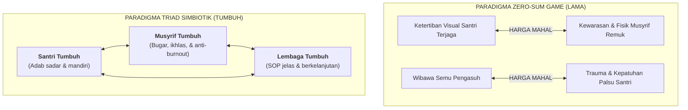

# SUB-BAB 5.1: MENGAKHIRI *ZERO-SUM GAME*: KETERTIBAN SANTRI TANPA MENGORBANKAN KEWARASAN MUSYRIF

---

## 1. Jebakan *Zero-Sum Game* dalam Pengasuhan Tradisional

Dalam teori sistem dan psikologi organisasi, **Zero-Sum Game** merujuk pada sebuah situasi di mana keuntungan yang diraih oleh satu pihak secara otomatis harus dibayar dengan kerugian pihak lain (*one's gain is another's loss*). [^1]

Di banyak pesantren konvensional, pengelolaan asrama tanpa disadari beroperasi di bawah jebakan *zero-sum game* yang merusak:
* **Ketertiban Santri Dibeli dengan Kehancuran Mental Musyrif**: Agar ratusan santri dapat tertib bangun Subuh, berbaris rapi, dan tidak membuat onar, para musyrif dipaksa bekerja layaknya robot selama 24 jam nonstop tanpa shift kerja yang layak. Keberhasilan asrama dinilai dari ketiadaan masalah santri, sementara kelelahan kronis dan depresi musyrif dianggap sebagai "resiko pengabdian".
* **Kepatuhan Santri Dibayar dengan Rasa Takut & Trauma**: Pendidik merasa "menang" dan berwibawa tatkala santri terdiam membisu karena bentakan, padahal kemenangan semu itu dibayar dengan hancurnya kepercayaan diri (*self-esteem*) dan matinya inisiatif kreatif santri.

Kaidah fiqih Islam menetapkan prinsip mutlak tentang larangan menciptakan sistem yang saling membahayakan:

> **لَا ضَرَرَ وَلَا ضِرَارَ**
> 
> *"Tidak boleh ada bahaya (kemudaratan bagi diri sendiri) dan tidak boleh pula menimbulkan bahaya (kemudaratan bagi orang lain)."* (HR. Ibnu Majah no. 2340 dan Ad-Daraquthni, hadits hasan) [^2]

Sebuah model pendidikan yang menuntut pengorbanan kesehatan mental dan fisik pengasuh secara zalim, atau menuntut trauma santri demi ketertiban lahiriah, secara hakiki melanggar kaidah syariat agung ini.

---

## 2. Merancang Ekosistem *Positive-Sum* (Saling Menguatkan)

Ekosistem TUMBUH merombak jebakan *zero-sum* ini menjadi sebuah ekosistem **Positive-Sum (Simbiotik Saling Menumbuhkan)**. Dalam sistem ini, ketertiban santri tidak diraih melalui pemerasan tenaga pengasuh, melainkan melalui **rekayasa sistem dan penataan lingkungan (*Environmental & Systems Engineering*)**:

1. **Otomasi Melalui Budaya 5S & Jadwal Sirkadian**: Ketika santri telah dilatih menjalankan rutinitas kamar 5S dan jadwal tidur 7 jam secara mandiri, energi musyrif tidak lagi terkuras untuk meneriaki hal-hal kecil setiap pagi.
2. **Dukungan Sarpras Bebas Titik Buta (CPTED)**: Tata letak fisik yang terang dan terbuka secara alami mencegah terjadinya pelanggaran, sehingga musyrif tidak perlu melakukan pengawasan polisional yang melelahkan.
3. **Rotasi Shift Kerja Terpadu (4 Shift)**: Musyrif bekerja dalam rentang waktu yang terukur dan memiliki hak istirahat penuh, sehingga saat bertugas mereka berada dalam kondisi bugar, sabar, dan penuh energi positif untuk membimbing santri dengan kasih sayang (*Firm & Kind*).

Ketika musyrif bahagia dan bugar, santri merasa aman dan terayomi. Dan ketika santri tertib atas kesadaran diri, lembaga pesantren berkembang menjadi pusat peradaban yang makmur dan berkah.

---

### 📚 Catatan Kaki & Referensi Akademik:

[^1]: Von Neumann, J., & Morgenstern, O. (1944). *Theory of Games and Economic Behavior*. Princeton: Princeton University Press, hlm. 85–112.
[^2]: Ibnu Majah, Muhammad bin Yazid. (2009). *Sunan Ibni Majah*. Ditahqiq oleh Syu'aib al-Arna'uth. Beirut: Dar ar-Risalah al-'Alamiyyah, Kitab *al-Ahkam*, Hadits no. 2340.
[^3]: Senge, P. M. (2006). *The Fifth Discipline: The Art & Practice of The Learning Organization*. New York: Doubleday, hlm. 68–92.
