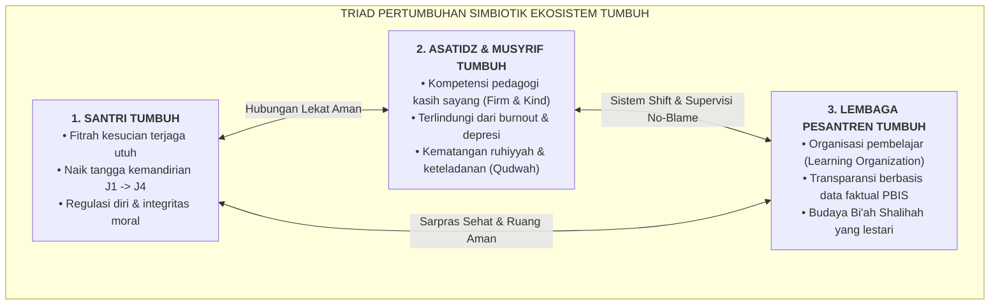

# SUB-BAB 5.2: TIGA DIMENSI PERTUMBUHAN SIMBIOTIK: SANTRI TUMBUH, ASATIDZ TUMBUH, DAN LEMBAGA TUMBUH

---

## 1. Arsitektur Triad Simbiotik: Keselarasan Tiga Entitas

Pilar filosofis ketiga dari Ekosistem TUMBUH adalah **Prinsip Triad Pertumbuhan Simbiotik**. Pendidikan pesantren tidak boleh dipandang sebagai relasi satu arah yang membebani salah satu pihak, melainkan sebagai sebuah ekologi terpadu yang memastikan **tiga entitas bertumbuh serempak secara harmonis**:

---

## 2. Eksplanasi Tiga Dimensi Pertumbuhan

### 🌿 1. Dimensi Pertama: Santri Tumbuh
Pertumbuhan santri dalam ekosistem TUMBUH diukur dari pematangan internal, bukan sekadar kepatuhan lahiriah:
* **Fitrah Terawat**: Potensi bawaan mencintai kebaikan tidak tercemar oleh trauma kekerasan atau intimidasi fisik.
* **Progresi Tangga Kemandirian (J1 $\rightarrow$ J4)**: Santri bertransisi dari fase ketergantungan pada pengawasan luar (J1) menuju pembiasaan mandiri (J2), pengendalian diri internal (J3), hingga kepemimpinan melayani sesama (J4).
* **Kecerdasan Sosio-Emosional (CASEL SEL)**: Mampu mengenali emosi diri, mengelola stres belajar, menunjukkan empati kepada kawan yang tertinggal, dan mengambil keputusan yang bertanggung jawab.

### 🌟 2. Dimensi Kedua: Guru & Musyrif Tumbuh
Pendidik dan pembina asrama bukan sekadar "pekerja pelaksana aturan", melainkan insan pembelajar yang terus ditingkatkan kapasitasnya:
* **Penguasaan Pedagogi *Firm & Kind***: Mampu menegakkan batasan disiplin secara konsisten tanpa perlu menaikkan intonasi suara, membentak, atau menggunakan kekerasan fisik.
* **Keterampilan Konseling & Mediasi Restoratif**: Mampu memfasilitasi dialog damai (*Ishlah al-Bain*) dan merumuskan rencana pemulihan perilaku bagi santri yang bermasalah.
* **Kesejahteraan Fisik & Mental yang Terlindungi**: Bekerja dalam sistem shift yang manusiawi, memiliki hak libur pasti, dan mendapatkan supervisi klinis mingguan bebas budaya saling menyalahkan (*No-Blame Culture*).

### 🏛️ 3. Dimensi Ketiga: Sistem Lembaga Pesantren Tumbuh
Lembaga pesantren bertransformasi dari sistem feodal yang bergantung pada figur personal menjadi **Organisasi Pembelajar (*The Learning Organization*)**:
* **Pengambilan Keputusan Berbasis Data Faktual (*Data-Driven PBIS*)**: Kebijakan dan alokasi sumber daya tidak didasarkan pada asumsi atau emosi sesaat, melainkan pada rekam data logbook dan tren perilaku santri.
* **Kultur Keamanan & Perlindungan Anak (*Safe Sanctuary*)**: Lembaga memiliki protokol tertulis yang jelas mengenai pencegahan perundungan, transparansi keuangan, dan audit sarpras berkala.
* **Keberlanjutan Sistem (*Institutional Sustainability*)**: Sistem pengasuhan tetap berjalan prima secara konsisten meskipun terjadi pergantian kepengurusan atau staf musyrif baru.

---

## 3. Matriks Saling Silang Pengaruh Antar-Entitas (*Cross-Impact Matrix*)

| Ketika Entitas Ini Tumbuh... | Dampak Positif Langsung pada Entitas Lain |
| :--- | :--- |
| **Santri Tumbuh Mandiri (5S & Ibadah)** | **Pada Musyrif**: Beban pengawasan fisik berkurang drastis; musyrif dapat fokus pada pembinaan kualitas batin santri. **Pada Lembaga**: Tingkat kerusakan inventaris rendah; reputasi pondok meningkat di mata masyarakat. |
| **Musyrif Tumbuh Sehat & Sejahtera** | **Pada Santri**: Santri diasuh dengan senyuman, kehangatan, dan keteladanan stabil tanpa ledakan amarah. **Pada Lembaga**: Tingkat pergantian musyrif (*turn-over rate*) sangat rendah (<5%), menghemat biaya pelatihan. |
| **Lembaga Tumbuh dengan SOP & Sarpras CPTED** | **Pada Santri**: Lingkungan fisik asrama aman dari titik buta perundungan; fasilitas kamar sehat dan higienis. **Pada Musyrif**: Prosedur kerja jelas; didukung fasilitas konseling Bilik Sakinah dan data analitik digital. |

Dengan keterpaduan Triad Simbiotik ini, pesantren membuktikan diri sebagai model pendidikan peradaban unggul: sebuah ekosistem yang merawat kemanusiaan dan mengantarkan seluruh warganya menuju rida Allah SWT.

---

### 📚 Catatan Kaki & Referensi Akademik:

[^1]: Bronfenbrenner, U. (1979). *The Ecology of Human Development: Experiments by Nature and Design*. Cambridge, MA: Harvard University Press, hlm. 55–80.
[^2]: Senge, P. M. (2006). *The Fifth Discipline: The Art & Practice of The Learning Organization*. New York: Doubleday, hlm. 139–170.
[^3]: Al-Ghazali, Abu Hamid Muhammad bin Muhammad. (2004). *Ihya' 'Ulumiddin*. Beirut: Dar al-Kutub al-'Ilmiyyah, Jilid II, Kitab *Adab al-Ulfah wa al-Ukhuwwah*, hlm. 175–190.
