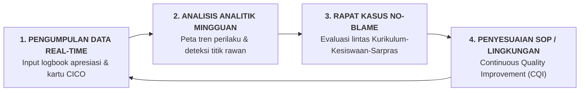

# SUB-BAB 5.3: METRIK KEBERHASILAN ORGANISASI PEMBELAJAR (*LEARNING ORGANIZATION*) BERBASIS DATA PBIS

---

## 1. Transformasi Budaya: Dari Asumsi Subjektif Menuju Keputusan Berbasis Data

Dalam manajemen pesantren konvensional, evaluasi terhadap keberhasilan pengasuhan asrama sering kali didasarkan pada **asumsi subjektif atau kesan sepintas (*anecdotal impressions*)**. Pimpinan pondok baru turun tangan tatkala sudah terjadi krisis besar—seperti santri kabur massal, perkelahian berdarah, atau laporan kekerasan dari wali santri ke pihak berwajib.

Ekosistem TUMBUH mengubah pendekatan reaktif-asumsi ini menjadi **Pendekatan Pengambilan Keputusan Berbasis Data (*Data-Driven Decision Making*)**. Sebagai sebuah Organisasi Pembelajar (*Learning Organization*), pesantren memantau kesehatan iklim asrama dan efektivitas pembinaan karakter secara harian dan mingguan melalui data faktual yang terekam dalam aplikasi *Logbook Digital PBIS*.



---

## 2. Lima Metrik Kunci Kesehatan Ekosistem TUMBUH (*Core Vital Signs*)

Untuk memastikan seluruh roda ekosistem bertumbuh secara sehat, pimpinan pesantren dan tim penjamin mutu (*Quality Assurance*) memantau **Lima Metrik Indikator Kunci**:

```
                 5 METRIK INDIKATOR KESEHATAN EKOSISTEM TUMBUH
                 
  1. RASIO APRESIASI EMAS          ──► Target: $\ge 4:1$ (Pujian vs Teguran)
  2. INDEKS BURNOUT MUSYRIF        ──► Target: $< 15\%$ (Skala MBI Sehat)
  3. PENURUNAN KASUS TIER 3        ──► Target: $< 3\%$ dari Total Santri
  4. KEPATUHAN AUDIT KAMAR 5S      ──► Target: $\ge 95\%$ Kamar Layak
  5. INDEKS KEPUTARAN MUSYRIF      ──► Target: $< 5\%$ per Tahun
```

### 📊 1. Rasio Emas Apresiasi Kebaikan ($\ge 4:1$)
* **Definisi**: Perbandingan antara jumlah catatan perilaku positif/kemajuan adab yang diapresiasi oleh musyrif dengan jumlah catatan teguran indisipliner dalam aplikasi logbook.
* **Standar Mutu**: Minimal $4$ apresiasi positif untuk setiap $1$ catatan teguran.
* **Makna Evaluasi**: Jika rasio turun di bawah $4:1$, hal itu mengindikasikan bahwa musyrif sedang mengalami kelelahan mental (*negativity bias*) dan mulai kembali ke pola pengasuhan punitif.

### 🩺 2. Indeks Burnout Musyrif ($< 15\%$)
* **Definisi**: Tingkat kelelahan emosional staf pengasuhan yang diukur setiap triwulan menggunakan instrumen *Maslach Burnout Inventory (MBI)*.
* **Standar Mutu**: Kurang dari $15\%$ staf yang berada pada zona risiko kelelahan sedang-berat.
* **Tindakan Korektif**: Musyrif yang terindikasi lelah segera diberikan rotasi shift ringan, cuti pemulihan, dan pendampingan konseling.

### 📉 3. Proporsi Distribusi Perilaku Multi-Tier (80-15-5)
* **Tier 1 (Universal)**: $80\% - 90\%$ santri berada dalam zona adab mandiri tanpa pelanggaran berulang.
* **Tier 2 (Targeted)**: $10\% - 15\%$ santri membutuhkan pendampingan CICO atau bimbingan kelompok kecil.
* **Tier 3 (Intensive)**: Kurang dari $3\% - 5\%$ santri yang memerlukan intervensi mendalam (FBA/BIP) dan mediasi restoratif berat.

### 🧹 4. Tingkat Kepatuhan Tata Graha Kamar 5S ($\ge 95\%$)
* **Definisi**: Persentase kamar asrama yang memenuhi standar kebersihan, kerapian lemari, dan sprei kencang (*hospital corner*) dalam audit inspeksi harian.
* **Makna Evaluasi**: Menunjukkan efektivitas pembiasaan adab keteraturan fisik dan pencegahan *Broken Windows Effect*.

### 🔄 5. Tingkat Retensi Musyrif & Kepuasan Kerja ($< 5\%$ Attrition Rate)
* **Definisi**: Persentase musyrif yang mengundurkan diri dalam satu tahun ajaran.
* **Makna Evaluasi**: Menjamin kontinuitas figur lekat aman (*secure attachment*) bagi perkembangan santri di asrama.

---

## 3. Siklus Peningkatan Mutu Berkelanjutan (*Continuous Quality Improvement - CQI*)

Data yang terkumpul tidak digunakan untuk menghukum staf (*No-Blame Culture*), melainkan sebagai bahan bakar perbaikan sistem secara siklikal:

| Temuan Data Faktual Mingguan | Analisis Akar Masalah Lintas Pilar | Tindakan Solusi Sistemik TUMBUH |
| :--- | :--- | :--- |
| Terjadi lonjakan keterlambatan sholat Subuh pada santri Gedung B (Kesiswaan). | Audit Sarpras menemukan 3 kran air wudhu di Gedung B patah, memicu antrean panjang. | Bagian Sarpras mengganti kran baru dalam tempo <24 jam; musyrif shift fajar mengawal pembagian kran cadangan. |
| Santri Kelas 8 sering ribut di lorong lantai 2 pada jam 16.30 sore. | Jam tersebut adalah titik transisi kosong antara olahraga dan mandi sore tanpa pengawas. | Penyesuaian jadwal patroli musyrif Shift 2 untuk hadir di lorong tersebut (*Warm Presence*). |

Dengan mekanisme berbasis data ini, Ekosistem TUMBUH menjelma menjadi institusi pendidikan yang dinamis, adaptif, dan senantiasa menyempurnakan diri demi memuliakan fitrah seluruh santri dan asatidz.

---

### 📚 Catatan Kaki & Referensi Akademik:

[^1]: Sugai, G., & Horner, R. H. (2006). A promising approach for expanding and sustaining school-wide positive behavior support. *School Psychology Review*, 35(2), 245–259.
[^2]: Maslach, C., Jackson, S. E., & Leiter, M. P. (1996). *Maslach Burnout Inventory Manual* (3rd ed.). Palo Alto, CA: Consulting Psychologists Press.
[^3]: Deming, W. E. (1986). *Out of the Crisis*. Cambridge, MA: MIT Center for Advanced Educational Services, hlm. 85–102.
[^4]: Senge, P. M. (2006). *The Fifth Discipline: The Art & Practice of The Learning Organization*. New York: Doubleday, hlm. 204–225.
