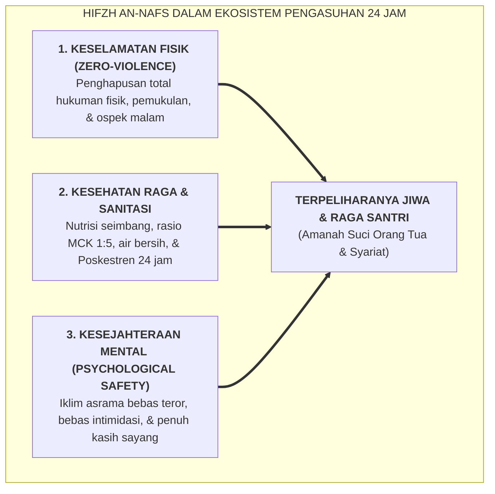

# SUB-BAB 6.1: MENJAGA JIWA (*HIFZH AN-NAFS*): STANDAR KESELAMATAN FISIK, MENTAL, DAN ZERO-VIOLENCE

---

## 1. Kerangka Maqashid Syari'ah: Perlindungan Jiwa Sebagai Mandat Primer

Dalam hierarki hukum Islam yang dirumuskan oleh Imam Abu Ishaq Asy-Syathibi (w. 790 H) dalam kitab *Al-Muwafaqat*, seluruh syariat diturunkan untuk memelihara lima kebutuhan pokok manusia (**Al-Kulliyyat al-Khamsah / Dharuriyyat al-Khamsah**): *Agama (Din), Jiwa (Nafs), Akal ('Aql), Keturunan/Kehormatan (Nasl/'Irdh), dan Harta (Mal)*. [^1]

Dalam ranah pendidikan pesantren, mandat **Hifzh an-Nafs (Penjagaan Jiwa dan Raga)** menempati posisi yang mutlak dan tidak boleh dikompromikan dengan alasan apa pun.

Allah SWT berfirman:

> **وَلَا تَقْتُلُوا أَنفُسَكُمْ ۚ إِنَّ اللَّهَ كَانَ بِكُمْ رَحِيمًا**
> 
> *"Dan janganlah kamu membunuh dirimu (dan membunuh saudaramu); sesungguhnya Allah adalah Maha Penyayang kepadamu."* (QS. An-Nisa' [4]: 29) [^2]

Prinsip ini menegaskan bahwa segala bentuk tindakan yang membahayakan integritas fisik, mencederai raga, atau merusak kesehatan mental santri secara hakiki bertentangan dengan tujuan tertinggi syariat Islam (*Maqashid asy-Syari'ah*).

---

## 2. Standar Operasional *Zero-Violence Safe Sanctuary* di Pesantren

Untuk mewujudkan *Hifzh an-Nafs* secara nyata, ekosistem TUMBUH menetapkan **Standar Keselamatan Fisik & Raga**:

1. **Dekrit Anti-Kekerasan Mutlak (*Absolute Zero Corporal Punishment*)**:
   * Larangan bagi siapa pun (Kiai, Pimpinan, Guru, Musyrif, maupun Santri Senior) untuk memukul, menampar, menendang, melempar benda, atau memberikan sanksi fisik yang melelahkan secara ekstrem.
   * Pelanggaran terhadap poin ini dikategorikan sebagai pelanggaran berat Tier 3 dengan konsekuensi hukum dan pemecatan.
2. **Standar Higienitas & Sanitasi Asrama**:
   * Menjamin rasio toilet yang memadai (minimal 1 kamar mandi untuk 5–7 santri) agar tidak terjadi penumpukan antrean mandi yang memicu stres pagi.
   * Pemeriksaan berkala kualitas air bersih dan sirkulasi udara kamar.
3. **Layanan Kesehatan Poskestren 24 Jam**:
   * Ketersediaan tenaga medis/perawat dan obat-obatan standar untuk penanganan cepat santri yang demam, cedera, atau sakit mendadak.

Menjaga keselamatan fisik santri adalah bentuk amanah syariat yang paling mendasar. Pesantren yang gagal melindungi raga santrinya dari kekerasan telah kehilangan legitimasi moralnya sebagai lembaga pendidikan Islam.

---

### 📚 Catatan Kaki & Referensi Akademik:

[^1]: Asy-Syathibi, Abu Ishaq Ibrahim bin Musa. (2003). *Al-Muwafaqat fi Ushul asy-Syari'ah*. Ditahqiq oleh Masyhur bin Hasan Al Salman. Kairo: Dar Ibnu 'Affan, Jilid II, hlm. 18–35.
[^2]: Tafsir Ibnu Katsir. (2000). *Tafsir Al-Qur'an al-'Azhim*. Riyadh: Dar Thayyibah, Jilid II, hlm. 268–272.
[^3]: Al-'Izz bin 'Abdissalam. (1999). *Qawa'id al-Ahkam fi Mashalih al-Anam*. Beirut: Dar al-Ma'arif, Jilid I, hlm. 45–60.
