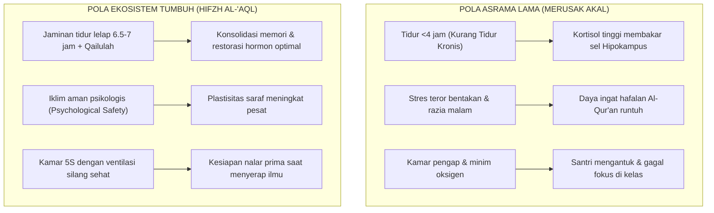

# SUB-BAB 6.2: MENJAGA AKAL (*HIFZH AL-'AQL*): ELIMINASI STRES KRONIS DEMI OPTIMALISASI PEMBELAJARAN

---

## 1. Menjaga Daya Nalar: Dimensi Biologis & Intelektual *Hifzh al-'Aql*

Dalam tradisi fiqih klasik, mandat **Hifzh al-'Aql (Penjagaan Akal Pikiran)** sering kali disempitkan pada larangan meminum khamar dan zat-zat yang memabukkan. Namun, dalam konteks aksiologi pendidikan Islam komprehensif, *Hifzh al-'Aql* mencakup kewajiban untuk **memelihara, mengembangkan, dan melindungi kapasitas fungsional otak anak didik agar dapat menyerap ilmu, bernalar kritis, dan memahami kebenaran wahyu secara optimal**.

Otak santri adalah instrumen biologis tempat bersemayamnya akal (*al-'aql*). Apabila sebuah sistem pesantren menerapkan jadwal harian yang merusak fungsi biologis otak, maka sistem tersebut secara tidak langsung telah mencederai mandat *Hifzh al-'Aql*.

---

## 2. Neurosains Tidur Remaja: Hak Sirkadian 7 Jam & Sunnah *Qailulah*

Riset neurosains kognitif modern (Matthew Walker, 2017) membuktikan bahwa proses **konsolidasi memori (penguncian hafalan Al-Qur'an dan pemahaman kitab dari memori jangka pendek ke memori jangka panjang)** terjadi terutama saat tubuh berada dalam fase tidur lelap (*Slow-Wave Deep Sleep* dan *REM Sleep*). [^1]

Deprivasi tidur kronis pada remaja santri menyebabkan:
1. **Penyusutan Sel-Sel Hipokampus**: Bagian otak yang bertugas menyimpan hafalan baru mengalami penurunan daya tangkap hingga $40\%$.
2. **Penurunan Kestabilan Emosi**: Santri menjadi mudah marah, cemas, dan kehilangan motivasi belajar.
3. **Penurunan Sistem Imunitas**: Santri mudah terserang flu, batuk, dan infeksi kulit.

Ekosistem TUMBUH memadukan konsensus sains ini dengan Sunnah Nabawiyyah:
* **Hak Tidur Malam (21:45 - 03:45)**: Menjamin santri tidur dalam suasana hening dan gelap selama minimal 6 jam penuh.
* **Sunnah Qailulah Siang (12:30 - 13:15)**: Istirahat tidur siang sejenak selama 30–45 menit setelah sholat Dzuhur untuk merestorasi neurotransmiter otak sebelum memulai KBM sesi siang.

Rasulullah SAW bersabda menganjurkan tidur siang:

> **قِيلُوا فَإِنَّ الشَّيَاطِينَ لَا تَقِيلُ**
> 
> *"Lakukanlah qailulah (tidur siang sejenak), karena sesungguhnya setan-setan itu tidak melakukan qailulah."* (HR. Ath-Thabarani dalam *Al-Mu'jam al-Ausath* no. 28, sanad hasan) [^2]

---

## 3. Menciptakan Lingkungan Belajar Bebas Stres Kronis

Untuk memaksimalkan daya nalar santri, ekosistem TUMBUH menetapkan standar lingkungan belajar:
* **Ergonomi Ruang Kelas & Halaqah**: Pencahayaan alami yang cukup, meja kursi ergonomis, dan sirkulasi udara bersih.
* **Pembelajaran Interaktif & Metakognitif**: Santri tidak hanya dijejali hafalan sepihak, melainkan diajak berdiskusi (*munazharah*), bertanya kritis, dan meneliti makna teks (*ijtihad terbimbing*).
* **Mudzakarah Terarah Malam Hari**: Sesi belajar mandiri malam dipandu secara tenang tanpa bentakan, difasilitasi oleh ketersediaan perpustakaan yang nyaman.

Dengan menjaga kesehatan biologis dan lingkungan belajar santri, mandat *Hifzh al-'Aql* ditegakkan seutuhnya, melahirkan generasi ulama dan cendekiawan yang cerdas, tajam daya nalarnya, dan jernih mata hatinya.

---

### 📚 Catatan Kaki & Referensi Akademik:

[^1]: Walker, M. (2017). *Why We Sleep: Unlocking the Power of Sleep and Dreams*. New York: Scribner, hlm. 105–132.
[^2]: Ath-Thabarani, Sulaiman bin Ahmad. (1995). *Al-Mu'jam al-Ausath*. Kairo: Dar al-Haramain, Jilid I, Hadits no. 28.
[^3]: Stickgold, R. (2005). Sleep-dependent memory consolidation. *Nature*, 437(7063), 1272–1278.
[^4]: Al-Ghazali, Abu Hamid Muhammad bin Muhammad. (2004). *Ihya' 'Ulumiddin*. Beirut: Dar al-Kutub al-'Ilmiyyah, Jilid I, Kitab *Tartib al-Aurad fi al-Lail wa an-Nahar*, hlm. 380–385.
