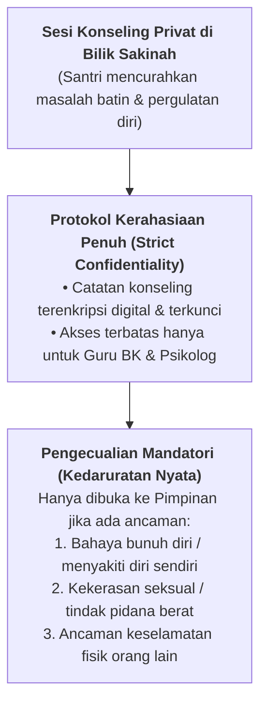

# SUB-BAB 6.3: MENJAGA KEHORMATAN (*HIFZH AL-'IRDH*): PERLINDUNGAN HAK ANAK DAN KERAHASIAAN KONSELING

---

## 1. Kehormatan Santri: Hak Fundamental yang Dilindungi Syariat

Dalam pandangan aksiologi Islam, **Hifzh al-'Irdh (Penjagaan Kehormatan dan Martabat Diri)** adalah pilar dharuri yang setara nilainya dengan perlindungan jiwa dan harta. Setiap santri, betapa pun muda usianya atau betapa pun berat kesalahan yang pernah diperbuatnya, tetap memiliki hak asasi untuk dilindungi nama baiknya, ditutupi aib pribadinya, dan diperlakukan secara terhormat.

Dalam praktik pengasuhan asrama lama, pelanggaran terhadap *Hifzh al-'Irdh* kerap terjadi dalam bentuk:
* Membeberkan pelanggaran pribadi santri di depan kelompok asrama atau forum umum.
* Menjadikan masalah keluarga santri (seperti perceraian orang tua atau kesulitan ekonomi) sebagai bahan sindiran.
* Kebocoran catatan konseling santri kepada pihak-pihak yang tidak berwenang.

Allah SWT melarang keras segala bentuk perbuatan yang mencemarkan kehormatan sesama:

> **يَا أَيُّهَا الَّذِينَ آمَنُوا لَا يَسْخَرْ قَوْمٌ مِّن قَوْمٍ عَسَىٰ أَن يَكُونُوا خَيْرًا مِّنْهُمْ... وَلَا تَلْمِزُوا أَنفُسَكُمْ وَلَا تَنَابَزُوا بِالْأَلْقَابِ ۖ بِئْسَ الِاسْمُ الْفُسُوقُ بَعْدَ الْإِيمَانِ**
> 
> *"Wahai orang-orang yang beriman! Janganlah suatu kaum mengolok-olok kaum yang lain (karena) boleh jadi mereka (yang diperolok-olokkan) lebih baik dari mereka (yang mengolok-olok)... Dan janganlah kamu mencela dirimu sendiri (saudaramu) dan janganlah kamu panggil-memanggil dengan gelar-gelar yang buruk. Seburuk-buruk panggilan adalah (panggilan) yang buruk setelah beriman."* (QS. Al-Hujurat [49]: 11) [^1]

---

## 2. Kode Etik Kerahasiaan Konseling Bimbingan Santri (*Confidentiality Protocol*)

Untuk memastikan perlindungan martabat santri, tim Bimbingan Konseling (BK) dan para musyrif TUMBUH terikat oleh **Protokol Kerahasiaan Data Konseling yang Ketat**:

### Standar Baku Kerahasiaan:
1. **Hak Privasi Percakapan**: Segala pengakuan atau curahan hati santri dalam sesi konseling di Bilik Sakinah bersifat rahasia dan haram dibocorkan kepada santri lain, staf pengajar umum, atau diumbar di grup percakapan asatidz.
2. **Pengamanan Rekam Medis & Psikologis**: Catatan riwayat psikologis santri disimpan dalam sistem digital terenkripsi dengan hak akses terbatas (*role-based access control*).
3. **Batas Pengecualian (*Mandatory Reporting*)**: Kerahasiaan hanya boleh dibuka kepada Kepala Pesantren dalam kondisi darurat medis atau ancaman keselamatan jiwa yang nyata.

---

## 3. Kebijakan Perlindungan Anak (*Child Safeguarding Policy*)

Ekosistem TUMBUH memadukan kaidah *Hifzh al-'Irdh* dengan konvensi perlindungan anak internasional (*United Nations Convention on the Rights of the Child - UNCRC*): [^2]

| Dimensi Perlindungan | Penerapan Nyata di Pesantren TUMBUH |
| :--- | :--- |
| **Bebas Pelecehan & Eksploitasi** | Penegakan aturan ketat pemisahan privasi kamar, penerangan lorong asrama, dan pelarangan aktivitas fisik yang tidak pantas. |
| **Kanal Pengaduan Aman** | Kotak aduan rahasia dan nomor hotline BK yang memungkinkan santri melapor tanpa takut diintimidasi. |
| **Pendampingan Korban yang Humanis** | Korban perundungan atau pelecehan mendapatkan perlindungan identitas, pemulihan trauma (*Trauma Healing*), dan bantuan hukum bila diperlukan. |

Dengan menegakkan mandat *Hifzh al-'Irdh*, pesantren membuktikan diri sebagai tempat yang paling aman, terpercaya, dan memuliakan anak-anak kaum muslimin.

---

### 📚 Catatan Kaki & Referensi Akademik:

[^1]: Tafsir Ibnu Katsir. (2000). *Tafsir Al-Qur'an al-'Azhim*. Riyadh: Dar Thayyibah, Jilid VII, hlm. 375–380.
[^2]: United Nations. (1989). *Convention on the Rights of the Child*. Treaty Series, 1577, 3.
[^3]: Corey, G. (2013). *Theory and Practice of Counseling and Psychotherapy* (9th ed.). Belmont, CA: Brooks/Cole, hlm. 38–55.
