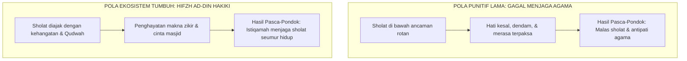

# SUB-BAB 6.4: MENJAGA AGAMA (*HIFZH AD-DIN*): MENUMBUHKAN KEMANISAN IMAN (*HALAWATUL IMAN*) DALAM IBADAH

---

## 1. Puncak Maqashid: Dari Formalitas Absen Menuju Kesadaran Kalbu

Tujuan tertinggi dari berdirinya seluruh pesantren adalah **Hifzh ad-Din (Penjagaan Agama dan Akidah)**. Namun, dalam praksis pengasuhan konvensional, penjagaan agama sering kali mengalami **reduksi formalistik yang kering**:
* Sholat berjamaah diukur semata-mata dari kehadiran fisik di shaf dan centang presensi buku absen.
* Santri dibangunkan dan digiring ke masjid dengan bentakan dan pukulan rotan, sehingga mereka berdiri sholat dalam kondisi dendam, mengantuk berat, dan benci terhadap ibadah itu sendiri.
* Begitu santri lulus dari pondok atau sedang liburan di rumah, mereka seketika meninggalkan sholat berjamaah karena sholat diasosiasikan dengan rasa sakit dan paksaan manusia.

Pendekatan semacam ini secara hakiki telah **gagal menjaga agama (*failed in Hifzh ad-Din*)**. Agama tidak dapat dijaga dengan melahirkan kebencian di dalam hati anak terhadap ibadah. Agama hanya akan lestari manakala anak didik merasakan **Kemanisan Iman (*Halawatul Iman*)** di dalam kalbunya.

Rasulullah SAW bersabda:

> **ثَلَاثٌ مَنْ كُنَّ فِيهِ وَجَدَ حَلَاوَةَ الْإِيمَانِ: أَنْ يَكُونَ اللَّهُ وَرَسُولُهُ أَحَبَّ إِلَيْهِ مِمَّا سِوَاهُمَا، وَأَنْ يُحِبَّ الْمَرْءَ لَا يُحِبُّهُ إِلَّا لِلَّهِ، وَأَنْ يَكْرَهَ أَنْ يَعُودَ فِي الْكُفْرِ كَمَا يَكْرَهُ أَنْ يُقْذَفَ فِي النَّارِ**
> 
> *"Tiga perkara yang barang siapa memilikinya, niscaya ia akan merasakan manisnya iman: Hendaklah Allah dan Rasul-Nya lebih ia cintai daripada selain keduanya; hendaklah ia mencintai seseorang semata-mata karena Allah; dan hendaklah ia benci untuk kembali kepada kekufuran sebagaimana ia benci dilemparkan ke dalam api neraka."* (HR. Al-Bukhari no. 16 dan Muslim no. 43) [^1]

---

## 2. Metodologi Menumbuhkan Kemanisan Ibadah dalam Ekosistem TUMBUH

Ekosistem TUMBUH merancang metodologi pembiasaan ibadah harian yang membangkitkan cinta dan kerinduan batin:

### 1. Pembiasaan dengan Kehadiran Hangat (*The Warm Call to Prayer*)
Musyrif dan pengurus tidak berdiri di ujung lorong dengan tongkat rotan, melainkan berjalan mengetuk pintu kamar santri dengan senyuman, doa keberkahan, dan memanggil mereka sebagai "ksatria fajar yang dicintai Allah".

### 2. Pengajaran Makna Bacaan Sholat (*Tafahhum Ma'ani ash-Shalah*)
Di kelas madrasah (Kurikulum), santri dibimbing membedah makna filosofis dan spiritual dari setiap gerakan serta bacaan sholat (takbir, ruku', sujud, tahiyyat). Santri diajak memahami bahwa sholat adalah momen dialog intim (*munajah*) antara seorang hamba yang lemah dengan Sang Pencipta Yang Maha Pengasih.

### 3. Majelis Halaqah Zikir & Muhasabah Malam yang Menyejukkan
Sebelum tidur, santri berkumpul di kamar asrama untuk membaca doa penutup, mengkaji adab harian, dan muhasabah diri. Suasana spiritual yang syahdu ini menenangkan amigdala dan menghadirkan kedamaian malaikat di dalam asrama.

---

## 3. Penutup Bab 06: Keselarasan Maqashid Syari'ah dalam Pembinaan 24 Jam

Dengan tegaknya empat pilar aksiologis ini—**Hifzh an-Nafs (Keselamatan Jiwa), Hifzh al-'Aql (Kecerdasan Nalar), Hifzh al-'Irdh (Kemuliaan Martabat), dan Hifzh ad-Din (Kemanisan Iman)**—Ekosistem TUMBUH membuktikan bahwa syariat Islam adalah pedoman peradaban yang sempurna: memuliakan kemanusiaan santri di dunia dan menyelamatkan masa depan mereka di akhirat.

---

### 📚 Catatan Kaki & Referensi Akademik:

[^1]: Al-Bukhari, Muhammad bin Isma'il. (2002). *Shahih al-Bukhari*. Riyadh: Darussalam, Kitab *al-Iman*, Hadits no. 16; Muslim bin al-Hajjaj. (2006). *Shahih Muslim*, Kitab *al-Iman*, Hadits no. 43.
[^2]: Al-Ghazali, Abu Hamid Muhammad bin Muhammad. (2004). *Ihya' 'Ulumiddin*. Beirut: Dar al-Kutub al-'Ilmiyyah, Jilid I, Kitab *Asrar ash-Shalah wa Muhimmatuha*, hlm. 195–230.
[^3]: Ibnu Qayyim Al-Jauziyyah, Syamsuddin Muhammad bin Abi Bakr. (2003). *Ash-Shalah wa Hukmu Tarikiha*. Ditahqiq oleh 'Ali Hasan al-Halabi. Kairo: Dar Ibnu 'Affan, hlm. 142–165.
