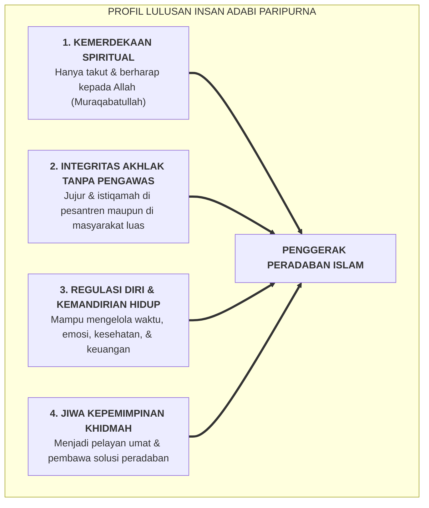

# SUB-BAB 7.1: POTRET PROFIL LULUSAN YANG MERDEKA JIWANYA DAN BERADAB AKHLAKNYA

---

## 1. Visi Akhir Tarbiyah: Melahirkan Insan Adabi Paripurna

Pendidikan pesantren yang berlandaskan Ekosistem TUMBUH tidak bertujuan mencetak individu yang sekadar lulus ujian hafalan atau tunduk secara mekanis di bawah ancaman sanksi. Visi tertinggi yang dituju adalah melahirkan **Insan Adabi**—yaitu manusia yang mengenali hakikat Tuhannya, meletakkan segala sesuatu pada tempatnya yang adil, merdeka dari perbudakan hawa nafsu, dan menjadi rahmat bagi alam semesta.

---

## 2. Karakteristik Utama Santri Lulusan Ekosistem TUMBUH

Santri yang tumbuh dalam ekosistem tanpa kekerasan dan berbasis keteladanan menunjukkan empat ciri keunggulan hidup:

1. **Integritas Otentik (*Authentic Integrity*)**: Santri berbuat baik bukan karena takut dihukum musyrif atau ingin dipuji orang tua, melainkan karena dorongan cinta batin kepada Allah SWT.
2. **Resiliensi Emosional (*Emotional Resilience / Grit*)**: Terbiasa menyelesaikan konflik melalui dialog restoratif dan regulasi diri di Bilik Sakinah, santri tidak mudah putus asa atau reaktif saat menghadapi badai ujian hidup di dunia luar.
3. **Keteraturan Hidup Mandiri (*5S Mindset*)**: Kebiasaan menata tempat tidur, pakaian, dan waktu yang dibina selama bertahun-tahun di asrama membentuk etos keteraturan (*Munazzhamun fi Syu'unih*) yang melekat abadi dalam dunia profesional dan keluarga.
4. **Keteladanan Sosial (*Prosocial Leadership*)**: Sebagai mantan *Peer-Mentors* di jenjang J4, para lulusan membawa semangat *Khadimul Ummah*—siap mengabdi dan membawa manfaat bagi masyarakat di mana pun mereka berada.

---

### 📚 Catatan Kaki & Referensi Akademik:

[^1]: Al-Attas, Syed Muhammad Naquib. (1980). *The Concept of Education in Islam*. Kuala Lumpur: ABIM, hlm. 33–42.
[^2]: Al-Harits Al-Muhasibi. (1986). *Risalah al-Mustarsyidin*. Ditahqiq oleh 'Abdul Fattah Abu Ghuddah. Aleppo: Maktab al-Mathbu'at al-Islamiyyah, hlm. 78–95.
