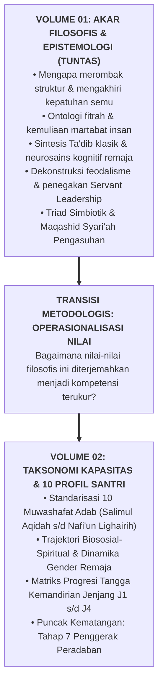

# SUB-BAB 7.2: JEMBATAN KONSEPTUAL MENUJU TAKSONOMI 10 KAPASITAS INSAN (VOLUME 02)

---

## 1. Dari Fondasi Filosofis Menuju Taksonomi Karakter Terapan

Dengan rampungnya pembahasan tujuh bab dalam **Buku Panduan Volume 01**, seluruh fondasi filosofis, teologis, neurobiologis, dan tata kelola Ekosistem TUMBUH telah dipancangkan secara kokoh:

Fondasi filosofis ini bukanlah sekadar teori abstrak, melainkan cetak biru (*blueprint*) yang menuntut operasionalisasi konkret di lapangan. Pertanyaan logis yang muncul berikutnya adalah:
* *Kapasitas adab dan kompetensi apa saja secara spesifik yang harus ditumbuhkan pada diri santri?*
* *Bagaimana tahapan perkembangan anak ditata dari saat ia baru masuk di kelas 7 (Jenjang J1) hingga menjadi pemimpin di kelas 12 (Jenjang J4)?*
* *Bagaimana indikator perilaku nyata untuk setiap karakter agar dapat diobservasi secara objektif?*

Seluruh jawaban operasional ini dijabarkan secara rinci, sistematis, dan komprehensif dalam buku panduan berikutnya: **[Volume 02: Taksonomi Kapasitas & 10 Profil Karakter Santri](file:///c:/xampp/htdocs/tumbuh/BOOK%20Series%202/Volume-02-Taksonomi-Kapasitas-dan-Profil-Santri)**.

---

### 📚 Catatan Kaki & Referensi Akademik:

[^1]: Bloom, B. S. (Ed.). (1956). *Taxonomy of Educational Objectives: The Classification of Educational Goals*. New York: David McKay Company.
[^2]: Al-Attas, Syed Muhammad Naquib. (1995). *Prolegomena to the Metaphysics of Islam: An Exposition of the Fundamental Elements of the Worldview of Islam*. Kuala Lumpur: ISTAC, hlm. 45–68.
