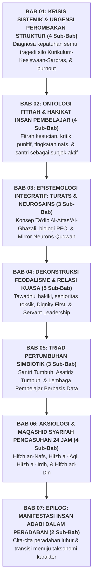

# BUKU PANDUAN VOLUME 01: AKAR FILOSOFIS & EPISTEMOLOGI PENDIDIKAN KARAKTER PESANTREN
## *Memahami Hakikat Fitrah, Integrasi Turats-Neurosains, Dekonstruksi Feodalisme, dan Maqashid Syari'ah Pengasuhan 24 Jam*

---

**Nomor Panduan**: `BOOK-SERIES-2/VOL-01/2026`  
**Sasaran Pembaca**: Kiai, Pengasuh Pondok, Kepala Madrasah, Wakamad, Tim Perumus Kebijakan, Dosen, dan Seluruh Pendidik  
**Dewan Pakar Pengkaji**: Pakar Filosofi TUMBUH, Pakar Epistemologi Turats, Pakar Neurosains Perkembangan, dan Pakar Tata Kelola Qudwah  

---

## 🧭 PETA STRUKTUR & DISTRIBUSI BAB VOLUME 01 (7 BAB ORGANIK)

Volume 01 dirancang dengan struktur berbobot filosofis dan epistemologis mendalam yang membedah akar masalah dan fondasi konseptual:

---

## 📚 DAFTAR LENGKAP BAB DAN SUB-BAB VOLUME 01

### 🏛️ [Bab 01: Krisis Sistemik Pesantren & Urgensi Perombakan Struktur (4 Sub-Bab)](file:///c:/xampp/htdocs/tumbuh/BOOK%20Series%202/Volume-01-Akar-Filosofis-dan-Epistemologi/Bab-01-Krisis-Sistemik-dan-Urgensi-Perombakan-Struktur)
* **Sub-Bab 1.1**: Fenomena Kepatuhan Semu (*Fear-Based Compliance*) & Bifurkasi Karakter Santri
* **Sub-Bab 1.2**: Tragedi Silo Kelembagaan: Kegagalan Integrasi Kurikulum, Kesiswaan, & Sarpras
* **Sub-Bab 1.3**: Sindrom Kelelahan Mental (*Burnout*) Musyrif & Pengasuhan Reaktif
* **Sub-Bab 1.4**: Rekonstruksi Struktur Tata Kelola: Menyatukan Tiga Pilar di Bawah Ekosistem TUMBUH

### 🌿 [Bab 02: Ontologi Fitrah & Hakikat Insan Pembelajar (4 Sub-Bab)](file:///c:/xampp/htdocs/tumbuh/BOOK%20Series%202/Volume-01-Akar-Filosofis-dan-Epistemologi/Bab-02-Ontologi-Fitrah-dan-Hakikat-Insan-Pembelajar)
* **Sub-Bab 2.1**: Doktrin Fitrah Primordial (*Fitrah al-Munazzalah*) & Potensi Kebaikan Santri
* **Sub-Bab 2.2**: Kritik atas Doktrin Punitif & Penegakan Martabat Insan (*Karamah al-Insan*)
* **Sub-Bab 2.3**: Tingkatan Nafs (*Ammarah $\rightarrow$ Lawwamah $\rightarrow$ Muthma'innah*) dalam Pembinaan Karakter
* **Sub-Bab 2.4**: Santri Sebagai Subjek Aktif Peradaban & Implikasinya bagi Pesantren

### 🧠 [Bab 03: Epistemologi Integratif: Sintesis Turats Islam & Neurosains Kognitif (3 Sub-Bab)](file:///c:/xampp/htdocs/tumbuh/BOOK%20Series%202/Volume-01-Akar-Filosofis-dan-Epistemologi/Bab-03-Epistemologi-Integratif-Turats-dan-Neurosains)
* **Sub-Bab 3.1**: Konsep *Ta'dib* Ulama Klasik vs Reduksionisme Pendidikan Modern
* **Sub-Bab 3.2**: Neurosains Kognitif Remaja: Biologi Pematangan PFC, Sistem Limbik, & *Scaffolding*
* **Sub-Bab 3.3**: Konvergensi *Qudwah Hasanah* & *Mirror Neuron System*: Pendidik Sebagai *Living Curriculum*

### 🛡️ [Bab 04: Dekonstruksi Feodalisme, Distorsi Tawadhu', & Rekonstruksi Relasi Kuasa (5 Sub-Bab)](file:///c:/xampp/htdocs/tumbuh/BOOK%20Series%202/Volume-01-Akar-Filosofis-dan-Epistemologi/Bab-04-Dekonstruksi-Feodalisme-dan-Relasi-Kuasa)
* **Sub-Bab 4.1**: Meluruskan Makna Tawadhu': Antara Kerendahan Hati Syar'i dan Inferioritas Tertekan
* **Sub-Bab 4.2**: Anatomi Senioritas Toksik di Asrama dan Tradisi Pelimpahan Hukuman
* **Sub-Bab 4.3**: Prinsip *Dignity First* dan Larangan Mempermalukan Santri di Ruang Publik
* **Sub-Bab 4.4**: Gugurnya Hak Senioritas Menghukum: Mengalihkan Peran Menjadi *Peer-Mentorship*
* **Sub-Bab 4.5**: Transformasi Menuju Kepemimpinan Pelayan (*Servant Leadership / Khadimul Ummah*)

### 🤝 [Bab 05: Triad Pertumbuhan Simbiotik: Santri, Musyrif, dan Lembaga (3 Sub-Bab)](file:///c:/xampp/htdocs/tumbuh/BOOK%20Series%202/Volume-01-Akar-Filosofis-dan-Epistemologi/Bab-05-Triad-Pertumbuhan-Simbiotik)
* **Sub-Bab 5.1**: Mengakhiri *Zero-Sum Game*: Ketertiban Santri Tanpa Mengorbankan Kewarasan Musyrif
* **Sub-Bab 5.2**: Tiga Dimensi Pertumbuhan Simbiotik: Santri Tumbuh, Asatidz Tumbuh, Lembaga Tumbuh
* **Sub-Bab 5.3**: Metrik Keberhasilan Organisasi Pembelajar (*Learning Organization*) Berbasis Data PBIS

### ⚖️ [Bab 06: Aksiologi & Maqashid Syari'ah Pengasuhan 24 Jam (4 Sub-Bab)](file:///c:/xampp/htdocs/tumbuh/BOOK%20Series%202/Volume-01-Akar-Filosofis-dan-Epistemologi/Bab-06-Aksiologi-dan-Maqashid-Syariah-Pengasuhan)
* **Sub-Bab 6.1**: Menjaga Jiwa (*Hifzh an-Nafs*): Standar Keselamatan Fisik, Mental, dan Zero-Violence
* **Sub-Bab 6.2**: Menjaga Akal (*Hifzh al-'Aql*): Eliminasi Stres Kronis Demi Optimalisasi Belajar
* **Sub-Bab 6.3**: Menjaga Kehormatan (*Hifzh al-'Irdh*): Perlindungan Anak dan Etika Kerahasiaan Konseling
* **Sub-Bab 6.4**: Menjaga Agama (*Hifzh ad-Din*): Menumbuhkan Kemanisan Iman (*Halawatul Iman*) dalam Ibadah

### 🌅 [Bab 07: Epilog: Manifestasi Insan Adabi dalam Arsitektur Peradaban (2 Sub-Bab)](file:///c:/xampp/htdocs/tumbuh/BOOK%20Series%202/Volume-01-Akar-Filosofis-dan-Epistemologi/Bab-07-Epilog-Manifestasi-Insan-Adabi)
* **Sub-Bab 7.1**: Potret Profil Lulusan yang Merdeka Jiwanya dan Beradab Akhlaknya
* **Sub-Bab 7.2**: Jembatan Menuju Taksonomi 10 Kapasitas Insan (Volume 02)
