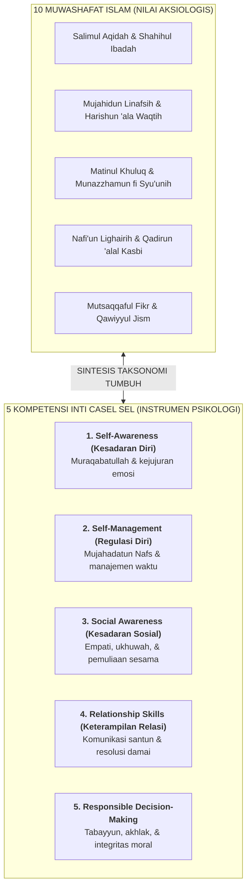

# SUB-BAB 1.1: REKONSTRUKSI TAKSONOMI KARAKTER: SINTESIS *MUWASHAFAT TARBIYAH* & *CASEL SEL*

---

## 1. Titik Temu Taksonomi: Menjembatani Warisan Tarbiyah dan Sains Modern

Dalam dunia pendidikan Islam, rumusan **10 Muwashafat Tarbiyah** (karakteristik kepribadian muslim) yang diwariskan oleh Imam Hasan Al-Banna telah lama menjadi rujukan utama pembinaan generasi muda: *Salimul Aqidah, Shahihul Ibadah, Matinul Khuluq, Qadirun 'alal Kasbi, Mutsaqqaful Fikr, Qawiyyul Jism, Mujahidun Linafsih, Munazzhamun fi Syu'unih, Harishun 'ala Waqtih, dan Nafi'un Lighairih*. [^1]

Namun, dalam praktiknya di banyak pesantren, kesepuluh profil mulia ini kerap berhenti sebagai slogan normatif yang sulit diukur perkembangannya secara objektif di lapangan.

Untuk menjadikannya operasional, Ekosistem TUMBUH melakukan **sintesis metodologis antara 10 Muwashafat Islam dengan kerangka konsensus sains internasional CASEL (Collaborative for Academic, Social, and Emotional Learning)**: [^2]

---

## 2. Matriks Integrasi 10 Muwashafat dengan 5 Kompetensi CASEL SEL

| No | 10 Muwashafat Karakter TUMBUH | Dimensi Kompetensi CASEL SEL | Indikator Perilaku Teramati di Asrama/Madrasah |
|:---:|:---|:---|:---|
| **1** | **Salimul Aqidah** *(Akidah Lurus)* | *Self-Awareness & Moral Identity* | Merasa selalu diawasi Allah (*Muraqabah*); menolak takhayul; tidak sombong saat dipuji. |
| **2** | **Shahihul Ibadah** *(Ibadah Sah & Khusyuk)* | *Self-Management & Spiritual Focus* | Sholat berjamaah tepat waktu; menguasai fiqih thaharah dan sholat sesuai sunnah. |
| **3** | **Matinul Khuluq** *(Akhlak Kokoh & Santun)* | *Relationship Skills & Social Awareness* | Bertutur kata mulia; menolak kata kasar (*fahsya'*); menghormati asatidz dan adik kelas. |
| **4** | **Qadirun 'alal Kasbi** *(Kemandirian Hidup)* | *Responsible Decision-Making* | Mengelola uang saku hemat; merawat barang pribadi; mandiri mencuci dan menata kamar. |
| **5** | **Mutsaqqaful Fikr** *(Intelektual & Kritis)* | *Cognitive Flexibility & Self-Awareness* | Gemar membaca (*Iqra'*); aktif dalam mudzakarah kitab; bertabayyun atas informasi. |
| **6** | **Qawiyyul Jism** *(Kebugaran Fisik)* | *Self-Management & Physical Health* | Disiplin tidur 7 jam; aktif berolahraga; menjaga kebersihan tubuh dan pakaian. |
| **7** | **Mujahidun Linafsih** *(Pengendalian Diri)* | *Self-Management & Emotion Regulation* | Mampu mengendalikan amarah saat tersinggung; sabar menghadapi antrean dan tugas. |
| **8** | **Munazzhamun fi Syu'unih** *(Keteraturan Diri)* | *Executive Function & Organization* | Menata lemari dan kasur standar 5S; memiliki jadwal belajar terstruktur. |
| **9** | **Harishun 'ala Waqtih** *(Manajemen Waktu)* | *Self-Management & Goal-Directed Action* | Tepat waktu di halaqah dan kelas; menghindari prokrastinasi dan obrolan sia-sia (*laghwi*). |
| **10** | **Nafi'un Lighairih** *(Kebermanfaatan/Khidmah)* | *Social Awareness & Relationship Skills* | Inisiatif membantu kawan sakit; aktif piket kamar; menjadi mentor adik asuh (*Peer-Mentor*). |

---

## 3. Manfaat Operasional Integrasi Taksonomi di Pesantren

Penyatuan kerangka ini memberikan tiga keunggulan praktis bagi asatidz dan musyrif:
1. **Bahasa Evaluasi yang Terstandarisasi**: Guru kelas dan pembina asrama memiliki pemahaman yang sama mengenai apa yang dimaksud dengan santri yang "berakhlak mulia" melalui indikator perilaku konkret.
2. **Asesmen yang Objektif & Bebas Subjektivitas**: Pengamatan adab santri tidak lagi bergantung pada "kesan suka/tidak suka" musyrif, melainkan mengacu pada rubrik deskriptif yang terukur.
3. **Penyelarasan Kurikulum Kelas & Asrama**: Nilai-nilai yang diajarkan dalam materi pelajaran akhlak di madrasah langsung dipraktikkan dan diamati instrumennya di lingkungan asrama 24 jam.

---

### 📚 Catatan Kaki & Referensi Akademik:

[^1]: Al-Banna, Hasan. (1992). *Risalah at-Ta'lim*. Kairo: Dar at-Tawzi' wa an-Nasyr al-Islamiyyah, hlm. 12–18.
[^2]: Collaborative for Academic, Social, and Emotional Learning. (2020). *CASEL's SEL Framework: What Are the Core Competence Areas and Where Are They Promoted?* Chicago: CASEL.
[^3]: Durlak, J. A., Weissberg, R. P., Dymnicki, A. B., Taylor, R. D., & Schellinger, K. B. (2011). The impact of enhancing students' social and emotional learning: A meta-analysis of school-based universal interventions. *Child Development*, 82(1), 405–432.
