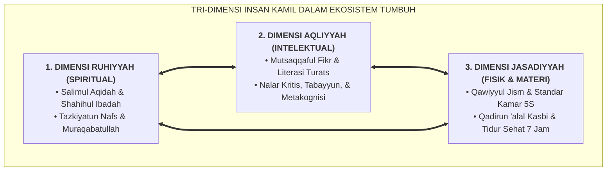

# SUB-BAB 1.2: TRI-DIMENSI INSAN KAMIL: INTEGRASI *JASADIYYAH, AQLIYYAH, & RUHIYYAH*

---

## 1. Menolak Dikotomi Pembinaan Manusia dalam Islam

Pendidikan pesantren konvensional terkadang terjebak dalam ekstremitas pembinaan yang tidak seimbang:
* **Ekstremitas Pertama (Spiritualisme Ekstrem)**: Menekankan ibadah ritual dan tirakat malam hingga mengabaikan hak tidur sehat santri, kebersihan lingkungan, dan gizi fisik. Akibatnya santri mudah sakit, lemas, dan daya tangkap belajarnya lemah.
* **Ekstremitas Kedua (Intelektualisme Kering)**: Menekankan hafalan teks dan nilai ujian semata tanpa menyentuh penyucian hati (*Tazkiyatun Nafs*) dan kepekaan sosial. Akibatnya lahir santri cerdas yang sombong dan berani merendahkan sesamanya.

Dalam epistemologi Islam, manusia adalah kesatuan harmonis yang terdiri atas tiga dimensi: **Ruh (*Ruhiyyah*), Akal (*Aqliyyah*), dan Jasad (*Jasadiyyah*)**. Mengabaikan salah satu dimensi akan merusak keutuhan fitrah insan.

---

## 2. Eksplanasi Keseimbangan Tiga Dimensi Pembinaan

### 🕊️ 1. Dimensi Ruhiyyah (Penyucian Kalbu & Kekokohan Iman)
* **Fokus**: Menghubungkan santri dengan Allah SWT melalui akidah tauhid yang bersih (*Salimul Aqidah*) dan ibadah yang bernyawa (*Shahihul Ibadah*).
* **Praksis di Asrama**: Membiasakan qiyamul lail sukarela, zikir pagi-petang, dan menjaga adab pergaulan islami tanpa paksaan rotan.
* **Dampak**: Memberikan ketenangan batin (*ithmi'nānul qalb*), keikhlasan berbuat baik, dan benteng moral dari kemaksiatan.

### 🧠 2. Dimensi Aqliyyah (Kecerdasan Intelektual & Berpikir Kritis)
* **Fokus**: Mengembangkan kapasitas nalar, logika, dan literasi santri (*Mutsaqqaful Fikr*).
* **Praksis di Madrasah & Asrama**: Membaca literatur klasik (*Kutubut Turats*) dengan metodologi kritis, menguasai sains kontemporer, dan terlatih melakukan verifikasi informasi (*Tabayyun*).
* **Dampak**: Menjadikan santri berwawasan luas, bijaksana dalam mengambil keputusan, dan tidak mudah terprovokasi hoaks atau fanatisme buta.

### 🏋️ 3. Dimensi Jasadiyyah (Kebugaran Fisik, Keteraturan 5S, & Kemandirian)
* **Fokus**: Membangun raga yang kuat, sehat, dan mandiri (*Qawiyyul Jism* dan *Qadirun 'alal Kasbi*).
* **Praksis di Asrama**: Disiplin olahraga beladiri/atletik, menjaga nutrisi bergizi seimbang, merawat kamar standar 5S, dan menjamin hak istirahat sirkadian 7 jam.
* **Dampak**: Memberikan stamina prima untuk menuntut ilmu, ketahanan mental menghadapi kesulitan (*grit*), dan kemandirian hidup tanpa bergantung pada orang lain.

---

## 3. Matriks Dampak Ketimpangan Dimensi Pembinaan

| Pola Pembinaan yang Tidak Seimbang | Manifestasi Perilaku Buruk yang Muncul pada Santri |
| :--- | :--- |
| **Ruhiyyah Kuat, Jasadiyyah Lemah** | Santri tekun berdoa namun kamar tidurnya jorok/berantakan; tubuh sering sakit-sakitan; mudah lelah saat belajar. |
| **Aqliyyah Kuat, Ruhiyyah Lemah** | Santri cerdas menghafal teks namun sombong; suka merendahkan teman; ibadah sholat sering lalai dan masbuk. |
| **Jasadiyyah Kuat, Aqliyyah & Ruhiyyah Lemah** | Santri berotot dan sehat fisik namun kasar; rentan terlibat perkelahian fisik dan perundungan adik kelas di asrama. |
| **Tri-Dimensi Seimbang (TUMBUH)** | **Insan Kamil**: Santri berhati jernih, bernalar tajam, bertubuh sehat, teratur kamarnya, dan santun perilakunya. |

Ekosistem TUMBUH memastikan bahwa jadwal harian 24 jam dirancang proporsional: tidak ada dimensi yang dikorbankan demi dimensi yang lain, sehingga seluruh potensi kemanusiaan santri mekar secara sempurna.

---

### 📚 Catatan Kaki & Referensi Akademik:

[^1]: Al-Ghazali, Abu Hamid Muhammad bin Muhammad. (2004). *Ihya' 'Ulumiddin*. Beirut: Dar al-Kutub al-'Ilmiyyah, Jilid III, Kitab *Riyadhat an-Nafs*, hlm. 55–80.
[^2]: Ibnu Hazm Al-Andalusi, 'Ali bin Ahmad. (2000). *Al-Akhlaq wa as-Siyar fi Mudawat an-Nufus*. Beirut: Dar al-Kutub al-'Ilmiyyah, hlm. 32–48.
[^3]: Gardner, H. (2011). *Frames of Mind: The Theory of Multiple Intelligences*. New York: Basic Books, hlm. 240–265.
