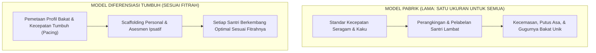

# SUB-BAB 1.3: PRINSIP DIFERENSIASI PEMBELAJARAN BERDASARKAN PACING FITRAH SANTRI

---

## 1. Menolak Model Pabrik: Menghargai Keberagaman Fitrah Santri

Salah satu kelemahan terbesar sistem persekolahan massal konvensional adalah penerapan **model pabrik (*factory model of education*)**—di mana seluruh santri diperlakukan secara seragam, dipaksa belajar dengan kecepatan yang sama (*identical pacing*), dan dinilai dengan alat ukur yang kaku tanpa memedulikan keunikan potensi fitrahnya.

Dalam asrama yang seragam ini:
* Santri yang memiliki kecepatan menghafal Al-Qur'an lebih lambat langsung dicap "bodoh" atau "kurang berkah", padahal ia mungkin memiliki kecerdasan kinestetik, kepekaan sosial, atau ketelitian mekanikal yang luar biasa.
* Santri yang membutuhkan waktu lebih lama untuk beradaptasi dengan ritme asrama dipaksa dengan ancaman, yang akhirnya memicu trauma batin dan *homesickness* akut.

Ekosistem TUMBUH menolak standardisasi kaku ini dan menegakkan **Prinsip Pembelajaran Berdiferensiasi Berbasis Fitrah (*Fitrah-Based Differentiated Learning*)**.

Rasulullah SAW telah mencontohkan diferensiasi pengasuhan ini secara nyata: Beliau tidak pernah memaksakan peran yang sama kepada para sahabatnya:
* **Khalid bin Walid** diarahkan pada ranah kepemimpinan militer (*pedang Allah*).
* **Ibnu Abbas** didoakan dan dibimbing mendalam dalam tafsir Al-Qur'an dan fiqih.
* **Abu Dzar Al-Ghifari** diarahkan pada kezuhudan dan integritas moral, namun dilarang memegang jabatan manajerial publik karena sifat kepribadiannya yang sangat sensitif.
* **Bilal bin Rabah** diamanahi sebagai muazin karena keindahan dan kelantangan suaranya.

---

## 2. Implementasi Prinsip Diferensiasi di Pesantren TUMBUH

Carol Ann Tomlinson merumuskan bahwa diferensiasi pembelajaran mencakup tiga pilar: **Konten (Materi), Proses (Metode Belajar), dan Produk (Hasil Karya)** yang disesuaikan dengan kesiapan (*readiness*), minat (*interest*), dan profil belajar santri. [^1]

Dalam praksis 24 jam Ekosistem TUMBUH, diferensiasi diterapkan melalui:

### 1. Pacing Halaqah Tahfidz & Kitab yang Adaptif
Santri tidak dipaksa mengejar target hafalan yang sama per hari jika kapasitas memori dasarnya berbeda. Pembimbing halaqah menerapkan **Target Berkala Personal**: santri yang mampu menghafal 1 halaman per hari didorong optimal, sementara santri yang berkapasitas setengah halaman didampingi dengan sabar tanpa dicemooh.

### 2. Diferensiasi Program Klub Minat & Bakat (Kesiswaan)
Di sore hari (16:00 - 17:30), santri diberi kebebasan memilih klub pengembangan diri sesuai kecenderungan fitrahnya:
* *Klub Literasi Turats & Jurnalistik* (Kecerdasan Linguistik).
* *Klub Robotik, Koding, & Sains* (Kecerdasan Logis-Matematis).
* *Klub Seni Khat, Kaligrafi, & Desain* (Kecerdasan Spasial-Visual).
* *Klub Olahraga Beladiri & Atletik* (Kecerdasan Kinestetik).
* *Klub Kepanduan & Khidmah Sosial* (Kecerdasan Interpersonal).

### 3. Penilaian Berbasis Pertumbuhan Diri (*Ipsative Baseline*)
Evaluasi kemajuan santri diukur dengan membandingkan capaian dirinya hari ini dengan baseline awalnya saat masuk pondok, bukan dengan merankingnya secara kompetitif terhadap santri lain.

---

## 3. Penutup Bab 01: Fondasi Menuju 10 Muwashafat

Dengan berdirinya arsitektur holistik dan prinsip diferensiasi fitrah ini, seluruh pengasuh memahami bahwa setiap santri adalah permata yang memiliki kilau dan keunikannya masing-masing.

Pada bab selanjutnya, kita akan membedah secara mendalam dan terperinci **sepuluh kapasitas karakter adab (10 Muwashafat) satu per satu**, lengkap dengan indikator perilaku, deskriptor rubrik, dan strategi pembiasaannya dalam **[Bab 02: Profil & Standarisasi 10 Muwashafat Adab (10 Sub-Bab)](file:///c:/xampp/htdocs/tumbuh/BOOK%20Series%202/Volume-02-Taksonomi-Kapasitas-dan-Profil-Santri/README.md)**.

---

### 📚 Catatan Kaki & Referensi Akademik:

[^1]: Tomlinson, C. A. (2014). *The Differentiated Classroom: Responding to the Needs of All Learners* (2nd ed.). Alexandria, VA: ASCD, hlm. 15–40.
[^2]: Ibnu 'Abdil Barr, Yusuf bin 'Abdillah. (1994). *Jami' Bayan al-'Ilm wa Fadhlih*. Ditahqiq oleh Abul Asybal az-Zuhairi. Dammam: Dar Ibnu al-Jauzi, Jilid I, hlm. 120–135.
[^3]: Vygotsky, L. S. (1978). *Mind in Society: The Development of Higher Psychological Processes*. Cambridge, MA: Harvard University Press, hlm. 79–91.
