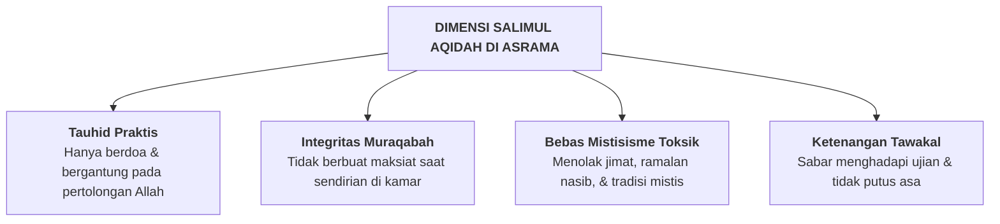

# SUB-BAB 2.1: *SALIMUL AQIDAH* — AKIDAH YANG LURUS, MURNI, & BEBAS KHURAFAT

---

## 1. Definisi Operasional & Landasan Turats

**Salimul Aqidah (سَلِيمُ الْعَقِيدَةِ)** adalah kapasitas keimanan yang kokoh, murni, dan lurus, di mana seorang santri memurnikan tauhid uluhiyyah, rububiyyah, dan asma' wa shifat semata-mata kepada Allah SWT, bersih dari noda syirik, khurafat, tahayul, dan jimat-jimat mistis. [^1]

Allah SWT berfirman:

> **قُلْ إِنَّ صَلَاتِي وَنُسُكِي وَمَحْيَايَ وَمَمَاتِي لِلَّهِ رَبِّ الْعَالَمِينَ ۝ لَا شَرِيكَ لَهُ ۖ وَبِذَٰلِكَ أُمِرْتُ وَأَنَا أَوَّلُ الْمُسْلِمِينَ**
> 
> *"Katakanlah: Sesungguhnya sholatku, ibadahku, hidupku, dan matiku hanyalah untuk Allah, Tuhan semesta alam. Tiada sekutu bagi-Nya; dan demikian itulah yang diperintahkan kepadaku dan aku adalah orang yang pertama-tama menyerahkan diri (kepada Allah)."* (QS. Al-An'am [6]: 162–163) [^2]

Dalam ranah psikologi moral, *Salimul Aqidah* menjadi jangkar identitas moral (*Moral Identity Anchor*): santri menghadirkan perasaan **Muraqabatullah (merasa selalu diawasi oleh Allah)**, sehingga ia memiliki benteng integritas yang kokoh saat berada dalam kesendirian di asrama tanpa pengawasan manusia.

---

## 2. Indikator Perilaku Mikro 24 Jam di Pesantren

* **Perilaku Teramati di Kamar**:
  - Menolak menyimpan rajah, jimat kekebalan, atau benda-benda mistis di lemari pakaian.
  - Membaca doa ma'tsurat pagi dan petang sebagai pelindung syar'i.
  - Menghindari kepanikan berlebihan atau cerita mistis tahayul yang menakut-nakuti santri yunior di asrama.
* **Perilaku Teramati di Madrasah**:
  - Mengaitkan fenomena sains alam dengan kebesaran ciptaan Allah SWT (*Ayat Kauniyyah*).
  - Berani bersikap jujur dalam ujian akademik karena meyakini Allah Maha Melihat.

---

## 3. Rubrik Perkembangan 4-Level PBIS untuk *Salimul Aqidah*

| Level 1: Perlu Bimbingan | Level 2: Berkembang | Level 3: Mandiri & Cakap | Level 4: Teladan (Qudwah) |
| :--- | :--- | :--- | :--- |
| Masih mempercayai mitos/tahayul asrama; jujur hanya jika diawasi musyrif. | Mulai memahami tauhid; sesekali masih takut pada mitos mistis kamar. | Istiqamah menjaga muraqabah; tidak berbuat curang meski sendirian; bebas jimat. | Menjadi penenang kawan saat takut; aktif mengajak zikir ma'tsurat; teladan tauhid. |

---

### 📚 Catatan Kaki & Referensi Akademik:

[^1]: Al-Banna, Hasan. (1992). *Majmu'ah ar-Rasa'il*. Kairo: Dar at-Tawzi' wa an-Nasyr al-Islamiyyah, hlm. 245–250.
[^2]: Tafsir Ibnu Katsir. (2000). *Tafsir Al-Qur'an al-'Azhim*. Riyadh: Dar Thayyibah, Jilid III, hlm. 385–388.
[^3]: Hardy, S. A., & Carlo, G. (2011). Moral identity: What is it, how does it develop, and does it explain moral action? *Child Development Perspectives*, 5(3), 212–218.
