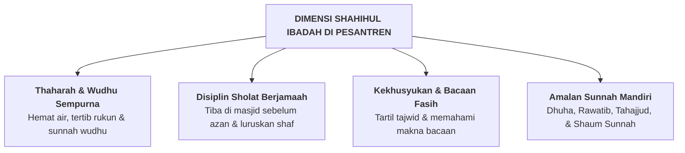

# SUB-BAB 2.2: *SHAHIHUL IBADAH* — IBADAH YANG SAH SESUAI SUNNAH & BERNYAWA

---

## 1. Definisi Operasional & Landasan Turats

**Shahihul Ibadah (صَحِيحُ الْعِبَادَةِ)** adalah kapasitas santri untuk menjalankan seluruh rangkaian ibadah mahdhah—khususnya thaharah, wudhu, sholat lima waktu, puasa, dan tilawah Al-Qur'an—secara benar dan sah sesuai kaidah fiqih madzhab dan Sunnah Nabawiyyah, yang diiringi dengan kehadiran hati (*khusyuk*) dan keikhlasan niat. [^1]

Rasulullah SAW bersabda:

> **صَلُّوا كَمَا رَأَيْتُمُونِي أُصَلِّي**
> 
> *"Sholatlah kalian sebagaimana kalian melihat aku sholat."* (HR. Al-Bukhari no. 631) [^2]

*Shahihul Ibadah* bukan sekadar gerakan mekanis raga, melainkan sebuah bentuk **regulasi atensi dan spiritualitas (*Spiritual Self-Management*)** yang menghubungkan ketertiban lahiriah fikih dengan kedalaman batin tasawuf.

---

## 2. Indikator Perilaku Mikro 24 Jam di Pesantren

* **Perilaku Teramati di Tempat Wudhu & Masjid**:
  - Berwudhu dengan hemat air (tidak membuka kran terlalu deras) sesuai Sunnah, menyempurnakan basuhan anggota wudhu (*isbaghul wudhu'*).
  - Merapikan sandal di rak luar masjid dan melangkah masuk dengan kaki kanan serta membaca doa.
  - Mengisi shaf terdepan secara rapat dan lurus tanpa saling dorong.
  - Membaca zikir ba'da sholat dengan tenang dan tidak terburu-buru lari keluar masjid.

---

## 3. Rubrik Perkembangan 4-Level PBIS untuk *Shahihul Ibadah*

| Level 1: Perlu Bimbingan | Level 2: Berkembang | Level 3: Mandiri & Cakap | Level 4: Teladan (Qudwah) |
| :--- | :--- | :--- | :--- |
| Wudhu tergesa-gesa (banyak rukun terlewat); sering masbuk sholat; butuh dibangunkan berkali-kali. | Wudhu sah; sholat tepat waktu jika diingatkan musyrif; bacaan sholat lancar. | Wudhu sempurna hemat air; istiqamah shaf awal mandiri; menjaga sholat rawatib. | Menjadi muazin/imam rawatib; membimbing tahsin adik asuh; khusyuk dan tenang. |

---

### 📚 Catatan Kaki & Referensi Akademik:

[^1]: Al-Jaza'iri, Abu Bakr Jabir. (2002). *Minhaj al-Muslim: Kitab 'Aqa'id wa Adab wa Akhlaq wa 'Ibadat*. Kairo: Maktabah al-Iman, hlm. 180–215.
[^2]: Al-Bukhari, Muhammad bin Isma'il. (2002). *Shahih al-Bukhari*. Riyadh: Darussalam, Kitab *al-Adzan*, Hadits no. 631.
[^3]: Koenig, H. G. (2012). Religion, spirituality, and health: The research and clinical implications. *ISRN Psychiatry*, 2012, 1–33.
