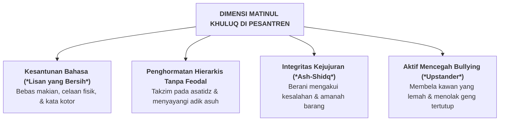

# SUB-BAB 2.3: *MATINUL KHULUQ* — AKHLAK MULIA, SANTUN, & BEBAS PERUNDUNGAN

---

## 1. Definisi Operasional & Landasan Turats

**Matinul Khuluq (مَتِينُ الْخُلُقِ)** adalah kapasitas keutamaan akhlak yang kokoh, mulia, dan stabil, yang tecermin dalam kesantunan tutur kata, kehalusan budi pekerti, kejujuran perbuatan, dan penghormatan tulus kepada sesama makhluk, serta penolakan mutlak terhadap segala bentuk kekerasan, caci maki, dan perundungan (*bullying*). [^1]

Rasulullah SAW menegaskan misi utama pengutusan beliau ke muka bumi:

> **إِنَّمَا بُعِثْتُ لِأُتَمِّمَ صَالِحَ الْأَخْلَاقِ**
> 
> *"Sesungguhnya aku hanyalah diutus untuk menyempurnakan kemuliaan akhlak."* (HR. Ahmad no. 8952 dan Al-Bukhari dalam *Al-Adab al-Mufrad* no. 273, sanad shahih) [^2]

Dalam kerangka CASEL SEL, *Matinul Khuluq* mencakup integrasi antara **Social Awareness (Kesadaran Sosial & Empati)** dan **Relationship Skills (Keterampilan Membina Hubungan Sehat)**. Santri yang memiliki akhlak kokoh mampu mengelola interaksi sosial secara asertif, damai, dan saling memuliakan (*Dignity-Honoring*).

---

## 2. Indikator Perilaku Mikro 24 Jam di Pesantren

* **Perilaku Teramati di Kamar & Lingkungan Asrama**:
  - Menggunakan bahasa santun (Bahasa Arab/Inggris resmi atau Bahasa Indonesia baku yang sopan) dan menolak kata-kata umpatan atau sarkasme.
  - Mengetuk pintu dan mengucapkan salam sebelum masuk ke kamar kawan atau kantor pengasuh.
  - Tidak mengambil barang milik kawan sekamar (sabun, odol, sandal) tanpa izin yang jelas (*ghasab*).
  - Berani menegur kawan sekamar yang mulai mengejek kekurangan fisik santri lain secara halus dan santun.

---

## 3. Rubrik Perkembangan 4-Level PBIS untuk *Matinul Khuluq*

| Level 1: Perlu Bimbingan | Level 2: Berkembang | Level 3: Mandiri & Cakap | Level 4: Teladan (Qudwah) |
| :--- | :--- | :--- | :--- |
| Sering memaki/mengejek kawan; ghasab barang; reaktif dan mudah memicu perkelahian. | Berbahasa sopan saat ada guru; sesekali masih mengejek; mau meminta maaf jika ditegur. | Konsisten bertutur kata mulia; amanah barang; menghargai adik kelas; bebas ghasab. | Menjadi penengah damai saat kawan berkonflik; pembela kawan yang dikucilkan; teladan adab. |

---

### 📚 Catatan Kaki & Referensi Akademik:

[^1]: Al-Ghazali, Abu Hamid Muhammad bin Muhammad. (2004). *Ihya' 'Ulumiddin*. Beirut: Dar al-Kutub al-'Ilmiyyah, Jilid III, Kitab *Bayan 'Ilaj Amradh al-Qalb*, hlm. 58–75.
[^2]: Al-Bukhari, Muhammad bin Isma'il. (1989). *Al-Adab al-Mufrad*. Ditahqiq oleh Muhammad Fu'ad 'Abdul Baqi. Kairo: Dar al-Bashir, Hadits no. 273.
[^3]: Eisenberg, N., Fabes, R. A., & Spinrad, T. L. (2006). Prosocial development. Dalam N. Eisenberg, W. Damon, & R. M. Lerner (Eds.), *Handbook of Child Psychology: Vol. 3. Social, Emotional, and Personality Development* (6th ed.). Hoboken, NJ: John Wiley & Sons, hlm. 646–718.
