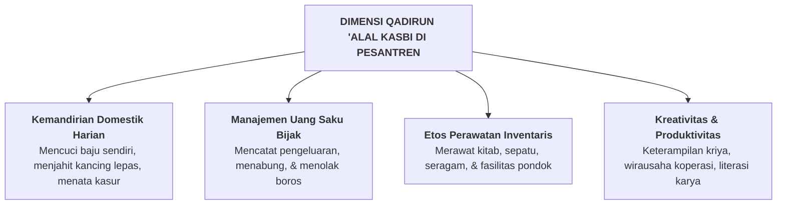

# SUB-BAB 2.4: *QADIRUN 'ALAL KASBI* — KEMANDIRIAN HIDUP, ETOS KERJA, & KETERAMPILAN FINANSIAL

---

## 1. Definisi Operasional & Landasan Turats

**Qadirun 'alal Kasbi (قَادِرٌ عَلَى الْكَسْبِ)** adalah kapasitas kemandirian hidup, etos kerja keras (*work ethic*), keterampilan teknis praktis (*life skills*), serta kemampuan mengelola keuangan secara hemat, bijak, dan bertanggung jawab, sehingga seorang santri mampu berdiri di atas kaki sendiri tanpa menjadi beban finansial atau sosial bagi orang lain. [^1]

Rasulullah SAW memuji orang yang mandiri dari hasil jerih payahnya sendiri:

> **مَا أَكَلَ أَحَدٌ طَعَامًا قَطُّ خَيْرًا مِنْ أَنْ يَأْكُلَ مِنْ عَمَلِ يَدِهِ، وَإِنَّ نَبِيَّ اللَّهِ دَاوُدَ عَلَيْهِ السَّلَامُ كَانَ يَأْكُلُ مِنْ عَمَلِ يَدِهِ**
> 
> *"Tidaklah seseorang memakan makanan yang lebih baik daripada makanan yang dihasilkan dari jerih payah tangannya sendiri. Dan sesungguhnya Nabi Allah Dawud 'alaihissalam dahulu makan dari hasil kerja tangannya sendiri."* (HR. Al-Bukhari no. 2072) [^2]

Dalam ranah psikologi perkembangan, kemandirian fungsional (*Functional Autonomy*) melatih santri memiliki rasa berdaya (*Self-Efficacy*), menghargai tetesan keringat orang tua, dan memupuk jiwa kewirausahaan sosial (*social entrepreneurship*).

---

## 2. Indikator Perilaku Mikro 24 Jam di Pesantren

* **Perilaku Teramati di Asrama & Koperasi Pesantren**:
  - Mencuci dan menyetrika pakaian seragam madrasah secara mandiri tanpa menyuruh santri yunior.
  - Memanfaatkan uang saku bulanan secara hemat (mengalokasikan untuk infak, tabungan, dan kebutuhan primer).
  - Merawat buku dan kitab kuning dengan sampul rapi dan tidak membiarkannya robek atau basah.
  - Terlibat aktif dalam unit produksi pondok (misal: pengelolaan koperasi santri, hidroponik, atau pembuatan karya desain).

---

## 3. Rubrik Perkembangan 4-Level PBIS untuk *Qadirun 'alal Kasbi*

| Level 1: Perlu Bimbingan | Level 2: Berkembang | Level 3: Mandiri & Cakap | Level 4: Teladan (Qudwah) |
| :--- | :--- | :--- | :--- |
| Uang saku habis di awal bulan; pakaian kotor menumpuk; menyuruh adik kelas mencuci. | Mulai mencuci sendiri jika ditegur; uang saku cukup sebulan; sesekali boros di kantin. | Mandiri mencuci & merapikan barang; mencatat pengeluaran keuangan; hemat & suka infak. | Terampil memperbaiki fasilitas rusak; menginisiasi proyek usaha kreatif; melatih adik kelas. |

---

### 📚 Catatan Kaki & Referensi Akademik:

[^1]: Al-Banna, Hasan. (1992). *Risalah at-Ta'lim*. Kairo: Dar at-Tawzi' wa an-Nasyr al-Islamiyyah, hlm. 14.
[^2]: Al-Bukhari, Muhammad bin Isma'il. (2002). *Shahih al-Bukhari*. Riyadh: Darussalam, Kitab *al-Buyu'*, Hadits no. 2072.
[^3]: Bandura, A. (1997). *Self-Efficacy: The Exercise of Control*. New York: W. H. Freeman, hlm. 36–60.
