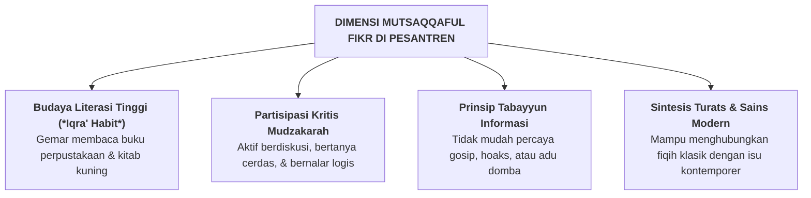

# SUB-BAB 2.5: *MUTSAQQAFUL FIKR* — WAWASAN INTELEKTUAL LUAS, IQRA', & BERPIKIR KRITIS

---

## 1. Definisi Operasional & Landasan Turats

**Mutsaqqaful Fikr (مُثَقَّفُ الْفِكْرِ)** adalah kapasitas intelektual yang tajam, berwawasan luas, gemar membaca (*Iqra'*), memiliki penguasaan mendalam atas khazanah Turats Islam dan sains kontemporer, serta memiliki kemampuan berpikir kritis, logis, dan analitis yang berlandaskan prinsip *Tabayyun* (verifikasi kebenaran). [^1]

Allah SWT berfirman:

> **يَرْفَعِ اللَّهُ الَّذِينَ آمَنُوا مِنكُمْ وَالَّذِينَ أُوتُوا الْعِلْمَ دَرَجَاتٍ**
> 
> *"Niscaya Allah akan meninggikan orang-orang yang beriman di antaramu dan orang-orang yang diberi ilmu pengetahuan beberapa derajat."* (QS. Al-Mujadilah [58]: 11) [^2]

Allah SWT juga memerintahkan verifikasi ilmiah dalam memproses informasi:

> **يَا أَيُّهَا الَّذِينَ آمَنُوا إِن جَاءَكُمْ فَاسِقٌ بِنَبَإٍ فَتَبَيَّنُوا أَن تُصِيبُوا قَوْمًا بِجَهَالَةٍ فَتُصْبِحُوا عَلَىٰ مَا فَعَلْتُمْ نَادِمِينَ**
> 
> *"Wahai orang-orang yang beriman! Jika seseorang yang fasik datang kepadamu membawa suatu berita, maka bertabayyunlah (telitilah kebenarannya), agar kamu tidak mencelakakan suatu kaum karena kebodohan (kecerobohan) yang akhirnya kamu menyesali perbuatanmu itu."* (QS. Al-Hujurat [49]: 6) [^3]

Dalam psikologi kognitif (*Cognitive Psychology*), *Mutsaqqaful Fikr* mencerminkan **Higher-Order Thinking Skills (HOTS)**—meliputi analisis kritis, sintesis gagasan, evaluasi bukti, dan metakognisi.

---

## 2. Indikator Perilaku Mikro 24 Jam di Pesantren

* **Perilaku Teramati di Madrasah & Perpustakaan**:
  - Mengisi waktu luang dengan membaca buku di perpustakaan atau mudzakarah kitab bersama kawan.
  - Berani mengajukan pertanyaan reflektif kepada guru di kelas tanpa rasa takut atau malu.
  - Memeriksa kebenaran kabar sebelum menyebarkannya di lingkungan asrama (*anti-hoax*).
  - Mampu menulis karya ilmiah sederhana, esai adab, atau resensi kitab dengan bahasa yang runtut dan berbobot.

---

## 3. Rubrik Perkembangan 4-Level PBIS untuk *Mutsaqqaful Fikr*

| Level 1: Perlu Bimbingan | Level 2: Berkembang | Level 3: Mandiri & Cakap | Level 4: Teladan (Qudwah) |
| :--- | :--- | :--- | :--- |
| Pasif saat belajar; menolak membaca buku selain LKS; mudah termakan gosip kamar. | Belajar saat menjelang ujian; membaca jika ditugaskan; mulai bertanya di kelas. | Gemar membaca mandiri; aktif dalam diskusi mudzakarah; bertabayyun atas kabar. | Menginisiasi klub literasi; menulis artikel bermutu; membimbing riset kawan sebaya. |

---

### 📚 Catatan Kaki & Referensi Akademik:

[^1]: Al-Banna, Hasan. (1992). *Risalah at-Ta'lim*. Kairo: Dar at-Tawzi' wa an-Nasyr al-Islamiyyah, hlm. 13.
[^2]: Tafsir Ibnu Katsir. (2000). *Tafsir Al-Qur'an al-'Azhim*. Riyadh: Dar Thayyibah, Jilid VIII, hlm. 55–60.
[^3]: Al-Qurthubi, Abu 'Abdillah Muhammad bin Ahmad. (2006). *Al-Jami' li Ahkam al-Qur'an*. Kairo: Dar al-Kutub al-Mishriyyah, Jilid XVI, hlm. 310–318.
[^4]: Paul, R., & Elder, L. (2019). *The Miniature Guide to Critical Thinking: Concepts and Tools* (8th ed.). Lanham, MD: Rowman & Littlefield.
