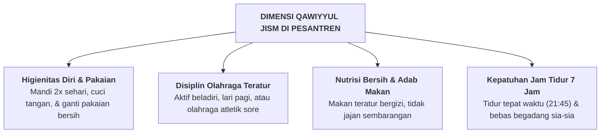

# SUB-BAB 2.6: *QAWIYYUL JISM* — KEBUGARAN FISIK, NUTRISI BERSIH, & POLA HIDUP SEHAT

---

## 1. Definisi Operasional & Landasan Turats

**Qawiyyul Jism (قَوِيُّ الْجِسْمِ)** adalah kapasitas kebugaran fisik, stamina prima, daya tahan tubuh (*physical endurance*), higienitas diri yang tinggi, serta kedisiplinan menjalankan pola hidup sehat (nutrisi seimbang, olahraga teratur, dan istirahat sirkadian cukup), sebagai sarana pendukung ibadah dan penuntutan ilmu. [^1]

Rasulullah SAW bersabda:

> **الْمُؤْمِنُ الْقَوِيُّ خَيْرٌ وَأَحَبُّ إِلَى اللَّهِ مِنَ الْمُؤْمِنِ الضَّعِيفِ، وَفِي كُلٍّ خَيْرٌ**
> 
> *"Orang mukmin yang kuat (fisik, iman, dan akalnya) lebih baik dan lebih dicintai oleh Allah daripada orang mukmin yang lemah, namun pada masing-masingnya terdapat kebaikan."* (HR. Muslim no. 2664) [^2]

Dalam ranah kesehatan remaja pesantren, *Qawiyyul Jism* menolak budaya asrama yang kumuh, penyakit kulit (*scabies*) yang dianggap wajar, atau begadang tak teratur. Raga santri adalah amanah suci yang wajib dirawat (*Hifzh an-Nafs*).

---

## 2. Indikator Perilaku Mikro 24 Jam di Pesantren

* **Perilaku Teramati di Lapangan & Kamar Mandi**:
  - Mandi tertib dua kali sehari dengan sabun dan mengeringkan handuk di tali jemuran luar yang terkena sinar matahari (bukan digantung di dalam kamar).
  - Mengikuti kegiatan senam pagi atau latihan beladiri sore (16:00 - 17:00) dengan antusias.
  - Memotong kuku secara rutin setiap hari Jumat dan menjaga kebersihan rambut serta gigi.
  - Segera melapor ke Poskestren jika merasakan gejala demam atau sakit agar tidak menular ke kawan sekamar.

---

## 3. Rubrik Perkembangan 4-Level PBIS untuk *Qawiyyul Jism*

| Level 1: Perlu Bimbingan | Level 2: Berkembang | Level 3: Mandiri & Cakap | Level 4: Teladan (Qudwah) |
| :--- | :--- | :--- | :--- |
| Malas mandi; handuk basah ditumpuk di kasur; sering begadang; mudah sakit. | Mandi teratur jika disuruh; sesekali berolahraga; tidur tepat waktu saat diawasi. | Mandiri menjaga kebersihan diri & kasur 5S; aktif berolahraga sore; bugar dan sehat. | Menjadi instruktur senam/olahraga; pelopor budaya sanitasi sehat; fisik sangat tangguh. |

---

### 📚 Catatan Kaki & Referensi Akademik:

[^1]: Al-Banna, Hasan. (1992). *Risalah at-Ta'lim*. Kairo: Dar at-Tawzi' wa an-Nasyr al-Islamiyyah, hlm. 13.
[^2]: Muslim bin al-Hajjaj. (2006). *Shahih Muslim*. Riyadh: Dar Thayyibah, Kitab *al-Qadar*, Hadits no. 2664.
[^3]: Sallis, J. F., et al. (2012). Physical activity in relation to mental health and academic performance in youth. *Lancet*, 380(9838), 247–257.
