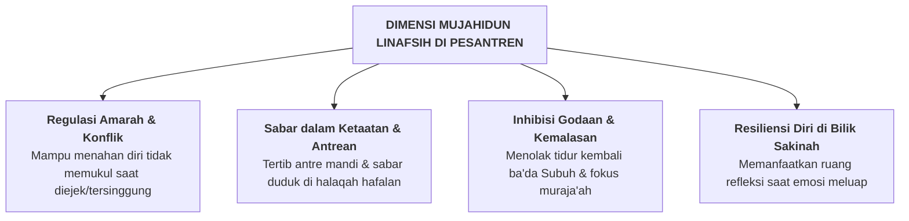

# SUB-BAB 2.7: *MUJAHIDUN LINAFSIH* — PENGENDALIAN DIRI, SABAR, & MANAJEMEN EMOSI

---

## 1. Definisi Operasional & Landasan Turats

**Mujahidun Linafsih (مُجَاهِدٌ لِنَفْسِهِ)** adalah kapasitas pengendalian diri (*self-control*), regulasi emosi (*emotion regulation*), ketahanan terhadap frustrasi (*frustration tolerance*), dan kegigihan batin (*Mujahadatun Nafs*) dalam menundukkan dorongan hawa nafsu primitif, amarah yang meledak, dan godaan kemalasan, demi menegakkan kepatuhan syar'i. [^1]

Rasulullah SAW bersabda menegaskan hakikat kesatria sejati:

> **لَيْسَ الشَّدِيدُ بِالصُّرَعَةِ، إِنَّمَا الشَّدِيدُ الَّذِي يَمْلِكُ نَفْسَهُ عِنْدَ الْغَضَبِ**
> 
> *"Bukanlah orang yang kuat itu orang yang pandai bergulat (secara fisik); sesungguhnya orang yang kuat itu adalah orang yang mampu mengendalikan dirinya tatkala sedang marah."* (HR. Al-Bukhari no. 6114 dan Muslim no. 2609) [^2]

Dalam neurosains kognitif, *Mujahidun Linafsih* adalah manifestasi dari kematangan fungsi eksekutif **Prefrontal Cortex (PFC)** dalam melakukan inhibisi (*response inhibition*) terhadap dorongan agresif sistem limbik/amigdala.

---

## 2. Indikator Perilaku Mikro 24 Jam di Pesantren

* **Perilaku Teramati di Asrama & Kelas**:
  - Menerapkan teknik menenangkan diri (*Take-a-Break* atau berwudhu) saat merasa emosinya mulai memuncak.
  - Sabar menunggu giliran di kamar mandi atau antrean makan tanpa menyerobot (*no line cutting*).
  - Melawan rasa kantuk di kelas dengan mengambil wudhu secara mandiri.
  - Mampu menahan diri dari godaan berbicara saat ustadz sedang membacakan kitab di majelis.

---

## 3. Rubrik Perkembangan 4-Level PBIS untuk *Mujahidun Linafsih*

| Level 1: Perlu Bimbingan | Level 2: Berkembang | Level 3: Mandiri & Cakap | Level 4: Teladan (Qudwah) |
| :--- | :--- | :--- | :--- |
| Mudah meledak amarahnya; menyerobot antrean; membanting pintu saat kesal; sering merajuk. | Mampu menahan marah jika diingatkan kawan; sesekali masih menggerutu saat antre. | Mampu meregulasi emosi mandiri; sabar antre; mempraktikkan sunnah wudhu saat marah. | Menjadi penenang kawan yang emosi; sangat sabar dalam tekanan; teladan mujahadah nafs. |

---

### 📚 Catatan Kaki & Referensi Akademik:

[^1]: Al-Ghazali, Abu Hamid Muhammad bin Muhammad. (2004). *Ihya' 'Ulumiddin*. Beirut: Dar al-Kutub al-'Ilmiyyah, Jilid III, Kitab *Kasyr asy-Syahwatain*, hlm. 95–115.
[^2]: Al-Bukhari, Muhammad bin Isma'il. (2002). *Shahih al-Bukhari*. Riyadh: Darussalam, Kitab *al-Adab*, Hadits no. 6114; Muslim bin al-Hajjaj. (2006). *Shahih Muslim*, Kitab *al-Birr*, Hadits no. 2609.
[^3]: Baumeister, R. F., & Tierney, J. (2011). *Willpower: Rediscovering the Greatest Human Strength*. New York: Penguin Press, hlm. 45–70.
