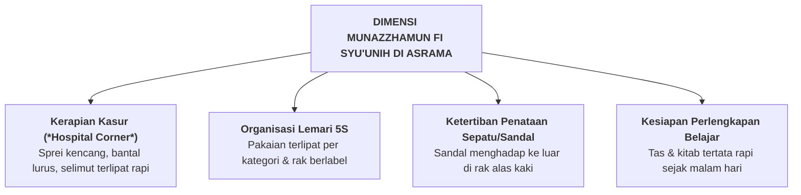

# SUB-BAB 2.8: *MUNAZZHAMUN FI SYU'UNIH* — KETERATURAN MANAJEMEN DIRI & BUDAYA 5S

---

## 1. Definisi Operasional & Landasan Turats

**Munazzhamun fi Syu'unih (مُنَظَّمٌ فِي شُؤُونِهِ)** adalah kapasitas keteraturan, kerapian sistemik, disiplin organisasi diri, serta pembudayaan tata kelola lingkungan fisik (*environmental orderliness*) berbasis metodologi 5S (*Seiri/Ringkas, Seiton/Rapi, Seiso/Resik, Seiketsu/Rawat, Shitsuke/Rajin*), yang mencerminkan ketertiban batin seorang mukmin. [^1]

Imam Ali bin Abi Thalib RA menyampaikan wasiat terakhirnya yang masyhur:

> **أُوصِيكُمَا وَجَمِيعَ وَلَدِي وَأَهْلِي وَمَنْ بَلَغَهُ كِتَابِي بِتَقْوَى اللَّهِ وَنَظْمِ أَمْرِكُمْ**
> 
> *"Aku berwasiat kepada kalian berdua, kepada seluruh anak-anakku, keluargaku, dan siapa saja yang sampai suratku ini kepadanya: Hendaklah kalian senantiasa bertakwa kepada Allah dan menjaga keteraturan dalam segala urusan kalian (*nazhmi amrikum*)."* [^2]

Dalam kognisi spasial, keteraturan fisik lingkungan hidup berdampak langsung pada kejernihan pikiran (*mental clarity*). Santri yang hidup dalam kamar yang teratur memiliki tingkat stres yang jauh lebih rendah dan daya fokus belajar yang jauh lebih tinggi.

---

## 2. Indikator Perilaku Mikro 24 Jam di Pesantren

* **Perilaku Teramati di Kamar Tidur Santri**:
  - Bangun tidur langsung menarik sprei kasur hingga kencang tanpa kerutan (*hospital corner*) dan melipat selimut secara simetris.
  - Menata isi lemari pakaian sesuai zona (baju madrasah digantung, pakaian harian dilipat, perlengkapan mandi dalam keranjang khusus).
  - Meletakkan sepatu dan sandal di rak alas kaki kamar dengan moncong sepatu menghadap ke luar.
  - Membuang sampah pada tempatnya sesuai pemilahan organik dan anorganik.

---

## 3. Rubrik Perkembangan 4-Level PBIS untuk *Munazzhamun fi Syu'unih*

| Level 1: Perlu Bimbingan | Level 2: Berkembang | Level 3: Mandiri & Cakap | Level 4: Teladan (Qudwah) |
| :--- | :--- | :--- | :--- |
| Kasur berantakan; pakaian kotor tercecer di lantai; isi lemari acak-acakan; sandal berserak. | Merapikan kasur jika diingatkan; lemari cukup tertata; sandal ditaruh di rak saat diawasi. | Mandiri menerapkan standar kasur & lemari 5S setiap hari; sandal tertata rapi; disiplin barang. | Menjadi auditor inspeksi kamar 5S; melatih adik asuh menata lemari; teladan kerapian. |

---

### 📚 Catatan Kaki & Referensi Akademik:

[^1]: Al-Banna, Hasan. (1992). *Risalah at-Ta'lim*. Kairo: Dar at-Tawzi' wa an-Nasyr al-Islamiyyah, hlm. 14.
[^2]: Asy-Syarif Ar-Radhi. (1998). *Nahj al-Balaghah*. Ditahqiq oleh Dr. Subhi ash-Shalih. Beirut: Dar al-Kitab al-Lubnani, Wasiat no. 47, hlm. 421.
[^3]: Imai, M. (1997). *Gemba Kaizen: A Commonsense, Low-Cost Approach to Management*. New York: McGraw-Hill, hlm. 65–88.
