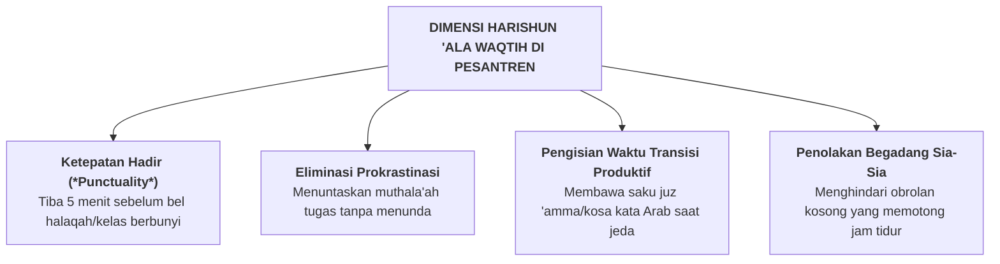

# SUB-BAB 2.9: *HARISHUN 'ALA WAQTIH* — PENJAGAAN WAKTU, DISIPLIN JADWAL, & ANTI-PROKRASTINASI

---

## 1. Definisi Operasional & Landasan Turats

**Harishun 'ala Waqtih (حَرِيصٌ عَلَى وَقْتِهِ)** adalah kapasitas penghargaan tinggi terhadap umur dan waktu, ketepatan jadwal (*punctuality*), kemampuan manajemen agenda (*time management*), serta tekad kuat untuk menghindari prokrastinasi (menunda-nunda tugas) dan obrolan sia-sia (*laghwi*), demi mengoptimalkan setiap detik usia untuk ibadah dan kemanfaatan ilmu. [^1]

Rasulullah SAW bersabda mengingatkan nikmat waktu yang kerap disia-siakan:

> **نِعْمَتَانِ مَغْبُونٌ فِيهِمَا كَثِيرٌ مِنَ النَّاسِ: الصِّحَّةُ وَالْفَرَاغُ**
> 
> *"Dua nikmat yang banyak manusia tertipu (merugi) di dalam keduanya: yaitu nikmat kesehatan dan nikmat waktu luang."* (HR. Al-Bukhari no. 6412) [^2]

Imam Hasan Al-Bashri (w. 110 H) menegaskan hakikat waktu bagi seorang insan: *"Wahai anak cucu Adam, sesungguhnya engkau hanyalah kumpulan hari-hari; setiap kali satu hari berlalu, maka hilanglah sebagian dari dirimu."* [^3]

---

## 2. Indikator Perilaku Mikro 24 Jam di Pesantren

* **Perilaku Teramati di Madrasah & Asrama**:
  - Bersegera melangkah saat mendengar bel panggilan halaqah tanpa menunggu dijemput musyrif.
  - Memanfaatkan waktu luang 15 menit sebelum sholat untuk membaca hafalan Al-Qur'an (*muraja'ah mandiri*).
  - Menyelesaikan tugas rangkuman kitab tepat waktu sesuai tenggat.
  - Memadamkan lampu tepat waktu pada pukul 21:45 dan langsung beristirahat tanpa mengobrol larut malam.

---

## 3. Rubrik Perkembangan 4-Level PBIS untuk *Harishun 'ala Waqtih*

| Level 1: Perlu Bimbingan | Level 2: Berkembang | Level 3: Mandiri & Cakap | Level 4: Teladan (Qudwah) |
| :--- | :--- | :--- | :--- |
| Sering terlambat halaqah/kelas; menunda tugas hingga malam larut; suka begadang ngobrol. | Tepat waktu jika diawasi musyrif; mengerjakan tugas menjelang deadline; tidur saat ditegur. | Konsisten hadir lebih awal mandiri; menuntaskan tugas terencana; disiplin jam tidur 7 jam. | Menjadi koordinator waktu halaqah; sangat produktif; teladan dalam efisiensi usia. |

---

### 📚 Catatan Kaki & Referensi Akademik:

[^1]: Al-Banna, Hasan. (1992). *Risalah at-Ta'lim*. Kairo: Dar at-Tawzi' wa an-Nasyr al-Islamiyyah, hlm. 14.
[^2]: Al-Bukhari, Muhammad bin Isma'il. (2002). *Shahih al-Bukhari*. Riyadh: Darussalam, Kitab *ar-Riqaq*, Hadits no. 6412.
[^3]: Abu Nu'aim Al-Ashbahani. (1996). *Hilyat al-Auliya' wa Thabaqat al-Ashfiya'*. Beirut: Dar al-Kutub al-'Ilmiyyah, Jilid II, hlm. 148.
[^4]: Covey, S. R. (2004). *The 7 Habits of Highly Effective People*. New York: Free Press, hlm. 145–182.
