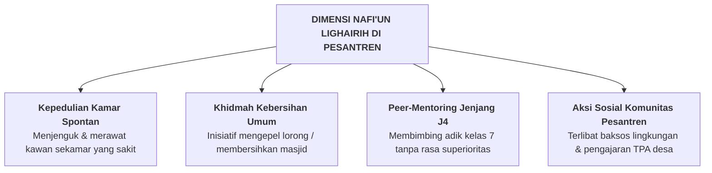

# SUB-BAB 2.10: *NAFI'UN LIGHAIRIH* — JIWA KHIDMAH, KEPEKAAN SOSIAL, & KEBERMANFAATAN BAGI UMAT

---

## 1. Definisi Operasional & Landasan Turats

**Nafi'un Lighairih (نَافِعٌ لِغَيْرِهِ)** adalah puncak dari kematangan karakter seorang santri, yaitu kapasitas empati sosial yang mendalam (*prosocial orientation*), jiwa kepemimpinan pelayan (*Servant Leadership*), keikhlasan berkhidmat (*al-khidmah al-ijtima'iyyah*), serta dedikasi untuk menebarkan manfaat nyata bagi kawan sekamar, madrasah, masyarakat sekitar, dan umat manusia secara luas. [^1]

Rasulullah SAW bersabda menegaskan standar manusia terbaik di sisi Allah:

> **أَحَبُّ النَّاسِ إِلَى اللَّهِ أَنْفَعُهُمْ لِلنَّاسِ، وَأَحَبُّ الْأَعْمَالِ إِلَى اللَّهِ سُرُورٌ تُدْخِلُهُ عَلَى مُسْلِمٍ، أَوْ تَكْشِفُ عَنْهُ كُرْبَةً، أَوْ تَقْضِي عَنْهُ دَيْنًا، أَوْ تَطْرُدُ عَنْهُ جُوعًا**
> 
> *"Manusia yang paling dicintai oleh Allah adalah yang paling bermanfaat bagi manusia lainnya. Dan amalan yang paling dicintai oleh Allah adalah kegembiraan yang engkau masukkan ke dalam hati seorang muslim, atau engkau hilangkan kesulitannya, atau engkau lunasi utangnya, atau engkau singkirkan rasa laparnya."* (HR. Ath-Thabarani dalam *Al-Mu'jam al-Awsath* no. 6026 dan Ibnu Abi ad-Dunya, sanad hasan) [^2]

---

## 2. Indikator Perilaku Mikro 24 Jam di Pesantren

* **Perilaku Teramati di Asrama & Lingkungan Sekitar**:
  - Mengambilkan makanan dari dapur dan membelikan obat di Poskestren untuk kawan sekamar yang terbaring sakit.
  - Membantu kawan yang kesulitan memahami materi nahwu atau hafalan juz 'amma secara sukarela.
  - Mengikuti kegiatan bakti sosial (*khidmah mujtama'iyyah*) membersihkan selokan desa sekitar pesantren dengan gembira.
  - Sebagai santri senior jenjang J4, menjalankan peran pendampingan adik asuh (*Peer-Mentorship*) dengan penuh kasih sayang.

---

## 3. Rubrik Perkembangan 4-Level PBIS untuk *Nafi'un Lighairih*

| Level 1: Perlu Bimbingan | Level 2: Berkembang | Level 3: Mandiri & Cakap | Level 4: Teladan (Qudwah) |
| :--- | :--- | :--- | :--- |
| Egois; tidak peduli jika kawan sekamar sakit; menolak tugas piket; hanya memikirkan diri sendiri. | Membantu kawan jika disuruh musyrif; menjalankan piket dengan cukup baik; sesekali berinfak. | Inisiatif merawat kawan sakit mandiri; aktif membantu fasilitas umum; ringan tangan berkhidmat. | Menjadi koordinator program khidmah umat; teladan Servant Leader; dicintai oleh seluruh santri. |

---

## 4. Penutup Bab 02: Harmonisasi 10 Muwashafat

Dengan teruraikannya seluruh sepuluh profil karakter adab ini, pengasuh dan santri memiliki panduan operasional yang sangat jernih. Karakter bukanlah konsep abstrak yang mengawang-awang di langit ide, melainkan rangkaian perilaku nyata yang dipraktikkan, dibiasakan, dan dirawat setiap detik dalam kehidupan asrama 24 jam.

Pada bab berikutnya, kita akan menelaah bagaimana kesepuluh karakter ini berinteraksi dengan **[Bab 03: Trajektori Biososial-Spiritual & Dinamika Gender Remaja (4 Sub-Bab)](file:///c:/xampp/htdocs/tumbuh/BOOK%20Series%202/Volume-02-Taksonomi-Kapasitas-dan-Profil-Santri/README.md)**.

---

### 📚 Catatan Kaki & Referensi Akademik:

[^1]: Al-Banna, Hasan. (1992). *Risalah at-Ta'lim*. Kairo: Dar at-Tawzi' wa an-Nasyr al-Islamiyyah, hlm. 14.
[^2]: Ath-Thabarani, Sulaiman bin Ahmad. (1995). *Al-Mu'jam al-Awsath*. Kairo: Dar al-Haramain, Jilid VI, Hadits no. 6026.
[^3]: Batson, C. D. (2011). *Altruism in Humans*. New York: Oxford University Press, hlm. 11–32.
