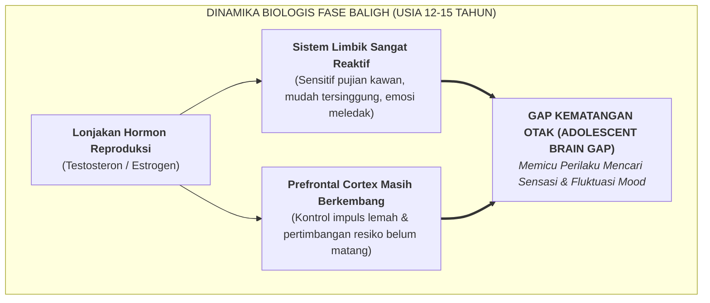

# SUB-BAB 3.1: FASE PUBERTAS AWAL & LEDAKAN HORMON (*ADOLESCENT TURMOIL*)

---

## 1. Biologi Perkembangan: Mengapa Masa Baligh Menjadi Fase Kritis?

Ketika santri memasuki usia 12 hingga 15 tahun (jenjang MTs/SMP), tubuh mereka mengalami transformasi biologis masif yang dipicu oleh **kematangan poros hipotalamus-hipofisis-gonad (Poros HPG)**. Terjadi lonjakan tajam kadar hormon reproduksi: **Testosteron** meningkat hingga $1000\%$ pada santri putra, dan **Estrogen serta Progesteron** berfluktuasi tajam pada santri putri. [^1]

Dalam perspektif syariat Islam, fase ini dikenal sebagai **Fase Baligh (بُلُوغ)**—titik peralihan sakral di mana seorang anak resmi memikul beban hukum syariat (*Taklif*) secara mandiri di hadapan Allah SWT.

---

## 2. Dampak *Adolescent Brain Gap* Terhadap Perilaku di Asrama

Ketidakseimbangan kecepatan matang antara *Sistem Emosi Limbik* (yang matang lebih dulu) dan *Prefrontal Cortex* (yang baru matang sempurna di usia 23–25 tahun) melahirkan beberapa dinamika khas santri puber: [^2]

1. **Fluktuasi Suasana Hati (*Mood Swings*)**: Santri dapat seketika menjadi sangat ceria, lalu beberapa jam kemudian berubah murung atau mudah tersinggung oleh ucapan sepele kawan sekamar.
2. **Kebutuhan Pengakuan Kelompok Sebaya (*Peer Conformity*)**: Rasa takut diasingkan dari kelompok teman (*fear of social rejection*) menjadi sangat kuat, melebihi rasa takut mereka kepada aturan ustadz.
3. **Pencarian Identitas Diri (*Identity Exploration*)**: Santri mulai mempertanyakan otoritas, mencari figur idola (*role models*), dan menguji batas-batas aturan yang ada.

---

## 3. Pendekatan Pedagogis Ekosistem TUMBUH Terhadap Santri Puber

Menghadapi fase badai pubertas (*Sturm und Drang*), pembina asrama dilarang keras merespons dengan kemarahan atau pelabelan negatif (*"Anak ini semakin besar semakin pembangkang!"*). 

Sistem TUMBUH membekali musyrif dengan **Tiga Prinsip Pendampingan Baligh**:
* **Memvalidasi Perubahan Tubuh & Emosi**: Menjelaskan fiqih thaharah (mandi wajib, mimpi basah, haid) secara ilmiah dan syar'i tanpa membuat santri merasa tabu atau berdosa.
* **Menyediakan Penyaluran Energi Fisik & Sosial**: Mengarahkan gejolak hormon santri ke dalam aktivitas positif (olahraga beladiri, debat ilmiah, seni khat, dan kepanduan).
* **Menjadi Sandaran Regulasi Eksternal (*Warm Scaffolding*)**: Musyrif hadir sebagai sosok penenang yang stabil emosinya, mendampingi santri melewati gejolak pubertas dengan keteladanan penuh kasih.

---

### 📚 Catatan Kaki & Referensi Akademik:

[^1]: Steinberg, L. (2014). *Age of Opportunity: Lessons from the New Science of Adolescence*. Boston: Houghton Mifflin Harcourt, hlm. 45–78.
[^2]: Casey, B. J., Jones, R. M., & Hare, T. A. (2008). The adolescent brain. *Annals of the New York Academy of Sciences*, 1124(1), 111–126.
[^3]: 'Ulwan, 'Abdullah Nashih. (1992). *Tarbiyatul Aulad fi al-Islam*. Kairo: Dar as-Salam, Jilid II, Bab *Fashl fi Bulugh ar-Rusyd*, hlm. 680–710.
