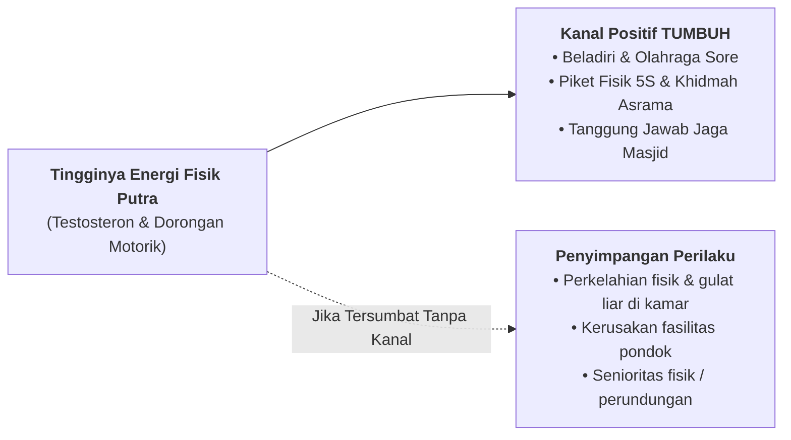

# SUB-BAB 3.2: DIFERENSIASI PENGASUHAN SANTRI PUTRA (*KEMANDIRIAN & TANGGUNG JAWAB FISIK*)

---

## 1. Profil Perkembangan Khusus Santri Putra

Santri putra pada fase remaja memiliki karakteristik biososial yang sangat khas:
* **Tingkat Energi Fisik Tinggi**: Tingginya kadar testosteron mendorong kecenderungan untuk banyak bergerak (*high motor activity*), berkompetisi secara fisik, dan menguji kekuatan.
* **Komunikasi Berbasis Aksi (*Action-Oriented Communication*)**: Anak laki-laki cenderung lebih mudah membuka diri dan berbicara ketika sedang melakukan aktivitas fisik bersama (seperti saat berolahraga atau piket), daripada dipaksa duduk diam diinterogasi.
* **Kebutuhan Tanggung Jawab Nyata (*Call to Responsibility*)**: Jiwa maskulinitas santri putra berkembang pesat saat diberi amanah kepemimpinan dan tantangan fisik yang bermakna.

---

## 2. Strategi Pengasuhan Khusus Asrama Putra di Ekosistem TUMBUH

Ekosistem TUMBUH merancang strategi pengasuhan spesifik untuk mengoptimalkan fitrah santri putra:

### 1. Penyaluran Energi Fisik Harian yang Terjadwal
Setiap sore pukul 16:00 - 17:15, asrama putra mewajibkan aktivitas fisik terarah: olahraga beladiri (*thibbun nabawi/pencak silat*), futsal, basket, atau lari lintas alam. Kegiatan ini melepaskan ketegangan otot dan mengalirkan endorfin, sehingga saat malam hari santri lebih tenang dan fokus belajar (*mudzakarah*).

### 2. Pendekatan Konseling "Bahu-Membahu" (*Shoulder-to-Shoulder Counseling*)
Musyrif putra diajarkan untuk tidak melakukan konseling santri secara konfrontatif tatap muka yang kaku. Musyrif mengajak santri berbicara sambil berjalan santai di lapangan atau duduk berdampingan saat menyapu masjid. Pendekatan ini menurunkan kecemasan defensif santri putra secara drastis.

### 3. Penanaman Mental Kesatria (*Futuwwah / Muru'ah*)
Menghidupkan doktrin *Futuwwah* (jiwa kesatria pemuda Islam): seorang ksatria sejati tidak pernah menindas yang lemah, selalu terdepan melindungi yang tertindas, dan bangga melayani kebutuhan jamaah (*Sayyidul qaumi khādimuhum*).

---

### 📚 Catatan Kaki & Referensi Akademik:

[^1]: Gurian, M. (2011). *Boys and Girls Learn Differently! A Guide for Teachers and Parents* (Revised ed.). San Francisco: Jossey-Bass, hlm. 85–120.
[^2]: As-Sulamiy, Abu 'Abdirrahman Muhammad bin al-Husain. (1998). *Kitab al-Futuwwah*. Ditahqiq oleh Ihsan 'Abbas. Beirut: Dar ash-Shadir, hlm. 25–48.
