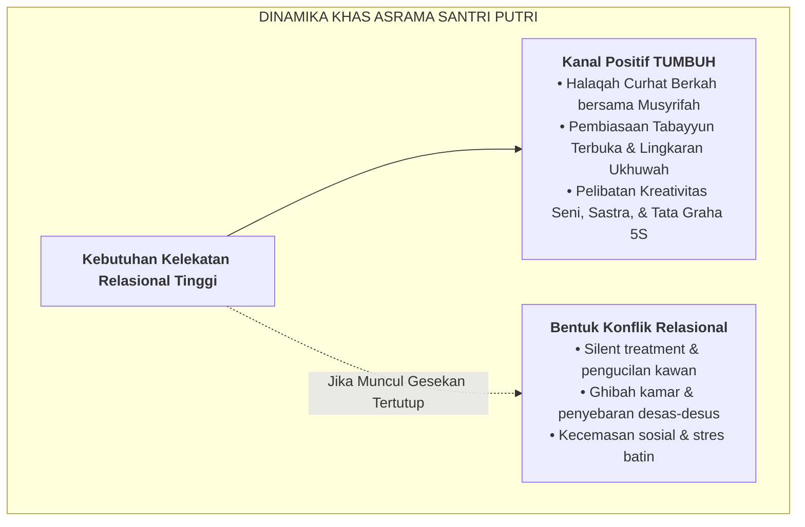

# SUB-BAB 3.3: DIFERENSIASI PENGASUHAN SANTRI PUTRI (*DINAMIKA EMOSI & KELEKATAN AFEKTIF*)

---

## 1. Profil Perkembangan Khusus Santri Putri

Santri putri pada masa pubertas memiliki kepekaan biososial dan dinamika relasional yang sangat mendalam:
* **Kepekaan Relasional Tinggi (*High Relational Sensitivity*)**: Santri putri sangat memprioritaskan kualitas keintiman persahabatan, penerimaan emosional kelompok (*belonging*), dan rasa saling percaya.
* **Kerentanan Terhadap Agresi Relasional (*Relational Aggression*)**: Konflik di kalangan santri putri jarang berbentuk kekerasan fisik, melainkan berbentuk sindiran halus (*passive-aggressive*), gosip rahasia (*ghibah kamar*), pembuatan kelompok eksklusif (*cliques*), atau pemboikotan kawan sekamar secara diam-diam (*silent treatment*). [^1]
* **Fluktuasi Emosi Sirklus Hormonal**: Pengaruh siklus menstruasi bulanan menuntut pemahaman dan kelembutan ekstra dari para pembina asrama putri (*musyrifah*).

---

## 2. Strategi Pengasuhan Khusus Asrama Putri di Ekosistem TUMBUH

Ekosistem TUMBUH merumuskan tiga pendekatan utama bagi asrama putri:

### 1. Majelis Halaqah "Curhat Berkah" Mingguan bersama Musyrifah
Musyrifah menyediakan waktu khusus setiap pekan untuk duduk melingkar santai bersama santri sekamar. Sesi ini menjadi ruang aman untuk menumpahkan unek-unek perasaan, menyelesaikan salah paham kecil sebelum membeku menjadi dendam, dan mendoakan satu sama lain.

### 2. Eliminasi Geng Tertutup & Pembudayaan Ukhuwah Terbuka
Menolak pembentukan "geng elit" di kamar. Musyrifah secara berkala merotasi peran kepanitiaan dan kelompok belajar agar santri putri terbiasa berinteraksi dengan seluruh kawan tanpa memandang latar belakang daerah atau status sosial.

### 3. Ruang Privasi & Manajemen Kesehatan Reproduksi
Menyediakan fasilitas sanitasi yang sangat bersih, ruang ganti tertutup, pasokan pembalut higienis di Poskestren, serta bimbingan fikih nisa' (haid dan istihadhah) yang mendalam dan menentramkan.

---

### 📚 Catatan Kaki & Referensi Akademik:

[^1]: Crick, N. R., & Grotpeter, J. K. (1995). Relational aggression, gender, and social-psychological adjustment. *Child Development*, 66(3), 710–722.
[^2]: Gilligan, C. (1982). *In a Different Voice: Psychological Theory and Women's Development*. Cambridge, MA: Harvard University Press, hlm. 24–65.
