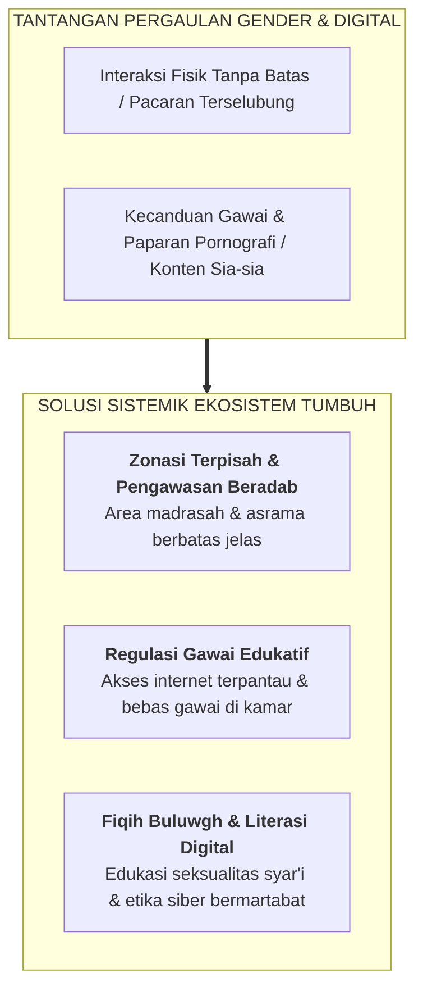

# SUB-BAB 3.4: MANAJEMEN INTERAKSI LINTAS GENDER (*GHADHUL BASHAR*) & ETIKA DIGITAL SANTRI

---

## 1. Menjaga Kesucian Pergaulan Remaja di Era Modern

Dalam mengelola interaksi antar-santri putra dan putri, Islam menetapkan batasan adab pergaulan (*Adab al-Mu'asyarah*) yang bertujuan menjaga kesucian hati (*Tazkiyatun Nafs*) dan kehormatan (*Hifzh al-'Irdh*). Perintah menundukkan pandangan (*Ghadhul Bashar*) adalah perintah langsung dari Allah SWT:

> **قُل لِّلْمُؤْمِنِينَ يَغُضُّوا مِنْ أَبْصَارِهِمْ وَيَحْفَظُوا فُرُوجَهُمْ ۚ ذَٰلِكَ أَزْكَىٰ لَهُمْ ۗ إِنَّ اللَّهَ خَبِيرٌ بِمَا يَصْنَعُونَ**
> 
> *"Katakanlah kepada orang laki-laki yang beriman: Hendaklah mereka menahan pandangannya, dan memelihara kemaluannya; yang demikian itu adalah lebih suci bagi mereka, sesungguhnya Allah Maha Mengetahui apa yang mereka perbuat."* (QS. An-Nur [24]: 30) [^1]

Di era digital saat ini, tantangan pergaulan tidak lagi terbatas pada interaksi fisik di lorong madrasah, melainkan merambah ke dunia maya: media sosial, aplikasi percakapan instan, dan paparan konten visual yang merusak fitrah.

---

## 2. Kebijakan Operasional Pengelolaan Gender & Perangkat Digital di TUMBUH

Ekosistem TUMBUH merumuskan tiga pilar tata kelola:

1. **Zonasi Fisik yang Teratur & Sopan**: Kompleks asrama putra dan putri dipisahkan secara tegas dengan pintu gerbang terkunci mandiri, tanpa memicu kesan diskriminasi. Kegiatan bersama (seperti upacara atau seminar umum) diatur dengan shaf/tempat duduk terpisah dan batas interaksi yang terhormat.
2. **Regulasi Penggunaan Perangkat Digital (*Digital Detox Policy*)**:
   - Santri tidak diperkenankan membawa gawai pribadi di kamar tidur asrama demi menjamin kualitas tidur lelap 7 jam dan interaksi ukhuwah tatap muka yang hangat.
   - Fasilitas internet dan komputer disediakan di laboratorium digital madrasah untuk keperluan riset pembelajaran dan komunikasi terjadwal dengan orang tua.
3. **Pendidikan Literasi Digital & Proteksi Diri**: Santri dibekali keterampilan berpikir kritis untuk memilah informasi, menolak konten pornografi secara sadar karena panggilan iman (*Salimul Aqidah*), serta memanfaatkan teknologi untuk dakwah dan literasi ilmiah.

---

### 📚 Catatan Kaki & Referensi Akademik:

[^1]: Tafsir Ibnu Katsir. (2000). *Tafsir Al-Qur'an al-'Azhim*. Riyadh: Dar Thayyibah, Jilid VI, hlm. 40–44.
[^2]: Twenge, J. M. (2017). *iGen: Why Today's Super-Connected Kids Are Growing Up Less Rebellious, More Tolerant, Less Happy--and Completely Unprepared for Adulthood*. New York: Atria Books, hlm. 55–85.
