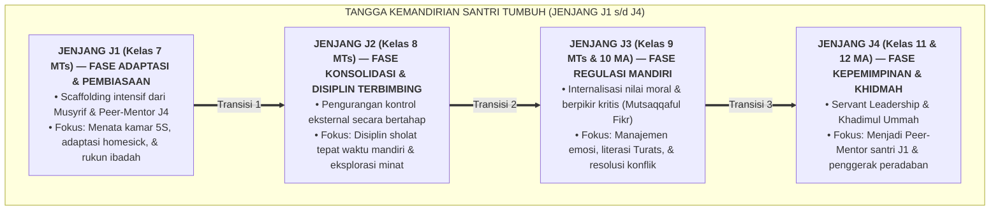

# SUB-BAB 4.1: FILOSOFI TANGGA KEMANDIRIAN: TRANSISI DARI KONTROL EKSTERNAL KE REGULASI INTERNAL

---

## 1. Menghindari Jebakan Menuntut Kedewasaan Instan

Dalam sistem pendidikan pesantren tradisional, salah satu kesalahan metodologis yang sering terjadi adalah **mengharapkan santri yang baru lulus SD/MI (usia 12 tahun) untuk seketika memiliki kemandirian dan kedewasaan penuh layaknya santri senior**. Ketika santri baru tersebut terlambat bangun, menangis karena rindu rumah (*homesick*), atau lemari pakaiannya berantakan, mereka kerap dibentak atau langsung dihukum.

Secara psikologi perkembangan dan neurosains kognitif, kemandirian bukanlah sifat bawaan yang lahir secara tiba-tiba, melainkan **sebuah tangga kematangan bertahap (*Developmental Progression Ladder*)** yang membutuhkan bantuan terstruktur (*Scaffolding*) dari pendidik dewasa. [^1]

---

## 2. Dinamika Transisi Psikologis: Dari 'Disuruh' Menjadi 'Panggilan Iman'

Tangga kemandirian ini dirancang untuk menggeser lokus kendali (*Locus of Control*) santri:
1. **Lokus Eksternal (Fase Awal J1)**: Santri tertib karena ada jadwal harian yang jelas, pengingat dari musyrif, dan bimbingan langsung kakak kelas.
2. **Lokus Internal (Fase Lanjut J3-J4)**: Santri bangun tahajjud, membersihkan kamar, dan menolong temannya atas dorongan **kesadaran iman dari dalam hatinya (*Internalized Moral Agency*)**, bahkan ketika tidak ada satu pun pengasuh yang mengawasinya.

Dengan memahami peta tangga ini, musyrif dan guru madrasah dapat memberikan pendampingan yang tepat sasaran sesuai dengan kapasitas psikologis usia santri (*Zone of Proximal Development*).

---

### 📚 Catatan Kaki & Referensi Akademik:

[^1]: Vygotsky, L. S. (1978). *Mind in Society: The Development of Higher Psychological Processes*. Cambridge, MA: Harvard University Press, hlm. 84–91.
[^2]: Kohlberg, L. (1984). *The Psychology of Moral Development: The Nature and Validity of Moral Stages*. San Francisco: Harper & Row, hlm. 170–215.
[^3]: Zimmerman, B. J. (2002). Becoming a self-regulated learner: An overview. *Theory Into Practice*, 41(2), 64–70.
