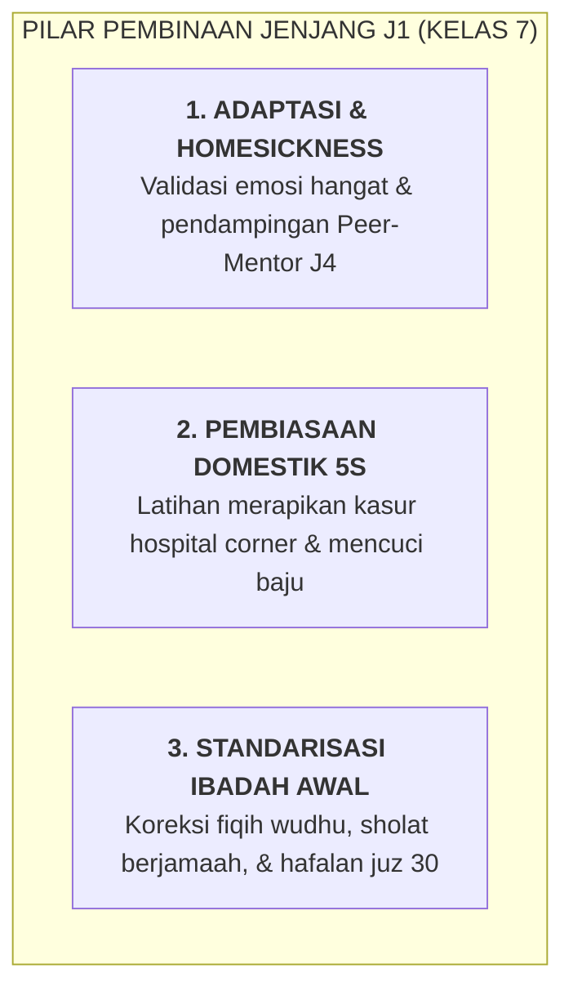

# SUB-BAB 4.2: JENJANG J1 (KELAS 7 MTs): FASE ORIENTASI, ADAPTASI, & PEMBIASAAN TERPIMPIN

---

## 1. Profil Perkembangan Santri Jenjang J1 (Usia 12–13 Tahun)

Santri jenjang **J1 (Kelas 7 MTs/SMP)** berada pada fase paling rentan dalam kehidupan kepesantrenan:
* **Krisis Keterpisahan (*Separation Anxiety*)**: Pertama kali berpisah dari pelukan orang tua dan kenyamanan rumah.
* **Keterbatasan Keterampilan Hidup Dasar**: Banyak santri belum terbiasa mencuci pakaian sendiri, menata kasur, atau mengatur uang saku.
* **Kebutuhan Rasa Aman yang Tinggi**: Membutuhkan lingkungan asrama yang sangat hangat, teratur, dan terlindungi dari segala bentuk intimidasi.

---

## 2. Standar Capaian Perkembangan Adab Jenjang J1

Pada akhir tahun pertama di Jenjang J1, santri ditargetkan mencapai kompetensi dasar berikut:

| Muwashafah Kunci | Target Capaian Jenjang J1 | Indikator Perilaku Teramati |
| :--- | :--- | :--- |
| **Munazzhamun fi Syu'unih** | Mampu menata kasur dan lemari 5S secara mandiri. | Kasur rapi setiap pagi tanpa perlu dibantu mentor J4; pakaian kotor masuk keranjang. |
| **Shahihul Ibadah** | Sah bacaan dan rukun sholat serta wudhu. | Lulus uji praktik wudhu dan sholat di hadapan tim penguji madrasah. |
| **Matinul Khuluq** | Mampu beradaptasi dengan kawan sekamar secara santun. | Bebas dari perkelahian fisik; bertutur kata sopan kepada asatidz dan kakak kelas. |
| **Qadirun 'alal Kasbi** | Mandiri merawat pakaian dan mengelola uang saku. | Mampu mencuci seragam sendiri dan mengalokasikan uang saku hingga akhir bulan. |

---

## 3. Protokol Pendampingan Musyrif & Peer-Mentor J4 untuk Santri J1

Untuk memastikan santri J1 melewati fase adaptasi dengan mulus:
1. **Rasio Pendampingan Terpadu**: Setiap 1 orang santri senior J4 mendampingi maksimal 3 orang santri J1 di kamar yang sama.
2. **Pekan Pengenalan Adab (*Ta'aruf & Adab Week*)**: Santri diajari praktik nyata cara melipat baju, cara memakai kain sarung yang kencang, dan cara antre wudhu yang tertib.
3. **Penyambutan Hangat Saat Sholat Subuh**: Musyrif dan mentor J4 membangunkan santri J1 dengan usapan pundak lembut dan doa, bukan dengan bentakan.

---

### 📚 Catatan Kaki & Referensi Akademik:

[^1]: Ainsworth, M. D. S. (1979). Infant-mother attachment. *American Psychologist*, 34(10), 932–937.
[^2]: Az-Zarnuji, Burhanuddin. (2001). *Ta'lim al-Muta'allim Thariq at-Ta'allum*. Ditahqiq oleh Dr. Shalah Muhammad al-Khiyami. Damaskus: Dar Ibnu Katsir, hlm. 35–48.
