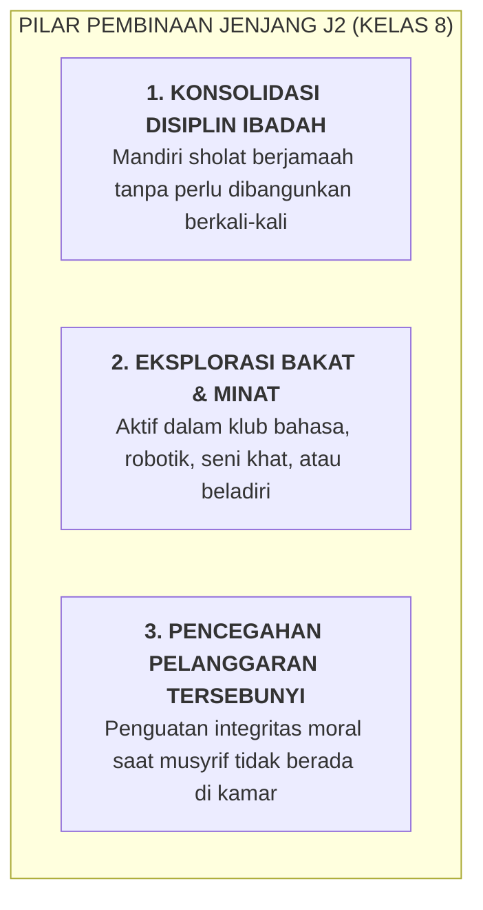

# SUB-BAB 4.3: JENJANG J2 (KELAS 8 MTs): FASE KONSOLIDASI KARAKTER & DISIPLIN TERBIMBING

---

## 1. Profil Perkembangan Santri Jenjang J2 (Usia 13–14 Tahun)

Santri jenjang **J2 (Kelas 8 MTs/SMP)** telah melewati masa kritis adaptasi awal dan mulai merasa nyaman dengan ritme asrama. Namun, fase ini memunculkan tantangan baru:
* **Tantangan Rasa Nyaman Berlebihan (*Complacency*)**: Mulai merasa "bukan anak baru lagi", sehingga terkadang mencoba-coba melanggar aturan kecil jika pengawasan melonggar.
* **Penguatan Solidaritas Geng Sebaya (*Peer Group Dynamics*)**: Mulai terbentuk kelompok pertemanan sebaya yang kuat, yang jika tidak diarahkan positif dapat berkembang menjadi budaya eksklusif.
* **Eksplorasi Minat & Bakat**: Memiliki rasa ingin tahu tinggi untuk mencoba kegiatan ekstrakurikuler baru.

---

## 2. Standar Capaian Perkembangan Adab Jenjang J2

| Muwashafah Kunci | Target Capaian Jenjang J2 | Indikator Perilaku Teramati |
| :--- | :--- | :--- |
| **Harishun 'ala Waqtih** | Tepat waktu hadir di halaqah dan kelas secara konsisten. | Tiba di masjid dan kelas 5 menit sebelum bel tanpa harus dipanggil. |
| **Qawiyyul Jism** | Disiplin menjaga stamina fisik dan kebugaran tubuh. | Aktif berolahraga sore 3x sepekan; menjaga kebersihan sanitasi diri. |
| **Mutsaqqaful Fikr** | Mengembangkan kegemaran membaca literatur di perpustakaan. | Membaca minimal 1 buku non-pelajaran per bulan dan membuat resensi singkat. |
| **Mujahidun Linafsih** | Mampu mengendalikan emosi saat terjadi gesekan antarteman. | Tidak terpancing melakukan perkelahian fisik tatkala terjadi perselisihan. |

---

## 3. Strategi Pembinaan Musyrif untuk Santri J2

Pengasuhan pada Jenjang J2 berfokus pada **Pengalihan Bimbingan dari Luar Menuju Kebiasaan Otomatis (*Habit Consolidation*)**:
* Memberikan ruang tanggung jawab kamar (menjadi ketua regu piket harian).
* Mengarahkan energi kompetitif ke ajang prestasi positif (lomba pidato bahasa Arab/Inggris, olimpiade sains, turnamen olahraga).
* Musyrif melakukan bimbingan berkala melalui kartu evaluasi perkembangan CICO bagi santri yang masih menunjukkan ketidakstabilan disiplin.

---

### 📚 Catatan Kaki & Referensi Akademik:

[^1]: Steinberg, L. (2008). A social neuroscience perspective on adolescent risk-taking. *Developmental Review*, 28(1), 78–106.
[^2]: Lally, P., et al. (2010). How are habits formed: Modelling habit formation in the real world. *European Journal of Social Psychology*, 40(6), 998–1009.
