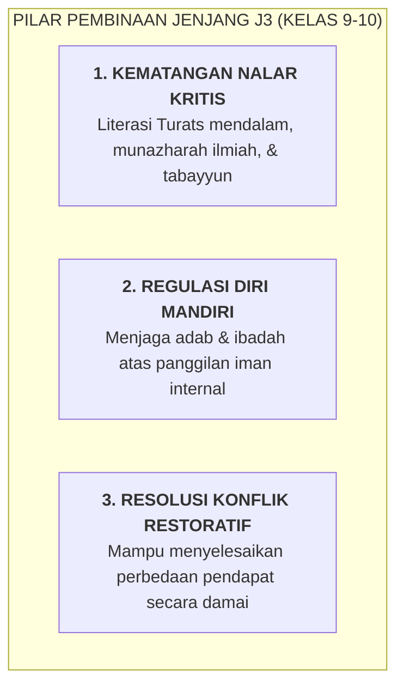

# SUB-BAB 4.4: JENJANG J3 (KELAS 9 MTs & 10 MA): FASE EKSPLORASI NILAI, KRITIS, & REGULASI MANDIRI

---

## 1. Profil Perkembangan Santri Jenjang J3 (Usia 14–16 Tahun)

Santri jenjang **J3 (Kelas 9 MTs dan Kelas 10 MA)** memasuki fase transisi emas menuju kematangan intelektual dan moral tingkat lanjut:
* **Perkembangan Nalar Kritis & Logika Abstrak**: Mampu menganalisis argumen fiqih, membedakan dalil yang kuat dan lemah, serta mempertanyakan relevansi aturan secara kritis.
* **Internalisasi Nilai Moral (*Autonomous Moral Reasoning*)**: Berbuat baik bukan lagi karena takut teguran musyrif, melainkan karena kesadaran filosofis dan nilai kebaikan itu sendiri.
* **Persiapan Menjadi Teladan**: Menempati posisi sebagai "kakak kelas menengah" yang mulai diperhatikan perilakunya oleh adik-adik kelas J1 dan J2.

---

## 2. Standar Capaian Perkembangan Adab Jenjang J3

| Muwashafah Kunci | Target Capaian Jenjang J3 | Indikator Perilaku Teramati |
| :--- | :--- | :--- |
| **Mutsaqqaful Fikr** | Menguasai kaidah dasar nahwu-sharaf dan membaca kitab gundul. | Mampu membaca dan menerjemahkan teks kitab kuning dasar secara mandiri. |
| **Salimul Aqidah** | Memiliki kematangan tauhid dan integritas muraqabah yang stabil. | Istiqamah menjaga sholat berjamaah dan zikir tanpa perlu diperiksa musyrif. |
| **Mujahidun Linafsih** | Mampu mengelola stres akademik dan ujian secara tenang. | Menjaga stabilitas emosi, tidak panik saat menghadapi pekan ujian hafalan. |
| **Matinul Khuluq** | Mampu menjadi mediator damai saat ada teman yang berselisih. | Mengajak kawan yang bertengkar ke Bilik Sakinah untuk mediasi damai. |

---

## 3. Strategi Pembinaan Musyrif untuk Santri J3

* **Metode Dialog Sokratik & Halaqah Ilmiah**: Musyrif dan guru mengajak santri berdiskusi terbuka mengenai isu-isu moral kontemporer, melatih mereka menyampaikan pendapat dengan dalil syar'i dan santun.
* **Pemberian Tanggung Jawab Kepanitiaan**: Mengikutsertakan santri J3 dalam kepanitiaan acara pondok (seperti peringatan hari besar Islam, musabaqah tilawatil Qur'an, dan pameran literasi).
* **Bimbingan Karier & Visi Masa Depan**: Membantu santri memetakan minat keilmuan untuk penjurusan di madrasah aliyah dan perguruan tinggi.

---

### 📚 Catatan Kaki & Referensi Akademik:

[^1]: Piaget, J. (1972). Intellectual evolution from adolescence to adulthood. *Human Development*, 15(1), 1–12.
[^2]: Kohlberg, L. (1984). *The Psychology of Moral Development*. San Francisco: Harper & Row, hlm. 216–240.
