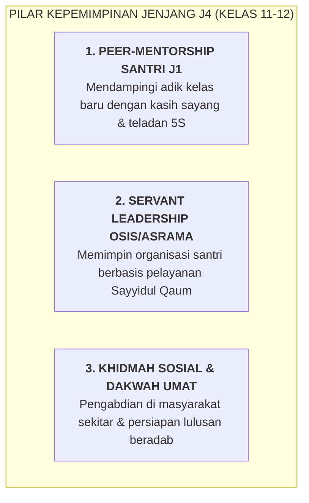

# SUB-BAB 4.5: JENJANG J4 (KELAS 11 & 12 MA): FASE KEPEMIMPINAN, PEER-MENTOR, & KHIDMAH

---

## 1. Profil Perkembangan Santri Jenjang J4 (Usia 16–18 Tahun)

Santri jenjang **J4 (Kelas 11 dan 12 MA)** menempati anak tangga tertinggi dalam struktur kemandirian kepesantrenan:
* **Kematangan Prefrontal Cortex (PFC) Lanjut**: Memiliki kapasitas nalar strategis, perencanaan jangka panjang, dan regulasi emosi tingkat tinggi.
* **Peran Sebagai Figur Teladan (*Living Role Models / Qudwah*)**: Santri J4 adalah cermin hidup bagi seluruh adik-adik kelas J1, J2, dan J3 di asrama.
* **Aktualisasi Diri Lewat Pelayanan (*Servant Leadership & Khidmah*)**: Kepemimpinan mereka diwujudkan bukan dengan memerintah atau menghukum, melainkan dengan melayani kebutuhan bersama.

---

## 2. Standar Capaian Perkembangan Adab Jenjang J4

| Muwashafah Kunci | Target Capaian Jenjang J4 | Indikator Perilaku Teramati |
| :--- | :--- | :--- |
| **Nafi'un Lighairih** | Menjadi mentor sebaya (*Peer-Mentor*) yang tulus bagi santri J1. | Membimbing adik asuh kamar menata lemari 5S, tilawah Al-Qur'an, dan adaptasi. |
| **Matinul Khuluq** | Menolak mutlak tradisi perpeloncoan dan kekerasan senioritas. | Melindungi adik kelas dari perundungan; mengayomi dengan wibawa akhlak. |
| **Qadirun 'alal Kasbi** | Mampu mengelola proyek kegiatan besar pondok secara mandiri. | Mengorganisasi kepanitiaan bakti sosial atau festival ilmiah santri dengan tertib. |
| **Shahihul Ibadah** | Istiqamah menjaga qiyamul lail dan sholat berjamaah di shaf depan. | Menjadi teladan ibadah bagi seluruh warga asrama atas panggilan rida Allah. |

---

## 3. Tugas Khidmah & Sertifikasi Portofolio Kelulusan Jenjang J4

Sebagai syarat kelulusan akhir dari Ekosistem TUMBUH, santri J4 wajib menuntaskan **Tiga Portofolio Pengabdian**:
1. **Laporan Pendampingan Adik Asuh (*Peer-Mentorship Portfolio*)**: Rekam jejak keberhasilan mendampingi 3 orang adik asuh J1 hingga mandiri 5S dan stabil emosinya.
2. **Proyek Khidmah Masyarakat (*Community Service Project*)**: Merancang dan melaksanakan program pengajaran TPA desa, sanitasi lingkungan, atau bantuan sosial di sekitar pesantren.
3. **Sidang Presentasi Refleksi Akhir Santri (*Senior Capstone Presentation*)**: Mempresentasikan perjalanan transformasi adab dirinya sejak kelas 7 hingga kelas 12 di hadapan dewan asatidz dan orang tua.

---

### 📚 Catatan Kaki & Referensi Akademik:

[^1]: Greenleaf, R. K. (1977). *Servant Leadership: A Journey into the Nature of Legitimate Power and Greatness*. New York: Paulist Press, hlm. 25–45.
[^2]: Al-Ghazali, Abu Hamid Muhammad bin Muhammad. (2004). *Ihya' 'Ulumiddin*. Beirut: Dar al-Kutub al-'Ilmiyyah, Jilid III, Kitab *Riyadhat an-Nafs*, hlm. 70–88.
