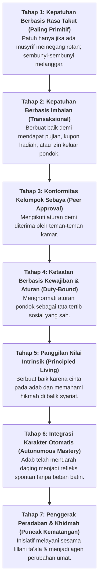

# SUB-BAB 5.1: TUJUH TINGKATAN KESADARAN SANTRI: DARI KEPATUHAN MENUJU PENGGERAK PERADABAN

---

## 1. Peta Kontinum Evolusi Kesadaran Spiritual & Moral Santri

Pematangan karakter dalam Ekosistem TUMBUH dipetakan ke dalam **Kontinum 7 Tingkatan Kesadaran (*7-Stage Consciousness Continuum*)**. Model ini menjelaskan bagaimana motivasi perilaku santri bertransformasi secara berangsur-angsur: dari tingkat kesadaran primitif menuju tingkat kesadaran penghambaan paripurna. [^1]

---

## 2. Eksplanasi Karakteristik 7 Tingkatan Kesadaran

### 🔴 Tahap 1–2: Fase Kesadaran Heteronom (Tergantung Pemicu Luar)
* Santri di level ini belum memiliki regulasi diri internal. Mereka membutuhkan batas aturan fisik yang jelas (*clear boundaries*), pendampingan hangat, dan eliminasi rasa takut punitif agar tidak terjebak dalam kepatuhan palsu.

### 🟡 Tahap 3–4: Fase Kesadaran Konvensional (Sosial & Aturan)
* Santri mulai menghargai norma bersama. Pengasuh membimbing mereka untuk tidak sekadar "ikut-ikutan kawan", melainkan memahami makna di balik tata tertib asrama.

### 🟢 Tahap 5–6: Fase Kesadaran Otonom (Internalisasi Adab)
* Santri merasakan kemanisan iman (*Halawatul Iman*). Sholat tahajjud, keteraturan 5S, dan puasa sunnah dilakukan atas kebutuhan jiwa, bukan karena bel asrama.

### 🌟 Tahap 7: Fase Penggerak Peradaban (*The Civilizational Catalyst*)
* Santri telah melampaui kepentingan diri sendiri (*self-transcendence*). Hatinya dipenuhi cinta kepada Allah dan kepedulian agung untuk mengangkat derajat kaum muslimin.

---

### 📚 Catatan Kaki & Referensi Akademik:

[^1]: Kohlberg, L. (1984). *The Psychology of Moral Development*. San Francisco: Harper & Row, hlm. 170–215.
[^2]: Kegan, R. (1982). *The Evolving Self: Problem and Process in Human Development*. Cambridge, MA: Harvard University Press, hlm. 85–112.
[^3]: Al-Ghazali, Abu Hamid Muhammad bin Muhammad. (2004). *Ihya' 'Ulumiddin*. Beirut: Dar al-Kutub al-'Ilmiyyah, Jilid IV, Kitab *at-Taubah wa ash-Shabr*, hlm. 12–35.
