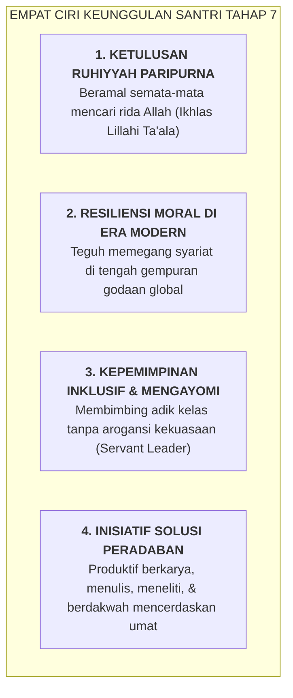

# SUB-BAB 5.2: PROFIL SANTRI TAHAP 7: INTEGRITAS MURNI & JIWA KEPEMIMPINAN GLOBAL

---

## 1. Puncak Pematangan: Ketika Karakter Menjadi Fitrah Kedua

Santri yang mencapai **Tahap 7 (Penggerak Peradaban)** adalah manifestasi nyata dari keberhasilan seluruh siklus pendidikan Ekosistem TUMBUH. Pada tahap ini, adab, tauhid, dan akhlak mulia bukan lagi sesuatu yang harus dipaksakan dengan susah payah, melainkan telah menyatu menjadi **fitrah kedua (*Second Nature / Khuluq Lazim*)**. [^1]

Imam Ibnu Qudamah Al-Maqdisi menjelaskan hakikat akhlak yang telah mencapai derajat kematangan ini:

> **الْخُلُقُ عِبَارَةٌ عَنْ هَيْئَةٍ فِي النَّفْسِ رَاسِخَةٍ، عَنْهَا تَصْدُرُ الْأَفْعَالُ بِسُهُولَةٍ وَيُسْرٍ، مِنْ غَيْرِ حَاجَةٍ إِلَى فِكْرٍ وَرَوِيَّةٍ**
> 
> *"Akhlak adalah gambaran tentang kondisi jiwa yang telah menghunjam kuat dan kokoh; yang darinya memancar berbagai perbuatan baik secara mudah dan ringan, tanpa lagi membutuhkan pemaksaan pikiran dan pertimbangan yang berat."* [^2]

---

## 2. Manifestasi di Masyarakat Pasca-Pesantren

Ketika santri Tahap 7 menyelesaikan pendidikannya dan terjun ke universitas, dunia industri, maupun medan dakwah masyarakat:
* Mereka menjadi pemimpin yang amanah, anti-korupsi, dan berorientasi pada kemaslahatan rakyat.
* Mereka membawa keteraturan 5S ke tempat kerja profesional dan keluarganya.
* Mereka menjadi lentera penerang yang mendamaikan polarisasi dan menghidupkan kembali peradaban Islam yang ramah, berilmu, dan bermartabat.

---

### 📚 Catatan Kaki & Referensi Akademik:

[^1]: Al-Attas, Syed Muhammad Naquib. (1980). *The Concept of Education in Islam*. Kuala Lumpur: ABIM, hlm. 38–45.
[^2]: Ibnu Qudamah Al-Maqdisi. (1998). *Mukhtashar Minhaj al-Qashidin*. Beirut: Al-Maktab al-Islami, hlm. 152.
[^3]: Maslow, A. H. (1971). *The Farther Reaches of Human Nature*. New York: Viking Press, hlm. 260–290.
