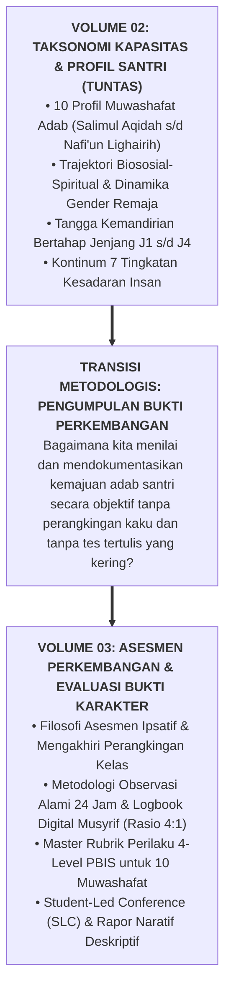

# SUB-BAB 5.3: JEMBATAN KONSEPTUAL MENUJU SISTEM ASESMEN KARAKTER (VOLUME 03)

---

## 1. Dari Taksonomi Karakter Menuju Pengukuran Bukti Lapangan

Dengan tuntasnya perumusan lima bab dalam **Buku Panduan Volume 02**, seluruh arsitektur **Taksonomi 10 Muwashafat Adab**, dinamika gender, tangga kemandirian Jenjang J1–J4, serta Kontinum 7 Tingkatan Kesadaran telah tersusun rapi secara teoretis dan operasional:

Tantangan berikutnya yang harus dijawab secara ilmiah adalah:
* *Bagaimana guru dan musyrif mengamati perilaku adab santri dalam kehidupan 24 jam secara alami tanpa membuat santri merasa dihakimi?*
* *Bagaimana merancang instrumen evaluasi ipsatif yang merayakan kemajuan unik tiap individu?*
* *Bagaimana format Rapor Naratif dan Student-Led Conference (SLC) yang melibatkan orang tua dan santri sebagai subjek aktif?*

Seluruh metodologi asesmen berbasis bukti ini dibedah secara tuntas dan aplikatif dalam buku panduan berikutnya: **[Volume 03: Sistem Asesmen Perkembangan & Evaluasi Bukti Karakter](file:///c:/xampp/htdocs/tumbuh/BOOK%20Series%202/Volume-03-Sistem-Asesmen-Perkembangan-Karakter)**.

---

### 📚 Catatan Kaki & Referensi Akademik:

[^1]: Wiggins, G. (1998). *Educative Assessment: Designing Assessments to Inform and Improve Student Performance*. San Francisco: Jossey-Bass.
[^2]: Stiggins, R. J. (2005). *Student-Involved Assessment for Learning* (4th ed.). Upper Saddle River, NJ: Prentice Hall.
