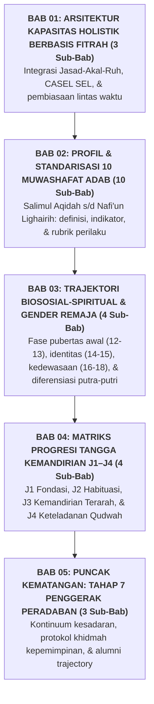

# BUKU PANDUAN VOLUME 02: TAKSONOMI KAPASITAS & 10 PROFIL KARAKTER SANTRI
## *Standarisasi 10 Muwashafat Adab, Trajektori Remaja, dan Tangga Kemandirian Jenjang J1 s/d J4*

---

**Nomor Panduan**: `BOOK-SERIES-2/VOL-02/2026`  
**Sasaran Pembaca**: Tim Kurikulum Adab, Wali Kelas Madrasah, Guru Pengampu, Musyrif Asrama, dan Pembina Klub  
**Dewan Pakar Pengkaji**: Pakar Desain Kurikulum Adab, Pakar Social-Emotional Learning, Pakar Neurosains Perkembangan, dan Pakar Psikologi Belajar  

---

## 🧭 PETA STRUKTUR & DISTRIBUSI BAB VOLUME 02 (5 BAB ORGANIK)

---

## 📚 DAFTAR LENGKAP BAB DAN SUB-BAB VOLUME 02

### 📐 [Bab 01: Arsitektur Kapasitas Holistik Berbasis Fitrah (3 Sub-Bab)](file:///c:/xampp/htdocs/tumbuh/BOOK%20Series%202/Volume-02-Taksonomi-Kapasitas-dan-Profil-Santri/Bab-01-Arsitektur-Kapasitas-Holistik)
* **Sub-Bab 1.1**: Rekonstruksi Taksonomi Karakter: Sintesis *Muwashafat Tarbiyah* & *CASEL SEL*
* **Sub-Bab 1.2**: Tri-Dimensi Insan Kamil: Integrasi *Jasadiyyah, Aqliyyah, & Ruhiyyah*
* **Sub-Bab 1.3**: Prinsip Diferensiasi Pembelajaran Berdasarkan Pacing Fitrah Santri

### 🌟 [Bab 02: Profil & Standarisasi 10 Muwashafat Adab (10 Sub-Bab Khusus)](file:///c:/xampp/htdocs/tumbuh/BOOK%20Series%202/Volume-02-Taksonomi-Kapasitas-dan-Profil-Santri/Bab-02-Profil-10-Muwashafat-Karakter)
* **Sub-Bab 2.1**: *Salimul Aqidah* — Akidah yang Lurus, Murni, & Bebas Khurafat
* **Sub-Bab 2.2**: *Shahihul Ibadah* — Ibadah yang Sah Sesuai Sunnah & Bernyawa
* **Sub-Bab 2.3**: *Matinul Khuluq* — Akhlak Mulia, Santun, & Bebas Perundungan
* **Sub-Bab 2.4**: *Qadirun 'alal Kasbi* — Kemandirian Hidup, Etos Kerja, & Keterampilan Finansial
* **Sub-Bab 2.5**: *Mutsaqqaful Fikr* — Wawasan Intelektual Luas, Iqra', & Berpikir Kritis
* **Sub-Bab 2.6**: *Qawiyyul Jism* — Kebugaran Fisik, Nutrisi Bersih, & Pola Hidup Sehat
* **Sub-Bab 2.7**: *Mujahidun Linafsih* — Pengendalian Diri, Sabar, & Manajemen Emosi
* **Sub-Bab 2.8**: *Munazzhamun fi Syu'unih* — Keteraturan Manajemen Diri & Budaya 5S
* **Sub-Bab 2.9**: *Harishun 'ala Waqtih* — Penjagaan Waktu, Disiplin Jadwal, & Anti-Prokrastinasi
* **Sub-Bab 2.10**: *Nafi'un Lighairih* — Jiwa Khidmah, Kepekaan Sosial, & Kebermanfaatan bagi Umat

### 📈 [Bab 03: Trajektori Biososial-Spiritual & Dinamika Gender Remaja (4 Sub-Bab)](file:///c:/xampp/htdocs/tumbuh/BOOK%20Series%202/Volume-02-Taksonomi-Kapasitas-dan-Profil-Santri/Bab-03-Trajektori-Biososial-Spiritual)
* **Sub-Bab 3.1**: Dinamika Fase Pubertas Awal (Kelas 7 MTs / 12–13 Tahun): Adaptasi & Homesickness
* **Sub-Bab 3.2**: Dinamika Fase Pencarian Identitas (Kelas 8–9 MTs / 14–15 Tahun): Peer Group Dynamics
* **Sub-Bab 3.3**: Dinamika Fase Konsolidasi Kedewasaan (Kelas 10–12 MA / 16–18 Tahun): Komitmen Cita-Cita
* **Sub-Bab 3.4**: Diferensiasi Pendekatan Pengasuhan Berbasis Gender (Santri Putra vs Santri Putri)

### 🪜 [Bab 04: Matriks Progresi Tangga Kemandirian Jenjang J1 s/d J4 (4 Sub-Bab)](file:///c:/xampp/htdocs/tumbuh/BOOK%20Series%202/Volume-02-Taksonomi-Kapasitas-dan-Profil-Santri/Bab-04-Matriks-Progresi-Tangga-J1-J4)
* **Sub-Bab 4.1**: Jenjang J1 (Kelas 7) — Tahap Fondasi & Regulasi Eksternal Terbimbing
* **Sub-Bab 4.2**: Jenjang J2 (Kelas 8) — Tahap Habituasi & Pembentukan Rutinitas Mandiri
* **Sub-Bab 4.3**: Jenjang J3 (Kelas 9–10) — Tahap Kemandirian Terarah & Regulasi Diri
* **Sub-Bab 4.4**: Jenjang J4 (Kelas 11–12) — Tahap Keteladanan (*Qudwah*) & Kepemimpinan Khidmah

### 👑 [Bab 05: Puncak Kematangan: Tahap 7 Penggerak Peradaban (3 Sub-Bab)](file:///c:/xampp/htdocs/tumbuh/BOOK%20Series%202/Volume-02-Taksonomi-Kapasitas-dan-Profil-Santri/Bab-05-Puncak-Kematangan-Tahap-7)
* **Sub-Bab 5.1**: Tujuh Tahap Kontinuum Kesadaran Santri: Dari Kepatuhan Menuju Keikhlasan
* **Sub-Bab 5.2**: Protokol Ujian Kepemimpinan Berbasis Khidmah Santri J4
* **Sub-Bab 5.3**: Keberlanjutan Karakter Pasca-Pesantren (*Alumni Character Sustainability*)
