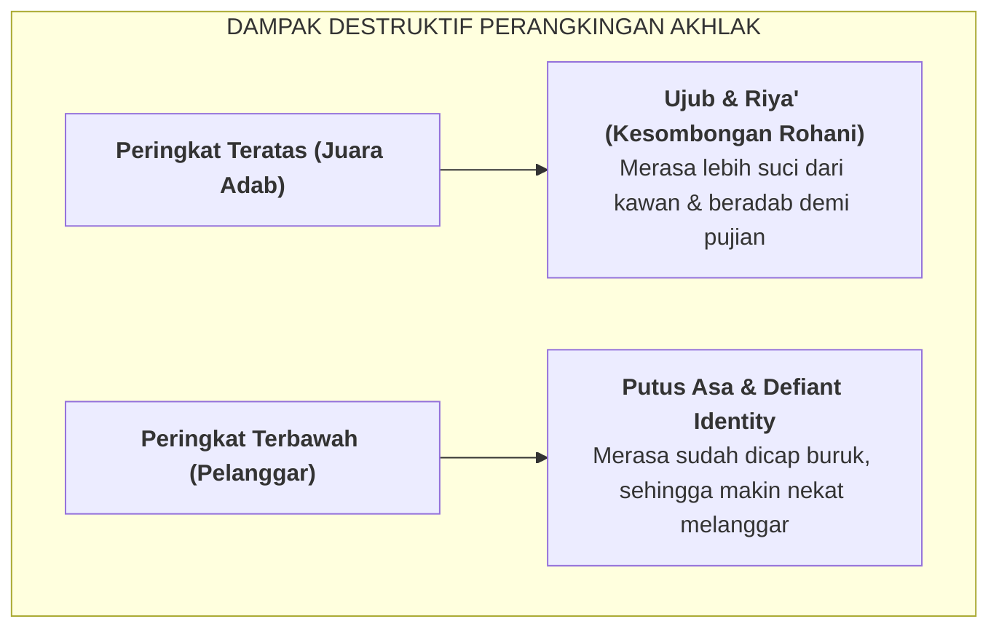

# SUB-BAB 1.1: PATOLOGI PERANGKINGAN KARAKTER: MENGAPA AKHLAK TIDAK BOLEH DIPERBANDINGKAN

---

## 1. Kritik Atas Praktik Ranking Adab dalam Pendidikan

Di banyak institusi pendidikan, termasuk sebagian pesantren, terdapat tradisi memberikan **perangkingan komparatif normatif (*Norm-Referenced Ranking*)** terhadap capaian akhlak atau kedisiplinan santri—seperti menobatkan "Santri Terdisiplin Juara 1" dan mencap santri lain sebagai "Santri Terburuk/Paling Melanggar".

Secara epistemologi Islam dan psikologi perkembangan, memperlakukan adab sebagai ajang perlombaan komparatif adalah sebuah **patologi tarbiyah yang merusak**. 

Imam Al-Ghazali (450–505 H) memperingatkan bahaya penyakit hati yang muncul akibat merasa diri lebih mulia daripada orang lain:

> **الْكِبْرُ هُوَ اسْتِعْظَامُ النَّفْسِ، وَرُؤْيَةُ قَدْرِهَا فَوْقَ قَدْرِ الْغَيْرِ... وَآفَتُهُ أَنَّهُ يَحُولُ بَيْنَ الْعَبْدِ وَبَيْنَ كُلِّ خُلُقٍ مَحْمُودٍ**
> 
> *"Sombong (kibr) itu adalah menganggap agung diri sendiri dan memandang kedudukan dirinya berada di atas kedudukan orang lain... Bahaya terbesar dari sifat sombong adalah ia menghalangi seorang hamba dari seluruh akhlak yang terpuji."* [^1]

Ketika santri berbuat baik demi mengejar "Ranking 1", niat ibadahnya bergeser dari keikhlasan mencari rida Allah (*Lillahi Ta'ala*) menjadi ketergantungan pada pengakuan manusia (*Riya' dan Sum'ah*).

---

## 2. Dampak Psikologis: Pembunuhan Motivasi Intrinsik

Carol Dweck dalam risetnya mengenai *Growth Mindset* membuktikan bahwa penilaian komparatif memicu **Fixed Mindset (Pola Pikir Statis)**: [^2]
* Santri yang dicap "santri bermasalah" akan menginternalisasi label tersebut menjadi identitas diri (*Self-Fulfilling Prophecy*). Mereka merasa tidak ada gunanya berusaha memperbaiki diri karena peringkat mereka sudah di bawah.
* Santri yang berada di peringkat atas menjadi takut mengambil inisiatif baru atau takut mengakui kesulitan emosionalnya karena cemas status kesempurnaannya akan runtuh.

Ekosistem TUMBUH menghapus sistem ranking karakter secara mutlak. Akhlak bukanlah komoditas kompetisi, melainkan proses penempaan fitrah yang suci di hadapan Allah SWT.

---

### 📚 Catatan Kaki & Referensi Akademik:

[^1]: Al-Ghazali, Abu Hamid Muhammad bin Muhammad. (2004). *Ihya' 'Ulumiddin*. Beirut: Dar al-Kutub al-'Ilmiyyah, Jilid III, Kitab *Dzammi al-Kibr*, hlm. 345–350.
[^2]: Dweck, C. S. (2006). *Mindset: The New Psychology of Success*. New York: Random House, hlm. 55–82.
[^3]: Hughes, G. (2014). *Ipsative Assessment: Motivation through Marking Progress*. London: Palgrave Macmillan, hlm. 12–35.
