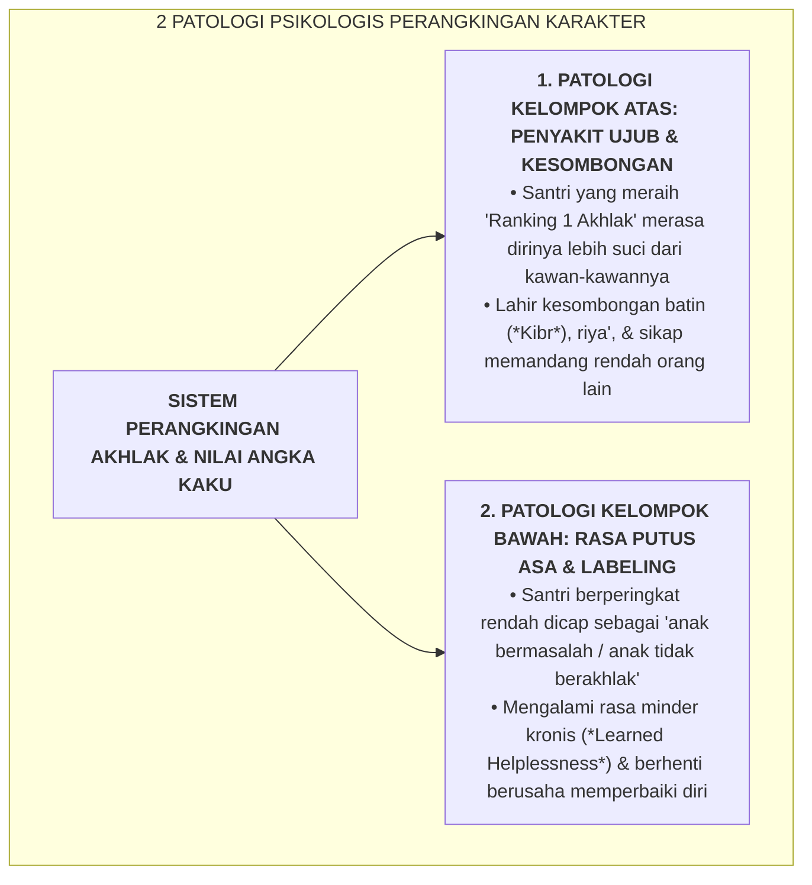

# SUB-BAB 1.1: PATOLOGI PERANGKINGAN KARAKTER (UJUB VS PUTUS ASA)

---

## 1. Kritik Paradigma Evaluasi: Mengapa Akhlak Tidak Boleh Diranking?

Dalam praktik pendidikan di banyak madrasah dan pondok pesantren konvensional, evaluasi karakter sering kali direduksi menjadi angka-angka kuantitatif yang kaku (misalnya: "Nilai Akhlak: 85") yang kemudian diperbandingkan antar-santri untuk menentukan peringkat kelas (*Norm-Referenced Ranking System*). [^1]

Secara tinjauan epistemologi Islam, psikologi perkembangan, dan neurosains kognitif, **praktik memperbandingkan dan memperankingan akhlak antaranak adalah sebuah patologi evaluasi yang sangat merusak jiwa santri**.

Perangkingan karakter membelah populasi santri menjadi dua kutub psikologis yang sama-sama toksik:

---

## 2. Landasan Turats: Larangan Menganggap Diri Paling Suci (*Tazkiyat an-Nafs*)

Al-Qur'an secara tegas melarang manusia untuk mengklaim atau menilai dirinya lebih suci dan lebih bertakwa dibandingkan orang lain: [^2]

> **فَلَا تُزَكُّوا أَنفُسَكُمْ ۖ هُوَ أَعْلَمُ بِمَنِ اتَّقَىٰ**
> 
> *"Maka janganlah kamu menganggap dirimu telah suci. Dialah yang paling mengetahui siapa orang yang bertakwa."* (QS. An-Najm [53]: 32)

Imam Al-Ghazali dalam *Ihya' 'Ulumiddin* (Kitab *Dzammi al-Kibr wa al-'Ujub*) mengingatkan bahwa penyakit ujub (merasa bangga diri dan lebih saleh dari orang lain) adalah perusak amal yang paling mematikan:

> **آفَةُ الْعُجْبِ شَدِيدَةٌ، وَهُوَ أَنْ يَرَى الْعَبْدُ نَفْسَهُ بِعَيْنِ الرِّفْعَةِ، وَيَرَى غَيْرَهُ بِعَيْنِ الِاسْتِصْغَارِ وَالِاحْتِقَارِ، وَهَذَا هُوَ عَيْنُ الْكِبْرِ الَّذِي قَالَ فِيهِ النَّبِيُّ صَلَّى اللَّهُ عَلَيْهِ وَسَلَّمَ: «لَا يَدْخُلُ الْجَنَّةَ مَنْ كَانَ فِي قَلْبِهِ مِثْقَالُ ذَرَّةٍ مِنْ كِبْرٍ»**
> 
> *"Bahaya penyakit ujub sangatlah dahsyat; yaitu tatkala seorang hamba memandang dirinya dengan pandangan ketinggian/kemuliaan, dan memandang orang lain dengan pandangan kerdil dan merendahkan. Dan inilah hakikat kesombongan yang disabdakan oleh Nabi SAW: 'Tidak akan masuk surga orang yang di dalam hatinya terdapat seberat biji sawi dari kesombongan'."* [^3]

---

## 3. Menghapus Kurva Lonceng Normal (*Bell-Curve Elimination*)

Dalam teori psikometri modern, penerapan kurva lonceng (*Bell-Curve Distribution*) pada pendidikan karakter adalah sebuah kekeliruan fatal. Kurva lonceng mengasumsikan bahwa harus selalu ada segelintir anak yang "gagal" demi memvalidasi keberhasilan anak di peringkat atas. 

Ekosistem TUMBUH membuang kurva lonceng ini: **Tujuan pendidikan Islam adalah mengantarkan SELURUH santri mencapai puncak kematangan fitrahnya masing-masing, bukan memenangkan kompetisi perankingan di atas kekalahan saudaranya**.

---

### 📚 Catatan Kaki & Referensi Akademik:

[^1]: Guskey, T. R. (2014). *On Your Mark: Challenging the Conventions of Grading and Reporting*. Bloomington, IN: Solution Tree Press, hlm. 45–78.
[^2]: Tafsir Ibnu Katsir. (2000). *Tafsir Al-Qur'an al-'Azhim*. Riyadh: Dar Thayyibah, Jilid VII, hlm. 465–468.
[^3]: Al-Ghazali, Abu Hamid Muhammad bin Muhammad. (2004). *Ihya' 'Ulumiddin*. Beirut: Dar al-Kutub al-'Ilmiyyah, Jilid III, Kitab *Dzammi al-Kibr wa al-'Ujub*, hlm. 340–355.
[^4]: Kohn, A. (1999). *The Schools Our Children Deserve: Moving Beyond Traditional Classrooms and "Tougher Standards"*. Boston: Houghton Mifflin.
