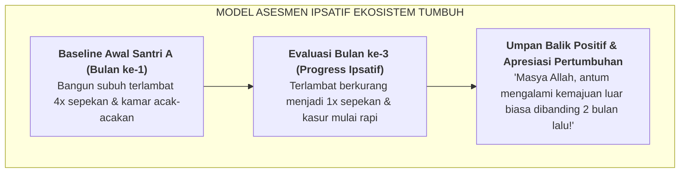

# SUB-BAB 1.2: PRINSIP ASESMEN IPSATIF (*SELF-REFERENCED GROWTH BASELINE*)

---

## 1. Definisi & Mekanisme Kerja Asesmen Ipsatif

Sebagai pengganti sistem ranking normatif yang merusak, Ekosistem TUMBUH menerapkan **Asesmen Ipsatif (*Ipsative Assessment*)**. 

Asesmen ipsatif adalah metode evaluasi di mana **kinerja dan perilaku seorang santri hari ini dibandingkan langsung dengan titik awal (*baseline*) dirinya sendiri di masa lalu**, bukan dibandingkan dengan pencapaian santri lain. [^1]

---

## 2. Keunggulan Pedagogis & Spiritual Asesmen Ipsatif di Pesantren

1. **Merayakan Setiap Langkah Kemajuan Kecil (*Progressive Small Wins*)**: Santri yang memiliki latar belakang keluarga yang kurang teratur merasa dihargai saat ia mampu mengurangi keterlambatan sholatnya, meskipun secara absolut ia belum sesempurna kawan sekamarnya yang berasal dari keluarga santri.
2. **Mendorong Muhasabah Diri Hakiki**: Santri dilatih untuk selalu bertanya kepada dirinya sendiri: *"Apakah adab dan ibadah saya hari ini lebih baik daripada kemarin?"*, selaras dengan pesan Khalifah Umar bin Al-Khattab RA:

> **حَاسِبُوا أَنْفُسَكُمْ قَبْلَ أَنْ تُحَاسَبُوا، وَزِنُوا أَنْفُسَكُمْ قَبْلَ أَنْ تُوزَنُوا**
> 
> *"Hisablah (evaluasilah) diri kalian sendiri sebelum kalian dihisab kelak (oleh Allah), dan timbanglah amal kalian sebelum amal kalian ditimbang."* [^2]
3. **Menumbuhkan Iklim Ukhuwah yang Hangat**: Karena tidak ada ranking yang diperebutkan, santri tidak saling menjatuhkan atau iri dengki (*hasad*). Mereka saling menyemangati dan membantu kemajuan kawan sekamarnya.

---

### 📚 Catatan Kaki & Referensi Akademik:

[^1]: Hughes, G. (2011). Towards a personal best: A case for introducing ipsative assessment in education. *Studies in Educational Evaluation*, 37(3), 176–183.
[^2]: At-Tirmidzi, Muhammad bin 'Isa. (1998). *Sunan at-Tirmidzi*. Ditahqiq oleh Ahmad Syakir. Beirut: Dar Ihya' at-Turats al-'Arabi, Kitab *Shifat al-Qiyamah*, Jilid IV, hlm. 638.
