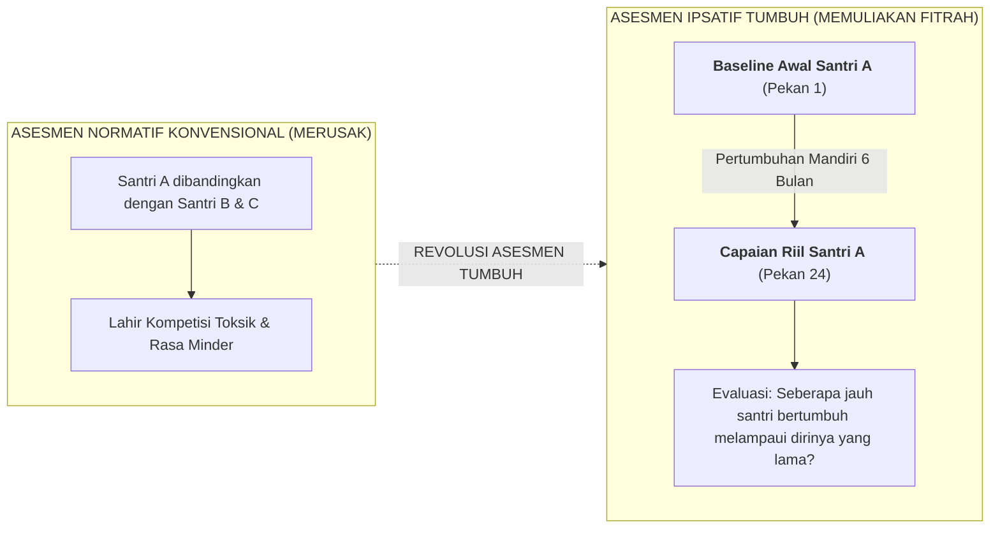

# SUB-BAB 1.2: PRINSIP ASESMEN IPSATIF BASELINE: MENGUKUR DIRI SENDIRI DARI TITIK AWAL

---

## 1. Konsep Dasar Asesmen Ipsatif (*Self-Referenced Assessment*)

Sebagai alternatif ilmiah dan syar'i atas sistem perangkingan yang merusak, Ekosistem TUMBUH mengadopsi metodologi **Asesmen Ipsatif (*Ipsative / Self-Referenced Assessment Model*)**. [^1]

Dalam asesmen ipsatif, capaian dan pertumbuhan karakter seorang santri **tidak pernah diperbandingkan dengan santri lain (*Norm-Referenced*)**, melainkan **diperbandingkan dengan titik awal (*Baseline*) kemampuan dan adab santri itu sendiri di masa lalu**:

$$\text{Tingkat Pertumbuhan Santri } (\Delta \text{Growth}) = \text{Capaian Perilaku Saat Ini} - \text{Baseline Awal Masuk}$$

---

## 2. Studi Komparasi: Menilai Pertumbuhan Santri Secara Adil

Perhatikan contoh perbandingan dua santri dengan latar belakang berbeda:
* **Santri A (Latar Belakang Sangat Disiplin)**: Di rumah sudah terbiasa bangun subuh dan rapi. Saat masuk pondok (Baseline: 80%), setelah 6 bulan capaiannya adalah 85% ($\Delta \text{Growth} = +5\%$).
* **Santri B (Latar Belakang Permisif)**: Di rumah tidak pernah sholat subuh tepat waktu dan kamar selalu berantakan (Baseline: 20%). Setelah 6 bulan dibimbing di asrama, ia berhasil bangun mandiri 5 hari dalam sepekan dan merapikan tempat tidur (Capaian: 70%, $\Delta \text{Growth} = +50\%$).

Dalam sistem perangkingan lama, Santri A akan mendapat Ranking 1 dan dipuji, sementara Santri B tetap dicap sebagai anak peringkat bawah. 

Dalam **Asesmen Ipsatif TUMBUH**, perjuangan luar biasa Santri B yang melompat $+50\%$ diakui dan diapresiasi setinggi-tingginya sebagai sebuah kemenangan jihad jiwa (*Mujahadatun Linafsih*) yang sangat membanggakan.

---

## 3. Landasan Turats: Muhasabah Diri Pribadi (*Hasibu Anfusakum*)

Asesmen ipsatif berakar kuat pada wasiat agung Sayyidina Umar bin Al-Khattab RA: [^2]

> **حَاسِبُوا أَنْفُسَكُمْ قَبْلَ أَنْ تُحَاسَبُوا، وَزِنُوا أَنْفُسَكُمْ قَبْلَ أَنْ تُوزَنُوا، فَإِنَّهُ أَهْوَنُ عَلَيْكُمْ فِي الْحِسَابِ غَدًا أَنْ تُحَاسِبُوا أَنْفُسَكُمُ الْيَوْمَ**
> 
> *"Hisablah (evaluasilah) diri kalian sendiri sebelum kalian dihisab (oleh Allah), dan timbanglah amal perbuatan kalian sendiri sebelum kalian ditimbang. Karena sesungguhnya hisab kalian di akhirat kelak akan menjadi lebih ringan apabila kalian telah mengevaluasi diri kalian hari ini."* (Diriwayatkan oleh Imam Ahmad dalam *Az-Zuhd* dan At-Tirmidzi dalam *Sunan*-nya)

Dengan asesmen ipsatif, santri tidak sibuk membanding-bandingkan dirinya dengan orang lain, melainkan fokus pada perjuangan memperbaiki dirinya sendiri detik demi detik di hadapan Allah SWT.

---

### 📚 Catatan Kaki & Referensi Akademik:

[^1]: Hughes, G. (2014). *Ipsative Assessment: Motivation through Marking Progress*. London: Palgrave Macmillan, hlm. 15–50.
[^2]: Ibnu Abi ad-Dunya. (1988). *Muhasabat an-Nafs wa al-Ikhlas*. Ditahqiq oleh Musthafa bin 'Ali. Beirut: Dar al-Kutub al-'Ilmiyyah, hlm. 22–25.
[^3]: Brookhart, S. M. (2018). *Effective Grading: A Tool for Learning and Student Success*. San Francisco: Jossey-Bass.
