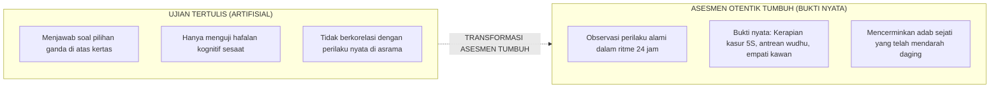

# SUB-BAB 1.3: EVALUASI BERBASIS BUKTI OTENTIK (*AUTHENTIC ASSESSMENT*) VS UJIAN TULIS KERING

---

## 1. Reduksionisme Ujian Tertulis dalam Penilaian Karakter

Karakter adab santri sering kali dinilai secara keliru melalui **lembar tes tertulis pilihan ganda (*multiple-choice paper tests*)**. Seorang santri diminta menjawab pertanyaan seperti: *"Apa hukum membuang sampah sembarangan? (A) Boleh, (B) Haram, (C) Sunnah"*. 

Santri yang hafal teori fikih dengan mudah memilih opsi yang benar dan mendapatkan nilai 100, namun di asrama dialah yang membuang bungkus makanan di kolong tempat tidur.

Grant Wiggins (1998) mengkritik keras pendekatan ini: ujian tertulis hanya menguji memori kognitif buatan (*superficial recall*), bukan kemampuan riil dalam situasi otentik kehidupan nyata. [^1]

---

## 2. Prinsip Asesmen Otentik 24 Jam di Pesantren TUMBUH

Ekosistem TUMBUH mendasarkan evaluasi karakter pada **Bukti Perilaku Otentik (*Authentic Behavioral Artifacts*)**:
1. **Pengamatan Kontekstual Alami**: Pengamatan dilakukan saat santri menjalani keseharian nyata—saat santri berwudhu di masjid, saat makan bersama di serambi, atau saat bermain di lapangan.
2. **Triangulasi Bukti Multipihak**: Evaluasi kemajuan santri dihimpun dari perpaduan catatan Wali Kelas (madrasah), Musyrif (asrama), refleksi diri santri sendiri (*self-reflection*), dan umpan balik teman sekamar (*peer feedback*).
3. **Dokumentasi Portofolio Adab**: Menghimpun artefak karya nyata, sertifikat partisipasi khidmah, catatan hafalan juz 'amma, dan lembar muhasabah berkala.

Dengan beralih ke asesmen bukti otentik, pesantren menjamin bahwa penilaian karakter tidak lagi menjadi formalitas angka di atas kertas raport, melainkan cermin sejati dari kemuliaan budi pekerti santri di dunia nyata.

---

### 📚 Catatan Kaki & Referensi Akademik:

[^1]: Wiggins, G. (1998). *Educative Assessment: Designing Assessments to Inform and Improve Student Performance*. San Francisco: Jossey-Bass, hlm. 21–45.
[^2]: Black, P., & Wiliam, D. (1998). Assessment and classroom learning. *Assessment in Education: Principles, Policy & Practice*, 5(1), 7–74.
