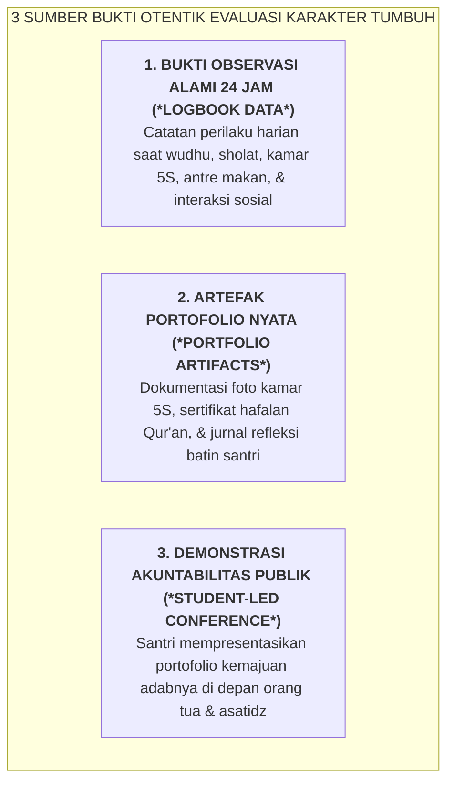

# SUB-BAB 1.3: EVALUASI BUKTI OTENTIK (*AUTHENTIC ASSESSMENT*) VS UJIAN TULIS FORMALITAS

---

## 1. Menolak Formalisme Ujian Tulis Pilihan Ganda Karakter

Salah satu ironi terbesar dalam evaluasi pendidikan akhlak di sekolah formal adalah **menilai karakter santri melalui lembar soal ujian tulis pilihan ganda (Multiple Choice Test)**: [^1]
* *"Apa yang kamu lakukan jika melihat sampah berserakan? A. Membuangnya ke tempat sampah, B. Membiarkannya, C. Menginjaknya."*

Seorang santri yang pandai menghafal jawaban teoritis akan dengan mudah memilih opsi [A] dan memperoleh nilai 100 pada ujian tulis Akhlak. Namun pada saat keluar dari ruang ujian, santri yang sama dapat dengan santai membuang bungkus es krim di lorong madrasah dan membiarkan kasur kamarnya berantakan.

Evaluasi berbasis ujian tulis kertas hanya menguji **Hafalan Kognitif Tingkat Rendah (*Low-Order Recall*)**, bukan adab nyata yang terinternalisasi ke dalam perilaku sehari-hari.

Ekosistem TUMBUH merombak formalitas ini dan menegakkan **Evaluasi Berbasis Bukti Karakter Otentik (*Authentic Assessment & Performance Evidence*)**:

---

## 2. Matriks Perbandingan Ujian Tulis Kertas vs Asesmen Otentik

| Dimensi Evaluasi | Ujian Tulis Kertas Konvensional | Asesmen Bukti Otentik Ekosistem TUMBUH |
| :--- | :--- | :--- |
| **Objek yang Diukur** | Hafalan dalil, definisi akhlak, & teori moral di atas kertas. | Tindakan nyata santri saat berinteraksi di asrama, masjid, madrasah, & kantin 24 jam. |
| **Konteks Pengambilan Data** | Ruang ujian buatan yang steril selama 90 menit. | Lingkungan alamiah 24 jam saat santri tidak sedang merasa "diuji". |
| **Validitas Data Perilaku** | Sangat rendah; mudah dimanipulasi dengan kepura-puraan (*Faked Compliance*). | Sangat tinggi; tervalidasi melalui triangulasi observasi Musyrif, Guru, & Kawan Sebaya. |
| **Dampak Terhadap Karakter** | Menghasilkan santri berpengetahuan teoritis namun miskin adab praksis. | Menghasilkan santri yang memiliki integritas batin, kemandirian 5S, dan keteladanan nyata. |

---

## 3. Menghadirkan Makna Hakiki *Ta'dib*

Syed Muhammad Naquib Al-Attas menegaskan bahwa hakikat *Ta'dib* adalah penanaman adab ke dalam diri manusia (*the instillation and inculcation of adab in man*), di mana adab mencakup pengenalan dan pengakuan akan tempat yang tepat bagi segala sesuatu dalam tata penciptaan. [^2]

Pengenalan tempat yang tepat ini termanifestasi dalam tindakan nyata: meletakkan sandal di tempatnya, menunaikan sholat tepat waktu, menjaga hak istirahat saudara sekamar, dan berbicara santun kepada pendidik. Inilah bukti otentik karakter yang menjadi standar kelulusan di pesantren TUMBUH.

---

### 📚 Catatan Kaki & Referensi Akademik:

[^1]: Wiggins, G. (1998). *Educative Assessment: Designing Assessments to Inform and Improve Student Performance*. San Francisco: Jossey-Bass, hlm. 20–55.
[^2]: Al-Attas, Syed Muhammad Naquib. (1980). *The Concept of Education in Islam*. Kuala Lumpur: ABIM, hlm. 25–40.
[^3]: Mueller, J. (2005). The authentic assessment toolbox: Enhancing student learning through online faculty development. *MERLOT Journal of Online Learning and Teaching*, 1(1), 1–7.
