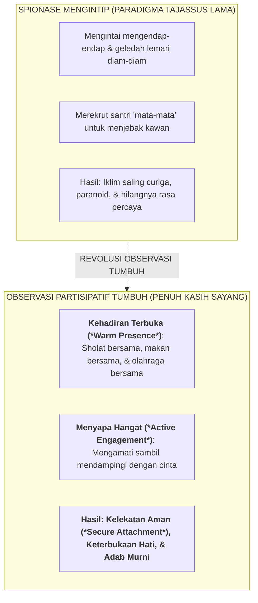

# SUB-BAB 2.1: SENI OBSERVASI PARTISIPATIF ALAMI TANPA SPIONASE (*ANTI-TAJASSUS*)

---

## 1. Menolak Budaya Spionase Asrama (*Anti-Tajassus Paradigm*)

Dalam tradisi pengasuhan sebagian pesantren lama, pengawasan terhadap santri kerap kali tergelincir ke dalam praktik **Spionase dan Pengintaian Mengendap-endap (*Tajassus & Surveillance Paranoia*)**. [^1]

Musyrif bersembunyi di balik pintu yang gelap, menggeledah lemari pakaian santri secara diam-diam tanpa izin, atau merekrut santri "mata-mata" (*informer*) untuk melaporkan rahasia kawan-kawannya.

Secara hukum syariat Islam, praktik pengintaian mencari-cari kesalahan ini adalah sebuah **perbuatan haram yang dilarang tegas oleh Allah SWT**:

> **يَا أَيُّهَا الَّذِينَ آمَنُوا اجْتَنِبُوا كَثِيرًا مِّنَ الظَّنِّ إِنَّ بَعْضَ الظَّنِّ إِثْمٌ ۖ وَلَا تَجَسَّسُوا وَلَا يَغْتَب بَّعْضُكُم بَعْضًا**
> 
> *"Wahai orang-orang yang beriman! Jauhilah banyak dari prasangka, sesungguhnya sebagian prasangka itu adalah dosa, dan janganlah kamu mencari-cari kesalahan orang lain (tajassus), dan janganlah sebagian kamu menggunjing sebagian yang lain..."* (QS. Al-Hujurat [49]: 12) [^2]

Secara psikologi pendidikan, iklim saling memata-matai menciptakan **Lingkungan Penuh Kecurigaan Toksik (*Hostile Low-Trust Climate*)**: santri hidup dalam ketakutan paranoid, saling mengkhianati sesama saudara, dan kehilangan rasa percaya kepada para ustadznya.

Ekosistem TUMBUH membuang praktik spionase ini dan menegakkan **Seni Observasi Partisipatif Alami (*Naturalistic & Participatory Observation*)**:

---

## 2. Prinsip Observasi Partisipatif Alami 24 Jam

1. **Mengamati Sambil Menemani (*Observing Through Accompaniment*)**:
   * Musyrif tidak duduk mengawasi dari jauh laksana sipir penjara, melainkan ikut duduk makan bersama santri di meja makan, ikut menyapu lorong saat piket bersama, dan ikut bermain futsal di sore hari. Dari kedekatan alamiah inilah karakter asli santri terlihat secara jujur tanpa kepura-puraan. [^3]
2. **Fokus Menangkap Kebaikan Santri (*Catch Them Being Good*)**:
   * Mata musyrif dilatih untuk secara aktif mencari dan mendokumentasikan inisiatif kebaikan kecil santri (misal: santri yang memungut sampah tanpa disuruh atau santri yang membantu membawakan sajadah kawan yang sakit).
3. **Pengamatan Terstandar Berbasis Rubrik Objektif**:
   * Catatan observasi tidak didasarkan pada prasangka suka/tidak suka pribadi, melainkan mengacu pada deskriptor perilaku konkret dalam Master Rubrik 10 Muwashafat.

---

### 📚 Catatan Kaki & Referensi Akademik:

[^1]: Al-Qurthubi, Abu 'Abdillah. (2006). *Al-Jami' li Ahkam al-Qur'an*. Kairo: Dar al-Kutub al-Mishriyyah, Jilid XVI, hlm. 330–335.
[^2]: Tafsir Ibnu Katsir. (2000). *Tafsir Al-Qur'an al-'Azhim*. Riyadh: Dar Thayyibah, Jilid VII, hlm. 378–382.
[^3]: Sprick, R. S. (2009). *CHAMPS: A Proactive and Positive Approach to Classroom Management* (2nd ed.). Eugene, OR: Pacific Northwest Publishing, hlm. 85–120.
