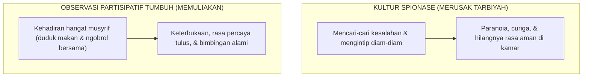

# SUB-BAB 2.1: SENI OBSERVASI PARTISIPATIF: MENGAMATI TANPA MEMATA-MATAI (*ANTI-SPYING*)

---

## 1. Mengharamkan Budaya Spionase & Pengintaian (*Tajassus*)

Dalam manajemen asrama yang tidak sehat, pengawasan santri sering kali berubah menjadi **praktik spionase (*espionage culture*)**—seperti merekrut santri sebagai "mata-mata" (*intel*) untuk melaporkan rahasia kawan sekamar, mengintip celah pintu kamar santri secara sembunyi-sembunyi, atau melakukan razia mendadak yang merusak privasi.

Secara hukum Islam, praktik mencari-cari aib dan memata-matai sesama muslim adalah perbuatan yang diharamkan dengan tegas oleh Allah SWT:

> **يَا أَيُّهَا الَّذِينَ آمَنُوا اجْتَنِبُوا كَثِيرًا مِّنَ الظَّنِّ إِنَّ بَعْضَ الظَّنِّ إِثْمٌ ۖ وَلَا تَجَسَّسُوا**
> 
> *"Wahai orang-orang yang beriman! Jauhilah banyak dari prasangka, sesungguhnya sebagian prasangka itu adalah dosa, dan janganlah kamu mencari-cari kesalahan orang lain (tajassus)..."* (QS. Al-Hujurat [49]: 12) [^1]

Rasulullah SAW juga bersabda:

> **إِنَّكَ إِذَا اتَّبَعْتَ عَوْرَاتِ النَّاسِ أَفْسَدْتَهُمْ، أَوْ كِدْتَ أَنْ تُفْسِدَهُمْ**
> 
> *"Sesungguhnya jika engkau terus-menerus mencari-cari aib dan kelemahan manusia, niscaya engkau akan merusak mereka, atau hampir merusak mereka."* (HR. Abu Dawud no. 4888, sanad shahih) [^2]

Ketika pesantren membangun atmosfer saling mengintai, rasa saling percaya (*mutual trust*) runtuh seketika. Santri hidup dalam paranoia, saling mencurigai kawannya sendiri, dan menjadi ahli dalam menyembunyikan keburukan secara rapi.

---

## 2. Seni Observasi Alami Melalui Kehadiran Hangat (*Warm Presence*)

Ekosistem TUMBUH mengganti pengintaian dengan **Observasi Partisipatif Alami (*Naturalistic Participatory Observation*)**:
* Musyrif hadir di tengah-tengah santri bukan sebagai "polisi rahasia", melainkan sebagai **orang tua pengganti (*In Loco Parentis*)** yang ikut duduk melingkar saat makan, menemani mudzakarah malam, dan menyapa ramah santri yang sedang berwudhu.
* Pengamatan perilaku adab dilakukan secara transparan dan manusiawi. Santri tahu bahwa musyrif hadir untuk mengayomi dan membantu kemajuan mereka, bukan untuk menjebak atau mencari-cari alasan menghukum.

---

### 📚 Catatan Kaki & Referensi Akademik:

[^1]: Tafsir Ibnu Katsir. (2000). *Tafsir Al-Qur'an al-'Azhim*. Riyadh: Dar Thayyibah, Jilid VII, hlm. 381–385.
[^2]: Abu Dawud, Sulaiman bin al-Asy'ats. (2009). *Sunan Abi Dawud*. Ditahqiq oleh Syu'aib al-Arna'uth. Beirut: Dar ar-Risalah al-'Alamiyyah, Kitab *al-Adab*, Hadits no. 4888.
[^3]: Angrosino, M. (2007). *Doing Ethnographic and Observational Research*. London: SAGE Publications, hlm. 35–58.
