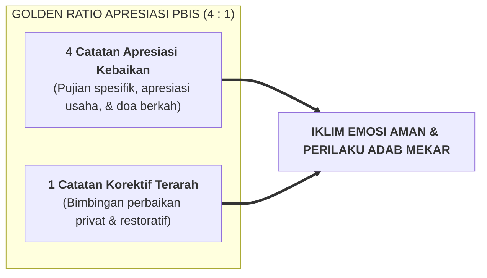

# SUB-BAB 2.2: GOLDEN RATIO 4:1: KEHARUSAN APRESIASI KEBAIKAN MENDAHULUI TEGURAN

---

## 1. Neurosains Penguatan Perilaku: Kekuatan Umpan Balik Positif

Salah satu hukum paling fundamental dalam psikologi perilaku dan School-Wide PBIS adalah **Golden Ratio 4:1 (Rasio Apresiasi Emas Empat Banding Satu)**. [^1]

Penelitian membuktikan bahwa otak manusia memiliki bias alami terhadap ancaman (*Negativity Bias*): satu teguran atau kritik negatif memiliki dampak emosional yang jauh lebih membekas daripada satu pujian. Jika seorang pendidik hanya menegur saat santri berbuat salah dan tidak pernah mengapresiasi saat santri berbuat baik, maka:
* Santri menganggap dirinya "hanya diperhatikan saat berbuat onar", sehingga sebagian santri sengaja melanggar aturan demi mendapatkan atensi musyrif.
* Hubungan emosional antara musyrif dan santri menjadi tegang, dingin, dan penuh resistensi batin.

---

## 2. Mengapa Apresiasi Harus Spesifik dan Tulus (*Specific Positive Feedback*)?

Apresiasi dalam Ekosistem TUMBUH bukanlah pujian kosong yang memicu kesombongan (*"Antum anak paling hebat sedunia"*), melainkan **apresiasi perilaku yang spesifik (*Behavior-Specific Praise*)**:
* *"Jazakallahu khairan, Fatih. Ustadz perhatikan antum tadi langsung bangun dan membantu merapikan bantal kawan antum yang terjatuh. Itu contoh akhlak Nafi'un Lighairih yang sangat mulia."*
* *"Alhamdulillah, barakallahu fiik Ahmad. Lemari antum hari ini sangat rapi standar 5S. Kerapian kasur dan lemari antum menunjukkan ketertiban batin antum."*

Apresiasi yang spesifik ini memicu pelepasan neurotransmiter **Dopamin** di otak santri, yang secara biologis mengunci memori perilaku baik tersebut untuk diulangi kembali (*Habit Reinforcement*).

---

## 3. Menjaga Keseimbangan Rasio di Aplikasi Logbook Digital

Aplikasi *Logbook Digital PBIS* TUMBUH dilengkapi dengan fitur **Indikator Rasio Real-Time**:
* Jika rasio catatan apresiasi seorang musyrif dalam sepekan turun di bawah $4:1$ (misal hanya $2:1$ atau $1:1$), sistem akan memberikan notifikasi lembut pengingat: *"Pekan ini antum lebih banyak mencatat teguran. Mari luangkan waktu mencari 4 kebaikan tersembunyi dari santri antum hari ini."*

Dengan mekanisme ini, musyrif senantiasa dilatih memiliki **"Kacamata Husnuzhan"**: selalu aktif mencari benih-benih kebaikan pada diri setiap santri.

---

### 📚 Catatan Kaki & Referensi Akademik:

[^1]: Flora, S. R. (2004). *The Power of Reinforcement*. Albany, NY: State University of New York Press, hlm. 45–72.
[^2]: Sugai, G., & Horner, R. H. (2002). The evolution of discipline practices: School-wide positive behavior supports. *Child & Family Behavior Therapy*, 24(1-2), 23–50.
[^3]: Baumeister, R. F., Bratslavsky, E., Finkenauer, C., & Vohs, K. D. (2001). Bad is stronger than good. *Review of General Psychology*, 5(4), 323–370.
