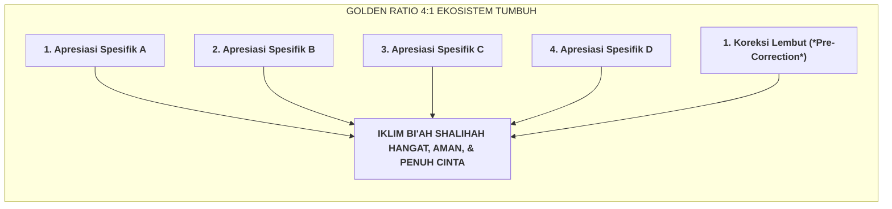

# SUB-BAB 2.2: GOLDEN RATIO APRESIASI 4:1 (APRESIASI SPESIFIK PBIS)

---

## 1. Neurosains Iklim Emosional: Rasio 4 Apresiasi Banding 1 Koreksi

Riset neurosains perilaku dan psikologi organisasi (Gottman, 1994; Fredrickson & Losada, 2005) membuktikan bahwa otak manusia secara evolusi memiliki **Bias Negativitas (*Negativity Bias*)**: satu pengalaman bentakan atau teguran kasar memberikan dampak emosional negatif yang 3 hingga 5 kali lebih kuat dibandingkan satu pujian biasa. [^1]

Tatkala seorang pendidik di asrama lebih sering menegur, mengkritik, dan memarahi santri dibanding memberikan apresiasi, amigdala santri terkunci dalam kondisi siaga stres (*Threat State*). Dalam kondisi terancam ini, otak santri melepaskan hormon kortisol yang menghambat fungsi belajar dan memicu sikap membangkang (*Defiance*).

Ekosistem TUMBUH menetapkan **Golden Ratio PBIS 4:1**: **Setiap satu kali koreksi adab yang diberikan kepada santri, seorang musyrif atau guru WAJIB MENGIMBANGINYA DENGAN MINIMAL 4 KALI APRESIASI POSITIF SPESIFIK**:

---

## 2. Tiga Kriteria Apresiasi Spesifik PBIS Berbasis Karakter (*Behavior-Specific Praise*)

Apresiasi yang efektif bukanlah pujian kosong yang klise (seperti *"Kamu hebat"* atau *"Kamu pintar"*), melainkan **Apresiasi Posifik Terfokus pada Usaha & Karakter (*Process & Effort-Focused Praise*)**: [^2]

1. **Spesifik Menyebutkan Bentuk Perilakunya (*Specific Behavior*)**:
   * *Contoh*: *"Terima kasih Zaid, antum tadi langsung meletakkan mushaf di rak dan mematikan kran air yang menetes sebelum keluar masjid."*
2. **Menghubungkan dengan Nilai 10 Muwashafat (*Value Linkage*)**:
   * *Contoh*: *"Inisiatif antum meminjamkan sajadah pada adik kelas adalah wujud nyata dari karakter Nafi'un Lighairih (bermanfaat bagi sesama)."*
3. **Diiringi Doa Berkah Nabawi (*Du'a-Centered*)**:
   * *Contoh*: *"Barakallahu fiik, semoga Allah menjadikan antum permata hati kebanggaan orang tua di dunia dan akhirat."*

---

## 3. Pemantauan Rasio 4:1 Melalui Dasbor Logbook Digital

Aplikasi logbook digital musyrif secara otomatis menghitung rasio harian (*Praise-to-Correction Ratio*):
* Jika rasio musyrif berada di bawah $4:1$ (misal $2:1$), sistem memberikan pengingat lembut: *"Ustadz, hari ini antum telah memberikan 2 koreksi. Mari temukan 6 kebaikan santri kamar antum untuk diapresiasi malam ini!"*
* Indikator ini memastikan bahwa atmosfer pengasuhan di asrama senantiasa dipenuhi oleh energi positif, harapan, dan doa-doa kemuliaan.

---

### 📚 Catatan Kaki & Referensi Akademik:

[^1]: Fredrickson, B. L., & Losada, M. F. (2005). Positive affect and the complex dynamics of human flourishing. *American Psychologist*, 60(7), 678–686.
[^2]: Dweck, C. S. (2006). *Mindset: The New Psychology of Success*. New York: Random House, hlm. 55–85.
[^3]: Sprick, R. S., et al. (2009). *CHAMPS: A Proactive and Positive Approach to Classroom Management*. Eugene, OR: Pacific Northwest Publishing.
