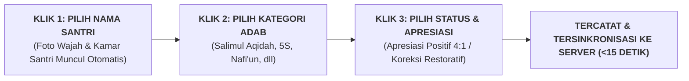

# SUB-BAB 2.3: ARSITEKTUR LOGBOOK DIGITAL PBIS: PENCATATAN 3-KLIK <15 DETIK

---

## 1. Ergonomi Digital: Mencegah Beban Administrasi Musyrif

Salah satu alasan mengapa sistem pencatatan perkembangan karakter santri sering gagal di lapangan adalah **rumitnya instrumen administrasi manual (kertas formulir tebal)** yang memakan waktu berjam-jam untuk diisi. Musyrif yang sudah lelah menjaga asrama tidak memiliki waktu untuk menulis esai panjang setiap malam, sehingga pencatatan terbengkalai. [^1]

Ekosistem TUMBUH merancang **Arsitektur Aplikasi Logbook Digital PBIS** dengan prinsip **Ergonomi Pencatatan Cepat (3-Klik dalam Waktu <15 Detik per Santri)**:

---

## 2. Struktur Database Relasional & Fitur Utama Aplikasi Logbook

Aplikasi dirancang ringan (*Lightweight Mobile-First Web Application*) yang dapat diakses melalui ponsel pintar atau tablet musyrif: [^2]

1. **Preset Cepat Perilaku Harian (*Quick-Tag Behaviors*)**:
   * Tersedia tombol sekali-sentuh untuk perilaku rutin: `[Subuh Tepat Waktu]`, `[Kasur 5S Kencang]`, `[Membantu Teman Sekamar]`, `[Fokus Mudzakarah]`.
2. **Input Suara Cepat (*Voice-to-Text Transcription*)**:
   * Musyrif dapat mendiktekan catatan naratif singkat menggunakan suara; sistem otomatis mengubahnya menjadi teks narasi laporan.
3. **Kerahasiaan & Pembatasan Hak Akses (*Role-Based Access Control - RBAC*)**:
   * Musyrif hanya dapat melihat data santri binaan di kamarnya; Guru BK dan Kepala Madrasah memiliki akses komprehensif ke seluruh data sekolah.

---

### 📚 Catatan Kaki & Referensi Akademik:

[^1]: Nielsen, J. (1994). *Usability Engineering*. San Francisco: Morgan Kaufmann, hlm. 115–140.
[^2]: Pressman, R. S., & Maxim, B. R. (2020). *Software Engineering: A Practitioner's Approach* (9th ed.). New York: McGraw-Hill.
