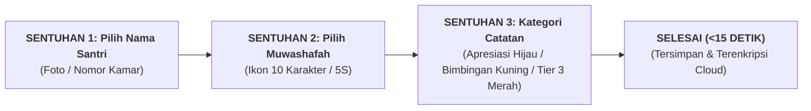

# SUB-BAB 2.3: ARSITEKTUR LOGBOOK DIGITAL PBIS: PENCATATAN MIKRO CEPAT & EFISIEN

---

## 1. Menghilangkan Beban Administrasi yang Melelahkan

Salah satu alasan kegagalan program penilaian karakter di banyak sekolah adalah **beban administrasi manual yang terlalu rumit (*administrative burnout*)**. Musyrif yang sudah lelah menjaga asrama dipaksa menulis laporan berlembar-lembar setiap malam, sehingga akhirnya mereka mengisi laporan secara asal-asalan (*copy-paste* formalitas).

Ekosistem TUMBUH merancang **Aplikasi Logbook Digital PBIS** dengan filosofi: **Pencatatan Cepat Berbasis Sentuhan (*3-Click Micro-Logging in <15 Seconds*)**.

---

## 2. Fitur Utama Aplikasi Logbook Digital Musyrif

Aplikasi logbook dirancang responsif untuk perangkat ponsel pintar (*smartphone*) musyrif dengan fitur-fitur esensial:

1. **Tagging 10 Muwashafat Cepat**: Ikon grafis intuitif untuk mencatat perilaku adab (misal: ikon masjid untuk *Shahihul Ibadah*, ikon buku untuk *Mutsaqqaful Fikr*, ikon sapu untuk *5S/Munazzhamun*).
2. **Rekaman Suara Cepat (*Voice-to-Text Feature*)**: Musyrif dapat mendiktekan catatan deskriptif singkat sambil berjalan tanpa perlu mengetik panjang lebar.
3. **Sinkronisasi Terpadu Madrasah-Asrama**: Catatan musyrif di asrama langsung terhubung dengan dashboard Wali Kelas di madrasah, sehingga guru pagi mengetahui kondisi santri yang semalam kurang fit atau baru saja diapresiasi.
4. **Keamanan & Kerahasiaan Data (*Role-Based Security*)**: Catatan kasus khusus hanya dapat diakses oleh Kepala Pesantren dan Tim Bimbingan Konseling (BK).

---

### 📚 Catatan Kaki & Referensi Akademik:

[^1]: Nielsen, J. (1994). *Usability Engineering*. San Francisco: Morgan Kaufmann, hlm. 115–140.
[^2]: Sugai, G., & Horner, R. (2009). Responsiveness-to-intervention and school-wide positive behavior support: Integration of multi-tiered system. *Exceptionality*, 17(4), 223–237.
