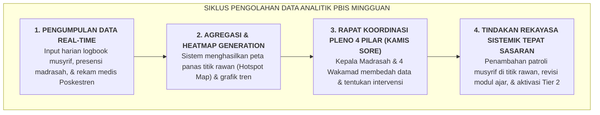

# SUB-BAB 2.4: PENGOLAHAN ANALITIK MINGGUAN & DETEKSI TITIK RAWAN (*HOTSPOTS*)

---

## 1. Dari Data Mentah Menuju Keputusan Strategis (*Data-Driven Decision Making*)

Data ribuan catatan logbook harian yang diinput oleh para musyrif dan guru madrasah tidak dibiarkan menumpuk tanpa makna di dalam server. Setiap akhir pekan, mesin analitik sistem PBIS mengolah data tersebut menjadi **Laporan Dasbor Analitik Perilaku Terpadu (*Big Data Behavioral Dashboard*)**. [^1]

Pengolahan data ini menjawab 4 pertanyaan diagnostik kunci:
1. *What (Perilaku apa yang paling sering terjadi atau dilanggar pekan ini?)*
2. *When (Pada jam berapa atau titik transisi mana insiden paling sering muncul?)*
3. *Where (Di lokasi mana titik rawan/hotspot terjadinya kegaduhan atau perselisihan?)*
4. *Who (Siapa santri yang membutuhkan intervensi CICO Tier 2 atau pendampingan konseling?)*

---

## 2. Peta Panas Titik Rawan (*Hotspot Heatmap Analysis*)

Sebagai contoh praktis: jika analitik data mingguan menunjukkan bahwa **$65\%$ insiden pertengkaran santri terjadi di lorong lantai 2 antara pukul 17:15 hingga 17:45 (saat jam antre mandi sore)**: [^2]
* Lembaga tidak meresponsnya dengan menghukum massal santri lantai 2.
* Lembaga melakukan **Rekayasa Sistemik Tepat Sasaran**:
  - Wakamad Sarpras memeriksa kran air mandi lantai 2 (jika debit air kecil sehingga antrean lama, pompa air segera diperbesar).
  - Wakamad Kesiswaan menempatkan 1 musyrif Shift 3 untuk berdiri aktif (*Active Supervision*) di lorong tersebut pada rentang jam 17:15 - 17:45.

Dalam tempo 3 hari, insiden pertengkaran di lokasi tersebut turun $100\%$ tuntas berkat keputusan berbasis data faktual.

---

### 📚 Catatan Kaki & Referensi Akademik:

[^1]: Sugai, G., & Horner, R. H. (2006). A promising approach for expanding and sustaining school-wide positive behavior support. *School Psychology Review*, 35(2), 245–259.
[^2]: McIntosh, K., et al. (2014). Using school-level data to predict and prevent student behavioral problems. *School Psychology Quarterly*, 29(3), 253–268.
