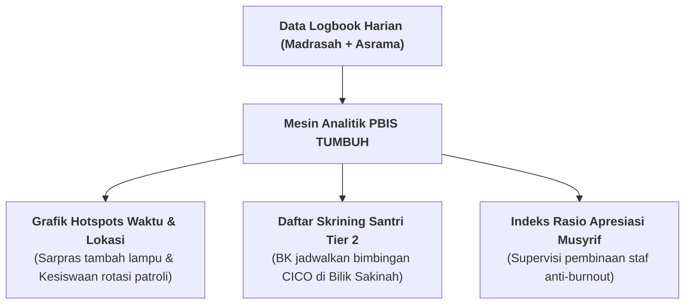

# SUB-BAB 2.4: PENGOLAHAN ANALITIK MINGGUAN & DETEKSI DINI TITIK RAWAN

---

## 1. Menghidupkan Data: Dari Angka Menjadi Keputusan Tarbiyah

Kumpulan data mikro harian yang dicatat oleh musyrif dan wali kelas diproses secara otomatis oleh mesin analitik PBIS menjadi **Laporan Dasbor Kesehatan Ekosistem Mingguan (*Weekly Ecosystem Analytics Dashboard*)**.

Pimpinan pesantren, Wakamad Kesiswaan, Wakamad Kurikulum, dan Wakamad Sarpras menggunakan data analitik ini untuk:
* **Mendeteksi Waktu Rawan (*Hotspots Timing*)**: Mengidentifikasi jam-jam rawan di mana kasus friksi santri meningkat (misal: jam transisi 16:30–17:15 sore atau 21:00–21:30 malam).
* **Mendeteksi Lokasi Rawan (*Hotspots Location*)**: Menemukan sudut-sudut fisik pondok yang kurang penerangan atau jarang dilewati musyrif.
* **Deteksi Dini Kebutuhan Intervensi Tier 2**: Mengenali santri yang dalam 14 hari terakhir mengalami penurunan drastis dalam catatan adab atau mengalami lonjakan keterlambatan bangun tidur, sebelum masalah tersebut membesar menjadi krisis.

---

## 2. Rapat Kasus Mingguan Bebas Menyalahkan (*No-Blame Case Conference*)

Setiap hari Kamis sore, tim pengasuhan menggelar **Rapat Koordinasi 4 Pilar**:
* **Fokus Pembahasan**: Mencari solusi sistemik atas temuan analitik, bukan mencari kambing hitam staf (*No-Blame Culture*).
* **Contoh Keputusan Terpadu**: Jika grafik menunjukkan kenaikan kasus santri mengantuk di kelas pagi (Kurikulum), tim Sarpras mengecek sirkulasi udara kamar, dan tim Kesiswaan memastikan jam padam lampu malam dipatuhi tepat waktu pukul 21:45.

Dengan analitik prediktif ini, pesantren beralih dari manajemen pemadam kebakaran yang serba panik menjadi manajemen peradaban yang rapi, tenang, dan visioner.

---

### 📚 Catatan Kaki & Referensi Akademik:

[^1]: Horner, R. H., Sugai, G., & Anderson, C. M. (2010). Examining the evidence base for school-wide positive behavior support. *Focus on Exceptional Children*, 42(8), 1–14.
[^2]: McIntosh, K., & Goodman, S. (2016). *Integrated Multi-Tiered Systems of Support: Blending RTI and PBIS*. New York: Guilford Press, hlm. 88–115.
